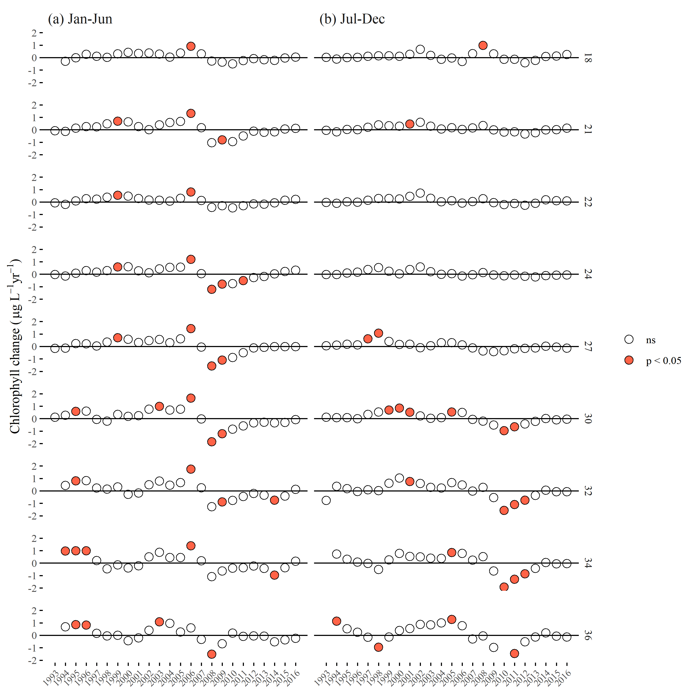
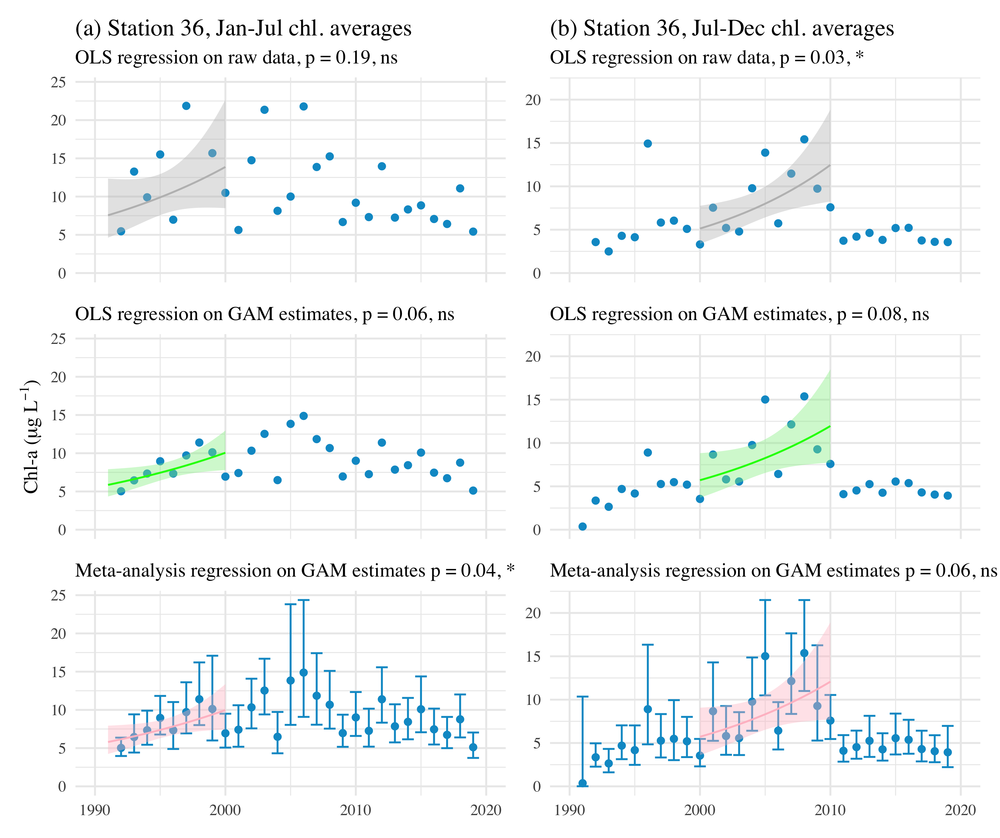
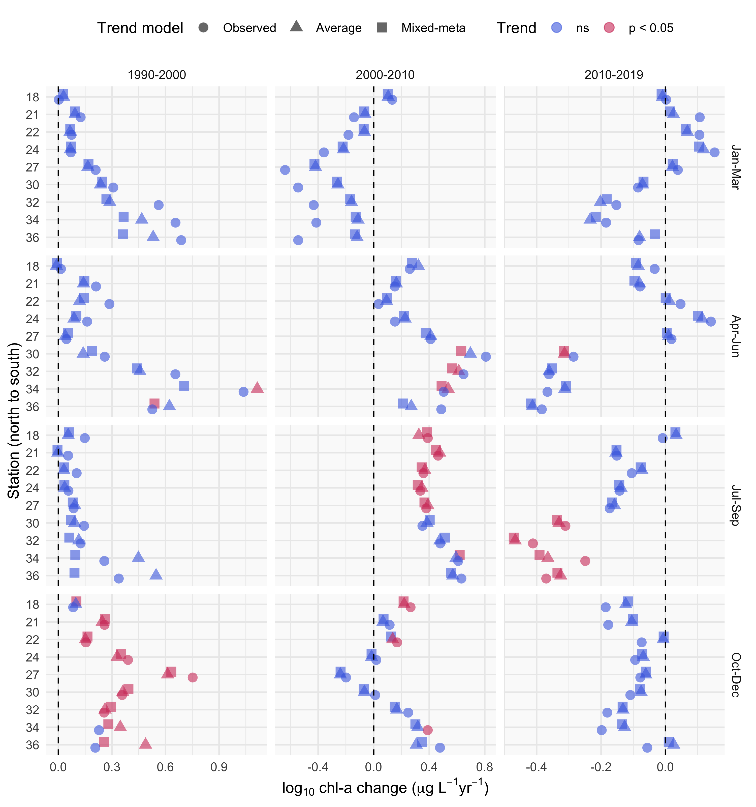

```{r setup, echo = F, warning = F, message = F, results = 'hide'}
# figure path, chunk options
knitr::opts_chunk$set(fig.path = 'figs/', warning = F, message = F, echo = F, cache = F, dev.args = list(family = 'serif'), dpi = 300, warning = F,
  fig.process = function(x) {
  x2 = sub('-\\d+([.][a-z]+)$', '\\1', x)
  if (file.rename(x, x2)) x2 else x
  })

# libraries
library(Jabbrev)
library(tidyverse)
library(wqtrends)
library(flextable)
library(officer)
library(ggmap)
library(sf)
library(ggsn)
library(USAboundaries)
library(hrbrthemes)
library(patchwork)
library(lubridate)
library(colorspace)

data(locs)
data(modprf)
data(seastrnd)
data(seastrnd2)
data(cmptrnd)
data(modstr)
data(modslog_chl18)
data(modslog_chl24)
data(modslog_chl27)
data(modslog_chl32)
data(modslog_chl34)

source('R/funcs.R')

locs <- locs %>% 
  rename(station = Station)

# # extract bib entries from online
# bib_scrp('manu_draft.Rmd', 'refs.bib')
```

`r paste('Last manuscript build', Sys.time())`

```{r echo = F, cache = F, eval = F}
spelling::spell_check_files('manu_draft.Rmd')
```

# Abstract

Accurate and flexible trend assessment methods are valuable tools for describing historical changes in environmental monitoring datasets.  A key requirement is complete propagation of uncertainty through the analysis.  However, this is difficult when there are mismatches between time scales of monitoring data and analysis methods. Here, we propose a novel application of Generalized Additive Models (GAMs) to model seasonal and multi-decadal changes in a long-term monitoring dataset of chlorophyll-a concentrations in South San Francisco Estuary.  GAMs are a general method for modelling a response variable as the additive sum of one or more smoother splines fit to predictor variables.  These models have shown promise in other applications to water quality monitoring data to separate long-term (i.e., annual or decadal) trends from seasonal variation.  Our proposed methods estimate seasonal averages in a response variable with GAMs and then use those ancertainty with mixed-meta regression analyses to quantify inter-annual trends that account for full propagation of error across methods.  We first demonstrate that nearly identical descriptions of temporal changes in l can be obtained using different smoothing splines for annual or seasonal components of the time series.  We then extract seasonal averages for an a priori period of time within each year from the GAM results, including an accurate assessment of standard error within each year where the seasonal average is estimated.  Finally, we demonstrate how trends can be quantified with mixed-meta regression analyses that evaluates changes in the seasonal averages between years with full propagation of uncertainty in the estimates.  Overall, this approach leverages the ability of GAMs to identify an optimal amount of smoothing from the raw data and uses those results to accurately assess trends that minimize the likelihood of false positive or negative results, which is particularly important for time series with missing observations or varying sample effort over time.       

# Introduction

Accurate quantification of trends must consider variation at different temporal scales regardless of the question of interest, such that ignoring variation at one scale could lead to incorrect conclusions about variation at another scale. Many environmental monitoring programs collect temporally resolved but irregular time-series data to quantify trends for regulatory, management, or research purposes.  The mismatch between the scales of monitoring versus analysis questions or management goals can present statistical challenges [@Urquhart98;@Cumming06;@Forbes18]. At short temporal scales typically less than a year, environmental systems exhibit variability caused by multiple factors (e.g., weather events, management, or seasonal changes).  Such fluctuations may not be of direct interest for inter-annual trends or may not be well-suited to multi-scale smoothing methods.  In this paper, we describe methods to estimate across-year trends of within-year features of interest such as a seasonal average, seasonal peak, or seasonal timing of events, while accounting for uncertainties across analysis steps.  

Existing methods that address our objectives in water quality trend analysis can be generalized into four basic approaches: seasonal Kendall tests, seasonal trend decomposition (STL), weighted regression on time, discharge, and season (WRTDS), and generalized additive models (GAMs).  Seasonal Kendall tests or related non-parametric approaches have been used for decades in water quality trend assessments to identify monotonic changes over several years while accounting for the predictable patterns among seasons [@Hirsch82;@Helsel20]. @Wan17 showed that non-parametric approaches have been the most commonly used methods in long-term water quality trend analysis despite critical limitations.  For descriptive decomposition of long-term monitoring data, they assume seasonal patterns within year do not change, require regularly spaced or balanced data, only use time as a descriptor for trends, and do not estimate a model that could be useful for other purposes.  Thus, while these non-parametric approaches have some degree of robustness to assess magnitude and direction of trends, they apply only to narrow goals.

The seasonal trend decomposition using loess (STL) decomposes a time series into additive components of a long-term trend, a seasonal pattern, and residuals [@Cleveland90;@Cloern10;@Stow15].  While useful and widely applied, this method also has important limitations.  STL decomposition does not incorporate explanatory variables besides time, it is defined more as an algorithm of statistical steps than as a coherent statistical model [e.g., @Wan17], and it does not usually estimate standard errors to allow hypothesis testing [but see @Hafen10].  STL methods may also over-simplify trends into absolute components that do not change over time, e.g., a seasonal estimate that is constant across years.  This limitation presents challenges when addressing questions relevant to long-term water quality data, such as timing of seasonal peaks that can suggest system response to changing  environmental conditions [@Cloern10;@Navarro12].

The weighted regression on time, discharge, and season (WRTDS) method addresses the problem of inflexibility in STL by using a more general local regression scheme [@Hirsch10;@Beck15;@Beck18b].  Designed for evaluating water quality in rivers where separating the effect of discharge on constituent concentration is important, WRTDS estimates a moving window regression model with components that allow parameters to vary smoothly in relation to both time and discharge.  This yields parameters that are specific to season, year, and flow regime.  The WRTDS approach is conceptually similar to localized multi-polynomial smoothing methods, with specific application to descriptive variables relevant for water quality constituents (i.e., season, year, and discharge). Standard error estimates of predictions from WRTDS are available through a "block bootstrap" approach that uses Monte Carlo estimates of false positive rates from the model results [@Hirsch15]. Although a useful addition to the original method [@Hirsch10], the approach requires extensive resampling as a post-hoc application to a previously fitted model.  Alternative methods that include standard error estimates simultaneously with model output may be preferred for intensive or more iterative applications

Generalized additive models (GAMs) are central to this paper and form the basis of our fourth and last method to separate fluctuations on different time scales.  GAMs combine one or more smoothing splines to model patterns in data and may be seen as generalizing the concepts behind STL and WRTDS [@He06;@Morton08;@Pearce11;@Haraguchi15;@Murphy19]. In statistics, the evolution of non-parametric regression methods has largely converged on GAMs, rather than kernel smoothing methods used by both STL and WRTDS.  Kernel smoothing and spline smoothing are closely related, and a key challenge for each is to determine the appropriate degree of smoothing.  For example, WRTDS can potentially give results similar to the spline-based smoothing methods used in GAMs, although at higher computational expense and with the limitation that uncertainty estimates are not readily obtainable from the original method [@Beck17]. WRTDS also requires specifying the desired degree of smoothing via the "windows" that define the local weighting at each point in the time series.  The windows in WRTDS are conceptually similar to the kernel (or bandwidth) used in more conventional smoothing methods. A challenge of WRTDS is that there is no clear rule that can be applied to determine the best choice of window size. The associated tradeoff between over- and under-smoothing is a hallmark of these approaches. 

GAMs have various advantages compared to kernel smoothing methods and are therefore used for non-parametric regression smoothing in many fields.  The "basis functions" used to formulate GAMs can be customized based on expected patterns in the data. Examples include cyclic splines, which can be used to model seasonal patterns, and low-dimensional interactions.  GAMs have added flexibility because they can include both parametric (e.g. linear or quadratic) components and non-parametric (spline) components.  Multiple approaches have been developed to determine the optimal degree of smoothness.  These approaches are based on likelihood estimates or optimization of out-of-sample prediction error, which address a key concern around methods like WRTDS that do not have analogs for choosing optimal degrees of smoothing.  Further, GAMs have natural frequentist and Bayesian interpretations, are naturally extensible to include random effects (i.e., generalized additive mixed models or GAMMs), and have computationally efficient implementations that can be optimized more quickly than other approaches [@Wood17].

GAMs have been applied previously to evaluate trends in water quality time-series from long-term monitoring programs [@Haraguchi15;@Murphy19]. For example, @Murphy19 used GAMs to decompose water quality time series from Chesapeake Bay into long-term and seasonal trends [@Murphy19] and test trend hypotheses between two points in time.  This study generalizes the approach to analyzing trends of seasonal spline features, describes the relationships among alternative spline formulations when they are used as designed [@Wood03;@Wood17] rather than for ad hoc separation of time scales, and prioritizes full incorporation of uncertainty.  Other studies of environmental time-series with GAMs have addressed the use of transformed response data [@Yang20], serial correlation in high resolution data [@Morton08;@Yang20], and quantifying time lags in relationships between response and predictor variables [@Lefcheck17;@Testa18].

Our motivating problem has several characteristics that are partially addressed by previous methods and can further build on  GAMs as a starting point. Our general goal is to understand interannual changes in seasonally averaged water quality metrics, such as chlorophyll.  However, the seasonal average within each year must be robust to inconsistent sampling times and intervals, and any trend analysis must consider the uncertainties in seasonal averages.  The critical need is the ability to obtain an accurate estimate of uncertainty (e.g., a standard error) of seasonal averages, even with irregular sampling and serial correlation, which is common to time series data.  This paper develops GAMs as a distinct application that can meet these requirements and simultaneously addressing key limitations of seasonal Kendall tests and the more complex STL and WRTDS methods.  We do so with the explicit goal of quantifying interannual trends in seasonal averages.  

We describe and demonstrate the proposed methods by analyzing water quality monitoring data from the southern portion of San Francisco Estuary, California, USA.  Approximately twice-monthly monitoring has been conducted for several decades at fixed locations (stations) on the longitudinal axis of the Bay.  Analysis of these data is complicated by irregularities in timing and consistency of data collection which can generate artifacts affecting simple seasonal averages of the data.  We were interested in questions such as: Are there significant trends in spring mean chlorophyll at four-year (or other) time-scales?  At what across-year scale do within-year summer-fall mean chlorophyll levels change?  Are there significant across-year trends in within-year timing of the spring bloom in chlorophyll or baseline levels of productivity between blooms?  We provide examples illustrating how these questions can be addressed using methods with GAMs.  We also provide an approach for using meta-analysis methods [@Gasparrini12;@Sera19] after signal extraction with GAMs.  This approach is new to environmental trend-detection problems.  For this step, we provide methods using meta-anlaysis for isolating seasonal trends with reasonalbe certainty from from GAM results and evaluating these trends between years.

# Methods

## Study area and data sources

The San Francisco Estuary (SFE) is the largest estuary on the Pacific Coast of North America.  Its watershed covers 200 thousand km$^2$ in the US state of California. Major freshwater inputs enter the system through the Sacramento-San Joaquin Delta complex upstream of Suisun Bay, where the combined inflow from both rivers is approximately 28 km$^3$ per year.  Salinity ranges from 0 to 15 ppt in the northern subembayments and from 5 to 35 ppt in southern subembayments closer to the Pacific Ocean, depending on the tidal cycle, effluent discharge from wastewater treatment plants, and stormwater runoff.  The South Bay embayment is heavily urbanized and includes thirty-seven wastewater treatment plants that serve 7.2 million people. An estimated 73.8 metric tons dy$^{-1}$ of inorganic nitrogen are discharged into the Bay, primarily from wastewater [@Novick14].  Secondary treatment occurs at most of the wastewater treatment plants that discharge into the SFE.  Agricultural runoff from the upper watershed contributes 30 metric tons dy$^{-1}$ of nitrogen to the SFE via the Delta.

Nitrogen and phosphorus levels in SFE usually exceed concentrations that cause eutrophication in other estuaries.  However, SFE has demonstrated resistance to eutrophication, which to high suspended sediments that reduce light penetration in the water column, low residence time caused by vigorous river flushing, and removal of primary producers by abundant suspension feeding bivalves.  Interest in the potential for nutrient loading to negatively affect water quality has increased recently particularly for South Bay, where harmful algal blooms (HABs), elevated summer-fall chlorophyll concentrations, and low dissolved oxygen concentrations have occurred since 1999 (Figure \@ref(fig:obsdat)) [@Cloern20]. Although changes in the data are visually apparent, statistical analyses to quantify these changes have been insufficient particularly with respect to seasonal differences between years.

We evaluated near-surface chlorophyll-a data measured biweekly to monthly from 1990 to 2019 along the South Bay axis extending from Central Bay (stations 18-23), South Bay (stations 24-32), and Lower South Bay (stations 34-36) (Table \@ref(tab:sumtab), Figure \@ref(fig:sitemap)). Monitoring data were obtained from the SFE Research Program of the US Geological Survey [@Cloern16;@Schraga20].  Chlorophyll on GFF filters was analyzed fluorometrically after extraction in 90% acetone. Sampling frequency varied somewhat over time and by station.  Every observation was included directly in the statistical models without spatial or temporal binning or averaging.

## GAM application

We implemented the GAMs in three stages.  First, we used a GAM to estimate a smooth pattern of variation in the raw data along with its uncertainty.  Second, we calculated a feature of interest from the estimated GAM, along with its propagated uncertainty. For this example, the seasonal averages were extracted, whereas other features could be the timing or magnitude of a seasonal peak, but those are not developed here.  Third, we used a mixed effects meta-analysis to estimate trends and test hypotheses about the change in seasonal averages across years.  While meta-analysis methods arose from analyses of results from multiple studies, their distinguishing characteristic is propagation of uncertainty [@Gasparrini12;@Sera19].  Meta-analysis uses response data that includes standard errors (uncertainties) as needed to address our questions.  We developed two mixed effects meta-analysis approaches that provided 1) a simple comparison of whether seasonal features differ across years, and 2) estimation of short-term linear trends on time-scales chosen by the analyst.

### First-stage analysis: GAM estimation

We used four different GAMs to estimate the long-term trend and uncertainty from the time series data, each with the potential to achieve a similar fit to the data but with a slightly different model structure (Table \@ref(tab:modsumtab)). Models are shown in the notation of the `mgcv` R package as formulas for the `gam` function [@Wood17]. 

GAMs smooth the raw data across time to separate variability in the response variable associated with an explanatory factor, indepdent of noise inherent in the raw data. The simplest GAM for this purpose is expressed as:

Model S: `y ~ s(cont_year, k = num_knots_Y)`

where `y` is the time-series of interest, such as chlorophyll, `cont_year` is "continuous year", a continuous numerical date (e.g., July 1st 2019 would be 2019.5), `y ~ s(...)` indicates that `y` will be explained by a smoothing spline (in this case of `cont_year`), and `num_knots_Y` is the number of knot or "connections" along the spline that influence curvature.  Log$_{10}$-transformed chlorophyll was used for all analyses to meet assumptions of normally-distributed residuals.

The optimal level of smoothing in `mgcv` is determined by a penalty on the net curvature of the spline [@Wood04].  Smoothing was determined using generalized cross-validation (GCV, as implemented in `mgcv`), which approximately minimizes out-of-sample prediction error.  To allow GCV (or other alternatives) to work as intended, a potential upper limit on the number of knots determined by the analyst must be sufficiently large.  Results should not be sensitive to the number of knots; if they are, the number of knots should be increased.  We chose a sufficiently large number of knots for `num_knots_Y` (Model S) as 12 times the number of years in the time series that was modeled.  This created the potential, as determined through GCV, to have one knot per month as an approach to both prevent under-fitting the observed data and to accurately estimate the seasonal signal within a year.  If the data were too sparse, the model will have insufficient degrees of freedom to fit 12 knots per year, in which case the number of knots was reduced by one knot per year until sufficient degrees of freedom were available (i.e., 12 * years, 11 * years, etc.).   

The next three spline formulations (Model SY, SYD, and SYDI) provide progressively increasing complexity in how spline terms compose a model to smooth the raw data.  Model SY describes the time series using a linear trend plus a spline for `cont_year`:

Model SY: `y ~ cont_year + s(cont_year, k = num_knots_Y)`

This model is mathematically equivalent to model S (Table \@ref(tab:modstrtab)).  The spline for `cont_year` includes an unpenalized linear trend, so a trend will be estimated in model S.  When `cont_year` is included explicitly as a linear term in model SY, `mgcv` adjusts the basis functions for the spline to exclude the linear term, thereby not over-parameterizing the model. Whereas an estimated linear trend in `cont_year` and its uncertainty can be extracted from the fitted spline in model S, model SY provides this trend directly, given the equivalent result.  Further, package `mgcv` can penalize linear trends in splines to provide a method for variable selection (option `select = TRUE`), such as when numerous splines are included in the model formulation for variables that may or may not be important.  For our approach, this option is not used and all models specify `select = FALSE`.  Details in the supplement explain this justification. 

MOdel SYD adds an average within-year cyclic pattern as a separate spline:

Model SYD: `y ~ cont_year + s(cont_year, k = num_knots_Y) + s(doy, bs = 'cc', k = num_knots_D)`

where `doy` is "day-of-year" (i.e., Julian date, a count starting January 1 for each year), `bs = 'cc'` indicates that the spline will be cyclic (constrained to start and end at the same value), and `num_knots_D` is the upper limit for the number of knots for the `doy` spline.  While model SYD is not mathematically equivalent to models S and SY, it should produce nearly identical results.  The `doy` spline in model SYD gives the average seasonal pattern and changes the interpretation of the `cont_year` spline to represent smoothed deviations from the average within-year pattern.

Models S, SY, and SYD can all potentially extract a similar signal from the raw data (Table \@ref(tab:modstrtab)).  What differs between the models is the allocation of penalties for curvature used to determine smoothness for each spline.  In model SYD, there are separate penalties for the two splines, as compared to S and SY that include penalties only for the `cont_year` spline. This is important because variation in the response variable can be differently attributed to each spline depending on model, whereas the sum of components for each model produce comparable results between models.  Our goal is to extract signals (i.e., seasonal estimates) from the fitted time series and different allocation of penalties among the splines in each model is unimportant for this task.  However, interpreting differences in fit between model SYD and models S or SY can be problematic because the penalties for smoothing splines based on curvature are heuristic [@Wood17]. For example, if a lower AIC is achieved in one model compared to another, assuming both use sufficient knots, this may just reflect the outcome of alternative penalization heuristics implied by the different formulations and does not imply one model fits better. In the examples here, model SYD achieves nearly identical fits to model S or SY, where the latter by definition also achieve identical fits.

Model SYD has the appealing feature that, if some parts of some years have limited data, model SYD will consider data from the same period in other years by imputing an average seasonal pattern with the `doy` spline. However, an interpretation of these imputations is challenging.  For example, the spring chlorophyll peak is a notable feature every year in south SFE.  If the peak occurs at the same time every year but the magnitude varies, then the average within-year pattern can be interpreted as the average magnitude. However, if the magnitude is the same but the timing varies across years, then the magnitude of the average peak cannot be similarly interpreted and instead underestimates the magnitude that usually occurs.  Moreover, the width or duration of the peak will be longer than typically occurs in a given year.

Finally, the raw data can be smoothed using a bivariate spline representing an interaction between `cont_year` and `doy`. This can be expressed as:

Model SYDI: `y ~ cont_year + s(cont_year) + s(doy, bs = "cc") + ti(cont_year, doy, bs = c("tp", "cc"), k = c(num_knots_Y_ti, num_knots_D_ti))`

where `ti()` specifies a tensor-product spline for a surface that varies smoothly as a function of both `cont_year` and `doy`.  The number of knots is the product of `num_knots_Y_ti` in the `cont_year` axis and `num_knots_D_ti` in the `doy` axis.  In SYDI, the need for sufficient knots can be satisfied either by sufficiently large values for `num_knots_Y_ti` and `num_knots_D_ti` or a sufficiently large value for knots in `s(cont_year)`, but not both given limits on the model degrees of freedom.

Following the rationale above, the relationship of model SYDI to model S is similar to that of model SYD to model S.  Model SYDI differs formulaically from model S to a greater extent than model SYDI, but all of the splines use the same inputs to smooth the same data.  The splines in `cont_year` and `doy` will likely not capture as much variation in model SYDI compared to model SY given the fewer knots that are available to the former.  The `ti` term represents an interaction by allowing the pattern in `cont_year` to vary by `doy` and vice-versa.  The interaction term in model SYDI provides an appearance that this model is fundamentally different from those provided by the other models.  However, models S, SY, and SYD all allow within-year fluctuations to vary across years by allowing a spline to be fit through the entire time-series.  Although model SYDI is the only model that includes an explicit interaction term, all of the models support the interaction conceptually. By providing this term with sufficient knots, the raw data can be fully smoothed with model SYDI to a similar degree as for the other models.  However, this outcome is difficult to achieve for reasons explained below.

The distinct aspect of model SYDI is the anticipation that within-year fluctuations will vary smoothly from year to year.  For example, if one year has an especially early and large magnitude spring bloom, the years before and after would be expected also to have earlier and larger than average spring blooms. For the raw SFE data, and chlorophyll-a dynamics in many estuaries, this is not expected to be the case. An early and large spring bloom could easily be followed the next year by a late and relatively small spring bloom.  If the interaction spline has many knots, then the degree of smoothness across years can be estimated to be very low, allowing fluctuations within years to vary strongly across years.  However, if that is the case, the conceptual motivation for model SYDI may not be supported by the data. Given that observed bloom dynamics for most systems do not vary smoothly across years, the potential benefits of using model SYDI could be outweighed by using simpler models.  Moreover, the spline and penalty structure differ from the other models, making it difficult to evaluate their relative performance (Table \@ref(tab:modstrtab)).

For models SYD and SYDI, the allocation of knots between the different splines can be chosen by the analyst so long as it is recognized that different choices will arbitrarily lead to related differences in allocation of variation among the splines. In models S, SY, and SYD, the number of knots in the `cont_year` term need to be sufficiently large.  In model SYDI, a very large number of knots in both the `cont_year` spline *and* in both dimensions of the interaction spline is impossible to achieve.  Allowing the `cont_year` spline to include many knots would somewhat defeat the purpose of the interaction spline.  

@Murphy19 used spline formulations related to those proposed here, but are insufficient for our needs of extracting and quantifying seasonal trends. @Murphy19 have a "`gam0`" with only a `s(doy)` term, a "`gam1`" like our SYD, and a "`gam2`" like our SYDI.  Their `gam0` is *a priori* not of interest for our data because of an assumption of constant seasonality and a linear annual trend.  Compared to our application of SYD and SYDI, their implementation of "`gam1`" and "`gam2`" allocated knots differently, leading to a different interpretation of results.  For "`gam1`" (our SYD), they set a maximum number of knots in the `s(cont_year)` term of 2/3 times the number of years, whereas we adopt a different approach using a number of knots equal to 12 times the number of years, or one per month.  Accordingly, they interpret this spline as separating a long-term (or low-frequency) trend from other patterns, whereas we use it to separate intra-annual changes in season from noise at a finer temporal scale.  In the "`gam2`" model (our SYDI model), @Murphy19 do not explicitly consider number of knots in the interaction spline.  In both cases, they effectively use their choice of number of knots in different spline components as an ad hoc allocation of variation in the data to different components, while not allowing any component to fully estimate the signal in the data. @Murphy19 acknowledge that incomplete modeling of fluctuations in the data may inflate their Type I error rates for estimating temporal changes, but they leave that problem for future work.  We seek to avoid inflating Type I error rates in this way.  Finally, @Murphy19 present large AIC differences between their spline formulations.  We instead emphasize that, given sufficient knots, the models represent alternative formulations of conceptually similar explanations for the data and yield similar fits (Table \@ref(tab:modstrtab)), making differences in AIC unimportant.  In our example, large differences in AIC only reflect inadequate choice of knots in one or more splines, which should be avoided. 

We visually compare chlorophyll estimates from models SY, SYD, and SYDI to emphasize that similar fits can be achieved by all of the presented models (Figure \@ref(fig:modsumfig), S is identical to SY and is not shown).  Models SY, SYD, and SYDI were fit to chlorophyll data from station 34 using large k values for the arguments `num_knots_y`, `num_knots_D`, `num_knots_Y_ti`, and `num_knots_D_ti` for each model.  Predictions by day of year from each model are visually similar (Figure \@ref(fig:modsumfig)a) and closely follow the 1:1 line (Figure \@ref(fig:modsumfig)b).  However, when contrasting the models using only the continuous year smoother (`s(cont_year)`, as an example), the model fits differ substantially because of structural differences and differences in the penalties applied to the basis functions.  These results are also reflected in differences in the effective degrees of freedom among the additive components of each model (Table \@ref(tab:modstrtab)). Accordingly, even though the models differ by which structural component describes variation in the chlorophyll time series, they provide similar predictions. 

For all results, model S was used with enough knots in `num_knots_y` to evaluate chlorophyll trends across the monitoring stations in South SFE.  This model was chosen because of the relatively quicker processing time to fit the model, while providing nearly identical explanatory power as compared to the other models (Table \@ref(tab:modstrtab)). 

### Second-stage analysis: Uncertainty propagation from estimated GAMs to seasonal features

\newcommand{\hm}{\hat{\mu}}
\newcommand{\hmt}{\hat{\mu}_t}
\newcommand{\mt}{\mu_t}
\newcommand{\hmr}{\hat{\mu}_r}
\newcommand{\hshmt}{\hat{\sigma}_{\hat{\mu}, t}}
\newcommand{\hshmr}{\hat{\sigma}_{\hat{\mu}, r}}
\newcommand{\hshm}{\hat{\sigma}_{\hat{\mu}}}
\newcommand{\hsshm}{\hat{\sigma}^2_{\hat{\mu}}}
\newcommand{\hsshmt}{\hat{\sigma}^2_{\hat{\mu}, t}}
\newcommand{\bX}{\mathbf{X}}
\newcommand{\hby}{\hat{\mathbf{y}}}
\newcommand{\hbb}{\hat{\boldsymbol{\beta}}}
\newcommand{\hShb}{\hat{\Sigma}_{\hat{\beta}}}
\newcommand{\hShy}{\hat{\Sigma}_{\hat{\mathbf{y}}}}
\newcommand{\sbs}{\sigma_b^2}

In the second-stage analysis, we estimated a seasonal average, such as the mean spring chlorophyll concentrations and the uncertainty in each year.  Define $\mu_t$ as the average for the period of interest (e.g., seasonal average) in year $t$, $\hmt$ as an estimate of $\mu_t$, and $\hshmt$ as the estimated standard error of $\hmt$. The season includes $n$ days.  For simplicity, the following text omits subscript $t$.

Point estimates of response values for the fitted GAM take the form $\hby = \bX \hbb$, where $\hbb$ is the vector of parameter estimates and $\mathbf{X}$ is a model matrix of explanatory variables, including spline basis function values.  Vector $\hbb$ includes both fixed effect parameters and spline parameters, and $\bX$ contains columns corresponding to each.  For example, using model SY, if a point estimate for chlorophyll is needed for a single day, given as `dec_year` = $r$, then $\bX$ would have a row with with $1$ in the first column (for the intercept parameter), $r$ (for the linear time trend) in the second column, and an evaluation of each spline basis function at $r$ (and possibly its corresponding `doy` value) in the remaining columns. The number of spline basis functions is related to the number of knots. Note that $r$ can be any time, not necessarily the time of an observation.

To obtain a vector, $\hby$, of fitted point estimates for every day in a season, $\bX$ would have one row for each day.  Here, the seasonal averages used in our examples were calculated at the resolution of days.  The estimated spline yields both $\hbb$ and $\hShb$, an estimate of the covariance matrix of the sampling distribution of $\hbb$.  The scalar standard errors of $\hbb$ are the square roots of the diagonal elements of $\hShb$, wheras the off-diagonal elements are the correlations among the elements of $\hbb$.  Since parameter estimates are correlated, the covariance of $\hby$ is $\hShy = \bX \hShb \bX^T$.

The estimated seasonal average was calculated from the vector of daily values for each of the $n$ days in the season of interest with $\hm = A^T \hby$, where $A^T$ is a row vector with all values equal to $1/n$.  The variance of $\hm$ is $\hsshm = A^T \hShy A$ and standard error is $\hshm$.  Each of these estimates are from on approximate multivariate normality of the sampling distribution of $\hbb$. @Murphy19 provided a similar approach for comparing multi-year averages of month-scale spline values for sets of years at the beginning vs. end of a time-series.  For example, the above estimates were used for a test of the null hypothesis that `y` is the same at two times. To do so, $\bX$ would have two rows for each time to compare.  The vector $A^T$ would be [-1, 1], so that $A^T \bX$ gives the point estimate of the difference in chlorophyll between those times, and $A^T \bX \hShb \bX^T A$ gives the squared standard error of that difference.  This difference was used to determine if the two estimates in time were significantly different from 0, e.g., is Chla-a different now than it was before based on GAM estimates. An alternative interpretation of this test is a quantification of differences between two points in time as affected by the magnitude of the difference and range of likely values for the magnitude of change.

### Third-stage analysis: Trend analysis of seasonal features with uncertainties

In stage three of the analysis, we used a meta-analysis method to evaluate across-year trends of within-year features such as seasonal water quality, characterized by the within-year means ($\hmt$) and their standard errors ($\hshmt$) that we estimated in stage two of the analysis.  In the examples, we considered two periods of interest for chlorophyll, January-July and August-December, which are relevant to phytoplankton bloom phenology in south SFE. 

This analysis provided a direct answer to the question: Is there a significant linear trend across a group of years in a seasonal average, where the time-scale of the trend is chosen by the investigator?  For example, is there a trend in the spring chlorophyll average from 1990 to 2000? This question can also be posed in a moving-window manner across a time-series (e.g., spring average trend from 1990-2000, 1991-2001, etc.). For all analyses, the response data of interest are $\hmt$, $t = 1, \ldots, N$, with their associated standard errors, $\hshmt$.  $N$ is the number of years of the study. 

### Linear trends across years at a chosen time-scale

A meta-analysis mixed effects model is useful to estimate linear trends when each observation has a unique and quantified standard error, which is the case with our estimates $\hmt$ and $\hshmt$.  Differences in standard errors, which may result from different monitoring effort between years, are explicitly considered in the analysis.  The model can be expressed using notation similar to @Sera19:

\begin{equation}
\hmt = \beta_0 + \beta_t t + b_t + \epsilon_t
(\#eq:mixmet)
\end{equation}

where $\beta_0$ is the intercept, $t$ is the year, $\beta_t$ is the slope, $b_t$ is the random effect for year $t$, and $\epsilon_t$ is the residual for year $t$. Accordingly, the seasonal average for year $t$ is $\mu_t = \beta_0 + \beta_t t + b_t$.  The "residual", $\epsilon_t$, represents estimation error in $\hmt$, namely $\hmt - \mt$.  The residuals are assumed to be independent and normally distributed with mean 0 and variance $\hsshmt$, where the latter is estimated from the calculations above.  The random effect, $b_t$, is the difference between $\mt$ and $\beta_0 + \beta_t t$ and is considered the "residual" in the sense of unexplained variation not due to the estimation error.  The random effect is assumed a normal distribution with mean 0 and unknown variance, $\sbs$, to be estimated.

We estimated the model (equation \@ref(eq:mximet)) using the *mixmeta* package in R [@Sera19]. Results from *mixmeta* have a similar interpretation as those from regression analysis, but parameter estimates and their standard errors incorporate the known standard errors of the response values.  Following meta-analysis theory, $mixmeta$ evaluates this model as a linear mixed effects model with some variance components fixed and others estimated ($\sbs$).  The default estimation method for meta-analysis models is restricted maximum likelihood (REML).

This method was applied to a chosen sequence or "window" of years for estimating the linear trend.  This approach evaluated whether there was a significant linear trend and provided an estimated rate of change (slope) in chlorophyll over a chosen series of years. Using the meta-analysis considered statistical properties derived from all the data in the years of interest (i.e., the seasonal averages and their uncertainty).  Years with more data have smaller standard errors for $\hmt$ compared to years with less data. The meta-analysis explicitly includes these differences in uncertainty magnitudes.

As a final analysis, the chosen sequence of years for evaluating a trend for a seasonal average can be applied across the time series to assess periods of time within which trends could be significant or not (e.g., spring average trend from 1990-2000, 1991-2001, etc.).  Although the initial year sequence and seasonal period to evaluate is chosen by the analyst, applying the method in a moving window approach reduces some of the ambiguity around points in the time series when trends may be changing with reasonable certainty.  The moving window approach applies the meta-analysis model from left to right in the time series across the seasonal averages to obtain the slope and significance of the estimated trend.  We chose a centered window where the model estimates are based on results at equal half-window widths to the left and right of a given year (e.g., an estimate for 1990 for a six year window assesses the trend from 1987 to 1993).  Although a left- or right-centered window could also be applied, we limit the analysis to a centered window to demonstrate the concept.    

### Back-transformation of model results

Model results were back-transformed from log$_{10}$-space to aid in the interpretation of trends [@Bradu70;@Duan83]. Back-transformation was accomplished using equation \@ref(eq:backtrans) for model predictions, estimates of mean values, and endpoints of confidence intervals from GAM results, such that:

\begin{equation}
E[y] = 10^{\mu + \frac{\log(10) \sigma^2}{2}}
(\#eq:backtrans)
\end{equation}

where the back-transformed, expected value of the response variable $y$ (chlorophyll) is a function of the mean value $\mu$ in log$_{10}$-space and a dispersion estimate $\sigma^2$ from the model.  The dispersion is obtained directly from the fitted GAM object as an estimate of the variance of the residuals divided by the model degrees of freedom.

Slope estimates that were used to determine significance of a seasonal trend across years from the mixed-meta analysis were not back-transformed.  While it is possible to back-transform model predictions, estimates of the mean values, and endpoints of confidence intervals, it is not possible for slope estimates in log$_{10}$-space that can change in arithmetic space across the values of the independent variable.  As such, all results reporting slope estimates as rates of change in chlorophyll per year were reported at the scale of the model in log$_{10}$-space.  

# Results

## Model performance and observed results

```{r, eval = T}
aver2 <- round(100 * mean(modprf$R2), 0)
minr2 <- round(100 * min(modprf$R2), 0)
maxr2 <- round(100 * max(modprf$R2), 0)
minst <- modprf$station[which.min(modprf$R2)]
maxst <- modprf$station[which.max(modprf$R2)]
```

Model predictions for chlorophyll trends across all stations had an average R-squared value equal to `r aver2`%  (Table \@ref(tab:modprftab)) and ranging from `r minr2`% (station `r minst`) to `r maxr2`% (station `r maxst`). GAM predictions from north to south on the longitudinal axis showed more pronounced annual and seasonal changes in chlorophyll towards the more southern stations (Figure \@ref(fig:prddat)). All the models suggested 1) increasing chlorophyll from 1990 until 2005 to 2010, followed by decreasing chlorophyll until the end of the record in 2019, 2) a spring chlorophyll peak, particularly at south Bay stations, and 3) a fall chlorophyll peak that was smaller than the spring peak.  The magnitude of the fall peak did not vary noticeably by location (Figure \@ref(fig:prddat)).  

## Trend estimates

Examples of results provided by the trend tests are shown for station 34, with estimates of percent change between year pairs and seasonal trend results for January to June and July to December for the same year pairs (Figure \@ref(fig:trnddat)).  This figure illustrates the narrative descriptions that can be obtained for each test and the differences that can be observed depending on season.  Figures \@ref(fig:trnddat)a-c demonstrate that average chlorophyll at station 34 from 1990 to 2000 had a 268.4% increase, although the change is insignificant because of large uncertainties in the chlorophyll averages in the first year. However, the change from 2000 to 2010 was a significant increase of 64%, followed by a significant decrease of 35% from 2010 to 2019.  Although these trends were insignificant, the results are based on a priori decisions of which years to compare.    

An assessment of the annual differences indicates if changes overall were observed, but provides no information on seasonal shifts that may have contributed to these differences. Accordingly, figures \@ref(fig:trnddat)d-i show results from mixed-meta regression analysis to evaluate changes across the same year pairs but using seasonal averages from GAM results. Rows d-f show the seasonal averages and trend estimates for the same year periods in rows a-c, but only for months from January to June.  Similarly, rows g-i show the seasonal averages and trend estimates from July to December.  The seasonal trend results suggested that a significant increase in chlorophyll was observed from 1991 to 2000 but only for the January to June period (slope 0.58 ug/L chlorophyll change per year).  Similarly, A significant increase was observed from 2000 to 2010 but only for the July to December period (slope 0.58)  Finally, a significant decrease was observed from 2010 to 2019 but only for the July to December period (slope -0.28). As a result, an assessment of trend changes by season provides a more precise assessment of trends over time and accounts for full uncertainty in estimates across model results. 

Spatial variation in trends suggested that most stations in South Bay had increasing chlorophyll from 1990 to 2010 following a decrease in recent years, although not all trends were significant and varied by location (Figure \@ref(fig:trndmap)a).  Comparing years 1990 and 2000, stations 21, 24, 27, and 30 had increasing significant trends.  The magnitude of the chlorophyll increase in the southernmost stations (34, 36) was higher during this same period, although the trends were not significant.  Comparing 2000 and 2010, significant increases were observed at the three northern-most stations (18, 21, and 22) and the three southern-most stations (32, 34, 36).  Comparing 2010 and 2019, the three southern-most stations had significant decreases in annual chlorophyll, whereas station 24 had a significant increase during this period.  The spatial trends were further evaluated with mixed-meta regression analysis to provide additional context to the annual changes by evaluating trends from January to June and July to December (Figure \@ref(fig:trndmap)b).  For the January to June period, significant increases were observed at stations 32, 34, and 36 from 1991 to 2000 and station 18 from 2000 to 2010, whereas a significant decrease was observed at stations 30 and 32 from 2010 to 2019. For the July to December period, significant increases were observed at stations 24, 27, 30, and 32 from 1991 to 2000 and stations 18, 21, 22, and 34 from 2000 to 2010, whereas significant decreases were observed at stations 30, 32, and 34 from 2010 to 2019.

A final analysis evaluated a moving window comparison of seasonal trends to provide additional context of when significant changes are occurring at each station (Figure \@ref(fig:winchg)).  Results were obtained using a centered five year window to estimate the slope and significance of a seasonal trend of GAM results from January to June and July to December for each five-year period at each station (note that estimates at the far left and far right of each time series cannot be calculated).  As before, larger trends were generally observed with the more southern stations.  Significant increases were observed for both January to June and July to December earlier in the period of record, whereas significant decreases were observed later in the record until recent years when trends were relatively stable.  Most stations showed a shift around 2007 when trends switched from significantly increasing to significantly decreasing, particularly in the January to June period.

## Trend comparisons

Trends results from the mixed-meta regression method for each season and different time periods were compared to alternative trend analyses to demonstrate how different and potentially misleading conclusions about trends can arise from methods that insufficiently account for propagation of uncertainty.  As stated above, mixed-meta regression allows for full consideration of uncertainty in trend assessments by explicitly incorporating standard error of averages from results obtained from the GAMs and it is expected that more generalized methods that do not account for uncertainty may lead to different conclusions.  Moreover, the mixed-meta analyses depend on GAM predictions to describe an estimated long-term signal in the observed time series.  Trends assessed on observed data may include substantial noise independent of any "canonical" signal derived from GAMs.

These distinctions are demonstrated in Figure \@ref(fig:trndcmpex) for two stations and two time periods, where the significance of trends are compared based on regression through seasonal averages (Figure \@ref(fig:trndcmpex) row 1), regression through GAM estimates (row 2), and mixed-meta regression through GAM estimates (row 3).  The stations and time periods were selected to demonstrate examples where different conclusions can be obtained depending on the methods and characteristics of the data.  For example, Figure \@ref(fig:trndcmpex)a shows trend estimates for station 36 for April to June averages from 1991 to 2000.  Only the mixed-meta regression results are significant in this example.  The observed regression results (top plot) and average regression on GAM estimates (middle plot) did not identify a significant trend.  Figure \@ref(fig:trndcmpex)b shows trend estimates for station 22 for October to December averages from 2000 to 2010.  Unlike the first example, the top two figures show significant trend estimates, whereas the bottom plot for the mixed-meta regression analysis does not show a significant trend because of added uncertainty in the averages provided by the GAMs.  In both cases, only the mixed-meta regression results provide accurate trend estimates because of full propagation of uncertainty across methods. 

Figure \@ref(fig:trndcmp) expands the results in Figure \@ref(fig:trndcmpex) by applying the method comparisons to all stations. As before, the different trend analysis methods provided conflicting information on the magnitude and significance of the seasonal chlorophyll changes in each decade.  The slope estimates from the linear models applied to the observed data were understandably more variable than the slope estimates from the GAM averages and mixed-meta methods, with much larger slopes observed especially at the more southern stations in the January to March period.  Slope estimates from the linear models applied to the averages from the GAMs as compared to the mixed-meta results were more similar, excluding some of the slope estimates for the southern stations.  Differences in significance of trends between the linear models applied to the GAM averages and the mixed-meta analyses were also observed, reflecting the ability of the former to more accurately assess significance of trends by accounting for uncertainty in the average estimates.

# Discussion

The approach developed here can be used to estimate seasonal averages with uncertainty in water quality parameters and evaluate trends in these seasonal changes across years using full propagation of error estimates across methods.  This approach leverages the ability of GAMs to objectively estimate smoothed trends across years by identifying an "optimal" level of smoothing with the mgcv R package that uses generalized cross-validation to extract an underlying signal in the observed data [@Wood04;@Wood17]. Importantly, specifying an upper limit for the number of knots that can potentially be used to fit different smoothers is critical to this approach.  A smaller limit can lead to under-smoothing and an insufficient characterization of trends that risk inflated Type I error rates. We further demonstrated that models with different structures in the smoothed components, such as separate smoothers for continuous year and day of year, can produce nearly identical results in the predicted trends if the knots are sufficiently high to allow the GAMs to be fit as intended by the methods in the mgcv package (Figure \@ref(fig:modsumfig)).  This comparison demonstrated that model structure (i.e., types of smoothers) was less important than allowing the model sufficient freedom to estimate the trends over time. Although models with different structures allocate variance components of the response variable differently, this is a trivial issue for the second and third stage of analyses to estimate significance of trends developed herein. 

The use of the GAM results with second and third stage analyses to assess trends is a new approach that previous trend analysis methods cannot sufficiently address.  Although the development of our approach was motivated by specific questions regarding assessment of seasonal changes over time, the application has advantages over more conventional methods that inadequately account for time series characteristics of water quality data from long-term monitoring programs. In particular, missing observations or irregular sampling can complicate trend assessment and comparison of trends between locations that may differ in sampling design [@Junninen04;@Racault14].  As noted above, non-parametric approaches (i.e., seasonal Kendall tests) are by far the most common trend analysis methods applied to long-term water quality data [@Hirsch82;@Helsel20].  These methods only assess the direction and significance of comparisons between year pairs, and importantly, do not account for full propagation of uncertainty inherent in raw observations.  Aggregation of raw data, e.g., averaging of observations within a year or season to comply with the requirements of Kendall tests, risks loss of information by removing variation between observations at smaller time scales. The logical outcome is increased likelihood of incorrect conclusions from test results.

Our example in Figures \@ref(fig:trndcmpex) and \@ref(fig:trndcmp) demonstrate how different conclusions can be obtained if propagation of uncertainty from raw observations across methods is unaccounted for in trend assessment.  These comparisons are analogous to the example in the previous paragraph where a common approach prior to trend analysis is to aggregate raw observations.  Our assessment of trends using linear regression applied to seasonal averages from the raw observations is effectively similar to averaging results within a year and applying a simple Kendall test. In many cases the results may be similar, but loss of information can lead to increased Type I or II error rates depending on characteristics of the raw data.  This is particularly problematic if sampling effort varies substantially between years.  Averages may be skewed in a particular direction if annual estimates are based on a handful of observations from select months (e.g., summer only)[@Fouquet12].  The use of GAMs to fit the long-term trend will reduce the potential of limited observations in a particular year skewing estimates of annual or seasonal averages. More importantly, limited observations in a year will be reflected in the standard error estimates derived from the GAM, which has direct implications for how uncertainty is treated in the mixed-meta regression analyses [@Sera19].  As a result, trend assessments from mixed-meta regression should be considered an accurate representation of the actual trend within the limits of the raw observations. 

The underlying cross-validation methods used by GAMs in the mgcv package also reduce the decisions required by an analyst that may be necessary for the implementation of alternative trend assessment methods.  For example, WRTDS and similar smoothing approaches (e.g., LOESS) require decisions on appropriate window widths or bandwidths to define the neighborhood of observations for smoothing [@Hirsch10;@Wan17].  Prior to the implementation of generalized cross-validation in GAMs, these decisions were also required, leading to potential under- or over-smoothing of fitted results to the raw observations.  Because these decisions are no longer needed for GAMs, the results can be considered a more objective and potentially "true" signal of actual trends that are minimally influenced by process or observation error present in the raw data.  However, we acknowledge that the third stage analyses that require explicit user inputs on year periods to define trends partially impose arbitrary decisions that can influence interpretation of results.  Although there are undoubtedly many scenarios where years of interest can be chosen objectively (e.g., regulatory compliance periods, time since management intervention, etc.), a more general question of "when" changes occur independent of user decisions is also important to address.  For example, trends could be assessed based on five or ten year moving windows, but which result should be used to inform decisions?  There may be additional methods to develop using objective criteria to more accurately identify inflection points or other important periods where changes occur independent of a user choice.   

The trend assessment approach also does not address causality in the observed trends.  In this regard, the approach is similar to other trend assessment methods where the focus is understanding direction, magnitude, and confidence in changes in water quality variables over time. However, a logical follow-up question is "what" is driving the trend after the trend has been adequately described.  This information has obvious implications for management decisions on factors that influence water quality changes, e.g., wastewater treatment upgrades, large-scale climatic factors, or flow regulation practices.  An advantage of GAMs is their flexibility in including alternative predictors, such that the significance of a predictor or comparison of nested models with and without different predictors can provide evidence of which predictors are driving the observed trends [@Wood02;@Zuur09]. In such cases, considerations of model structure can have direct implications on conclusions regarding potential causality.  As noted above, model structure in describing the long-term trend component was irrelevant for describing long-term trends, although a distinction here is made in the objective of the analysis.  Our goal herein was to describe chlorophyll changes relative to time where the predictors were variations on a general theme (e.g., season vs. year), whereas using GAMs with different predictors assess potential causality is a different application with alternative goals.  Therefore, using our approach to assess causality will require considerations of model structure given how GAMs could be used to assess different questions. 

Finally, the evaluation of trends for alternative water quality variables in addition to chlorophyll is a trivial but logical extension of the methods proposed in this study.  The long-term monitoring program maintained by USGS includes multiple parameters in addition to chlorophyll that can provide additional context into broader water quality trends in South Bay [@Cloern16;@Schraga20]. These parameters include salinity, temperature, light attenuation, dissolved oxygen, suspended particulate matter, and dissolved inorganic nutrients, which collectively can be used to provide a broader understanding of potential eutrophication patterns or ecosystem shifts at seasonal and multi-decadal scales.  Chlorophyll measurements can also be used to estimate gross primary production to assess process rates that may be more indicative of system function [@Jassby02;@Cloern07].  We provide an open-source R package to facilitate these analyses (see supplement) that includes all methods described in this manuscript. 

# Supplement

The wqtrends R package includes all methods described in this manuscript.  The package is available for download at https://tbep-tech.github.io/wqtrends.  A full vignette describing installation and use is also available in the link provided.  Please cite this manuscript in applications using the R package.

A note about the `select` argument in `mgcv`: When `select = TRUE` is included, the comparison between models S and SY changes.  This option tells `mgcv` to penalize the coefficient of the linear terms in the spline.  This would be appropriate if `cont_year` was an explanatory variable subject to variable selection, but it is irrelevant if including both a linear and spline term for `cont_year`.  If `select = TRUE` is used, models S and SY would still be effectively equivalent, but AIC selection would suggest that one model is superior.  This result would be an artifact of the choice in model SY to include a linear trend in `cont_year` both as a separate term and as part of the spline, with the latter subject to penalization.

# Acknowledgments

We thank the staff of the US Geological Survey that collect and maintain long-term monitoring data in San Francisco Bay.  This work benefited from discussions with the San Francisco Bay Nutrient Technical Workgroup and Steering Committee.   

# Figures

```{r, results = 'hide', message = F}
# treatment colors
cls1 <- RColorBrewer::brewer.pal(9, 'Greys')
cls2 <- RColorBrewer::brewer.pal(3, 'BrBG')

toplo1 <- rawdat %>%
  filter(param %in% 'chl') %>% 
  filter(mo %in% c('Aug', 'Sep', 'Oct', 'Nov', 'Dec')) %>% 
  # filter(station %in% c(24, 27, 30, 32)) %>% 
  group_by(yr) %>% 
  mutate(Median = median(value, na.rm = TRUE)) %>% 
  ungroup() 

toplo2 <- rawdat %>%
  filter(param %in% 'chl') %>% 
  mutate(
    yrcat = case_when(
      yr < 2000  ~ '1990-2000', 
      yr >= 2000 & yr < 2010 ~ '2000-2010', 
      yr >= 2010 ~ '2010-2019'
    ), 
    yrcat = factor(yrcat, levels = c('1990-2000', '2000-2010', '2010-2019'))
  )

ylab <- expression(paste("Chlorophyll-a (", italic(mu), "g ", L^-1, ")"))

p1 <- ggplot(toplo1, aes(x = yr, y = value, fill = Median, group = yr)) + 
  geom_violin(draw_quantiles = 0.5)  + 
  scale_fill_gradientn(colours = cls1) + 
  scale_y_log10() +
  theme_minimal(base_family = 'serif') +
  theme(
    axis.title.x = element_blank()
  ) +
  labs(
    y = ylab, 
    subtitle = '(a) Annual summer/fall concentrations'
  )

p2 <- ggplot(toplo2, aes(x = mo, y = value, fill = yrcat)) + 
  geom_violin(draw_quantiles = 0.5)  + 
  scale_y_log10(ylab) +
  facet_wrap(~yrcat, ncol = 3) + 
  theme_minimal(base_family = 'serif') +
  scale_fill_manual(values = cls2) +
  theme(
    legend.title = element_blank(), 
    legend.position = 'none', 
    axis.title.x = element_blank(), 
    axis.text.x = element_text(angle = 45, hjust = 1), 
    strip.background = element_blank()
  ) +
  labs(
    y = ylab, 
    subtitle = '(b) Monthly concentrations by decade'
  )

p <- p1 + p2 + plot_layout(ncol = 1)
png('figs/obsdat.png', height = 7, width = 8, family = 'serif', units = 'in', res = 400)
print(p)
dev.off()
```
```{r obsdat, fig.cap = "Observed chlorophyll concentrations for all stations in central and south San Francisco Estuary (18-36, Figure \\@ref(fig:sitemap)), with (a) annual summer/fall concentrations (Aug - Dec) and (b) monthly concentrations by decade."}
knitr::include_graphics('figs/obsdat.png')
```

```{r, results = 'hide', message = F}
# station locations
sflocs <- locs %>% 
  st_as_sf(coords = c('lon', 'lat'), crs = 4326)

# for inset
states <- us_states() %>% 
  filter(!name %in% c('Alaska', 'Hawaii', 'Puerto Rico'))
castate <- states %>% 
  filter(name %in% 'California')
locbuff <- st_buffer(sflocs, dist = 0.1)
locbuff2 <- st_buffer(sflocs, dist = 0.07)
insetbb <- st_buffer(sflocs, dist = 1.5) %>% 
  st_bbox() %>% 
  st_as_sfc(crs = 4326)

# basemap
dat_ext <- unname(st_bbox(locbuff))
bsmap1 <- get_stamenmap(bbox = dat_ext, maptype = 'terrain-background', zoom = 11)

# change opacity of basemap
mapatt <- attributes(bsmap1)
bsmap1_transparent <- matrix(adjustcolor(bsmap1, 
                                                alpha.f = 0.75), 
                                    nrow = nrow(bsmap1))
attributes(bsmap1_transparent) <- mapatt

# basemape plus stations
p1 <- ggmap(bsmap1_transparent) +
  geom_sf(data = sflocs, inherit.aes = F, col = 'black', pch = 21, fill = 'grey', size = 4) + 
  geom_text(data = locs, aes(x = lon + 0.02, y = lat + 0.02, label = station), fontface = 'bold.italic') + 
  theme(
    axis.title = element_blank()
  ) + 
  north(locbuff, scale = 0.15, symbol = 10, location = 'bottomright') +
  scalebar(locbuff2, dist = 10, dist_unit = 'km', location = 'bottomleft', transform = T, 
           st.color = 'black', border.size = 0.5, st.dist = 0.02, st.size = 4) 

# inset
p2 <- ggplot() + 
  geom_sf(data = states, fill = 'white', colour = 'black') + 
  geom_sf(data = castate, fill = 'grey', colour = 'black') + 
  geom_sf(data = insetbb, fill = NA, color = 'blue', size = 2) +
  theme_void()

# final map
p <- p1 + 
  inset(ggplotGrob(p2), xmin = -122.3, xmax = -121.97, ymin = 37.75, ymax = 37.95)

# save as png
png('figs/sitemap.png', height = 6.5, width = 5, units = 'in', family = 'serif', res = 300)
print(p)
dev.off()
```
```{r sitemap, fig.cap = 'Station locations in the central and south San Francisco Estuary used for analysis.  See Table \\@ref(tab:sumtab) for station descriptions.  Full dataset described in @Schraga20.'}
knitr::include_graphics('figs/sitemap.png')
```

```{r, results = 'hide'}
# use previously fitted list of models
mods <- modstr[2:4]

thm <-theme_minimal() + 
  theme(
    legend.title = element_blank(),
    legend.position = 'right'
  )
lncol <- 'tomato1'
alph <- 0.5
ylm <- c(0.8, 100)

p1a <- show_prddoy(mods[[1]], ylab = 'SY: Chl-a (ug/L)', size = 0.8, alpha = 0.8) + 
  guides(colour = ggplot2::guide_colourbar(barheight = 15, barwidth = 1)) +
  scale_colour_gradient(low = "white", high = "black") + 
  coord_cartesian(ylim = ylm) +
  theme_minimal() + 
  theme(
    legend.position = 'none', 
    axis.title.x = element_blank()
  ) +
  labs(
    title = '(a) Model predictions by day of year'
  )
p1b <- show_prddoy(modstr[[2]], ylab = 'SYD: Chl-a (ug/L)', size = 0.8, alpha = 0.8) + 
  guides(colour = ggplot2::guide_colourbar(barheight = 15, barwidth = 1)) +
  scale_colour_gradient(low = "white", high = "black") + 
  coord_cartesian(ylim = ylm) +
  theme_minimal() + 
  theme(
    legend.position = 'none'
  )
p1c <- show_prddoy(mods[[3]], ylab = 'SYDI: Chl-a (ug/L)', size = 0.8, alpha = 0.8) + 
  guides(colour = ggplot2::guide_colourbar(barheight = 8, barwidth = 1)) +
  scale_colour_gradient('Year', low = "white", high = "black") + 
  coord_cartesian(ylim = ylm) +
  theme_minimal() + 
  theme(
    legend.position = 'right', 
    axis.title.x = element_blank()
  )

p1 <- p1a + p1b + p1c + plot_layout(ncol = 3, widths = c(1, 1, 1))
prds <- lapply(modstr, anlz_prd) %>% 
  enframe('model', 'dat') %>%
  unnest('dat')

toplo2 <- prds %>% 
  select(model, date, value) %>% 
  spread(model, value)

toplo3 <- prds %>% 
  select(model, date, annvalue) %>% 
  spread(model, annvalue)

p2a <- ggplot(toplo2, aes(x = SY, y = SYD)) + 
  geom_point(alpha = alph) + 
  geom_abline(slope = 1, intercept = 0, color = lncol) + 
  scale_y_log10(limits = ylm) + 
  scale_x_log10(limits = ylm) + 
  thm + 
  labs(
    title = '(b) Estimated chlorophyll between models'
  )
p2b <- ggplot(toplo2, aes(x = SYD, y = SYDI)) + 
  geom_point(alpha = alph) + 
  geom_abline(slope = 1, intercept = 0, color = lncol) + 
  scale_y_log10(limits = ylm) + 
  scale_x_log10(limits = ylm) + 
  thm
p2c <- ggplot(toplo2, aes(x = SY, y = SYDI)) + 
  geom_point(alpha = alph) + 
  geom_abline(slope = 1, intercept = 0, color = lncol) + 
  scale_y_log10(limits = ylm) + 
  scale_x_log10(limits = ylm) + 
  thm

p2 <- p2a + p2b + p2c + plot_layout(ncol = 3)


p3a <- ggplot(toplo3, aes(x = SY, y = SYD)) + 
  geom_point(alpha = alph) + 
  geom_abline(slope = 1, intercept = 0, color = lncol) + 
  scale_y_log10(limits = ylm) + 
  scale_x_log10(limits = ylm) + 
  thm +
  labs(
    title = '(c) Estimated smoother for continuous year between models'
    )
p3b <- ggplot(toplo3, aes(x = SYD, y = SYDI)) + 
  geom_point(alpha = alph) + 
  geom_abline(slope = 1, intercept = 0, color = lncol) + 
  scale_y_log10(limits = ylm) + 
  scale_x_log10(limits = ylm) + 
  thm
p3c <- ggplot(toplo3, aes(x = SY, y = SYDI)) + 
  geom_point(alpha = alph) + 
  geom_abline(slope = 1, intercept = 0, color = lncol) + 
  scale_y_log10(limits = ylm) + 
  scale_x_log10(limits = ylm) + 
  thm

p3 <- p3a + p3b + p3c + plot_layout(ncol = 3)

out <- p1 / p2 / p3
png('figs/modsumfig.png', height = 7, width = 8, units = 'in', family = 'serif', res = 400)
print(out)
dev.off()
```
```{r modsumfig, fig.cap = "GAM output of estimated chlorophyll for models SY, SYD, and SYDI.  Model S is identical to SY and is not shown.  Plots in (a) show model predictions by day of year with separate lines for each year.  Plots in (b) show pairwise comparisons of predicted chlorophyll between the models and plots in (c) show the same comparisons as in (b) but only for results from the estimated smoother for the `cont_year` variable.  The plots demonstrate that results between the models are comparable except for a few observations at extreme values(a), but they vary in the penalties applied to the basis functions for any particular smoother depending on which additive components are included in each model (b).  The 1:1 lines are in red to facilitate comparisons."}
knitr::include_graphics('figs/modsumfig.png')
```

```{r, results = 'hide', message = F}
# get predictions to plot
modprds <- list.files('data', pattern = '^modslog\\_chl', full.names = T) %>% 
  enframe() %>% 
  group_by(value) %>% 
  nest %>% 
  mutate(
    prd = purrr::map(value, function(x){
      
      load(file = x)
      
      nm <- basename(x)
      nm <- gsub('\\.RData', '', nm)

      mod <- get(nm) %>% 
        pull(model) %>% 
        deframe()
      
      prd <- anlz_prd(mod)
      
      return(prd)
      
    })
  ) %>% 
  ungroup %>% 
  select(station = value, prd) %>% 
  mutate(
    station = gsub('^data/modslog\\_chl|\\.RData$', '', station)
  ) %>% 
  unnest('prd')

modobs <- rawdat %>% 
  filter(param == 'chl')
ylab <- 'Chlorophyll-a (ug/L)'

p1 <- ggplot2::ggplot(modprds, ggplot2::aes(x = date)) + 
  ggplot2::geom_point(data = modobs, ggplot2::aes(y = value), size = 0.5, colour = 'grey') +
  ggplot2::geom_line(ggplot2::aes(y = value), size = 0.75, alpha = 0.7) + 
  ggplot2::facet_grid(station~.) +
  ggplot2::scale_color_viridis_d() + 
  ggplot2::theme_minimal(base_family = 'serif', base_size = 14) + 
  ggplot2::scale_y_log10() +
  ggplot2::theme(
    legend.position = 'top', 
    legend.title = ggplot2::element_blank(),
    strip.background = ggplot2::element_blank()
  ) + 
  ggplot2::labs(
    y = ylab,
    x = 'Continuous year', 
    subtitle = '(a) Continous predictions'
  )

 p2 <- ggplot2::ggplot(modprds, ggplot2::aes(x = doy, group = factor(yr), colour = yr)) + 
    ggplot2::geom_line(ggplot2::aes(y = value), size = 0.5, alpha = 1) + 
    ggplot2::theme_minimal(base_family = 'serif', base_size = 14) + 
    ggplot2::theme(
      legend.position = 'right', 
      legend.title = ggplot2::element_blank(), 
      strip.background = ggplot2::element_blank(), 
      strip.text = ggplot2::element_blank(), 
      axis.title.y = ggplot2::element_blank()
    ) + 
    ggplot2::scale_colour_gradient(low = "white", high = "black") + 
    ggplot2::facet_grid(station ~ .) +
    ggplot2::scale_y_log10() +
    ggplot2::guides(colour = ggplot2::guide_colourbar(barheight = 20, barwidth = 1)) +
    ggplot2::labs(
      x = "Day of year", 
      subtitle = '(b) Day of year\npredictions'
    )
p <- p1 + p2 + plot_layout(ncol = 2, width = c(1, 0.4))

png('figs/prddat.png', height = 10, width = 9, family = 'serif', units = 'in', res = 400)
print(p)
dev.off()
```
```{r prddat, fig.cap = "GAM predictions for all stations from north to south for model S. The results show (a) predictions across the time series and (b) predictions by day of year.  Observed data in (a) are shown with the gray points. Station locations are in Figure \\@ref(fig:sitemap)."}
knitr::include_graphics('figs/prddat.png')
```

```{r, results = 'hide', message = F}
mod <- modslog_chl34 %>%
  pull(model) %>% 
  deframe()

seas <- tibble(
  doystr = c(41, 41, 41, 213, 213, 213), 
  doyend = c(213, 213, 213, 338, 338, 338), 
  yrstr = c(1991, 2000, 2010, 1991, 2000, 2010), 
  yrend = c(2000, 2010, 2019, 2000, 2010, 2019)
  ) %>% 
  mutate(
    est = purrr::pmap(list(doystr, doyend, yrstr, yrend), function(doystr, doyend, yrstr, yrend){
      
      mixmet <- anlz_avgseason(mod, doystr = doystr, doyend = doyend) %>% 
        anlz_mixmeta(yrstr = yrstr, yrend = yrend)

      slope <- summary(mixmet)$coefficients[2, c(1, 5, 6)]
      slope <- round(slope, 2)
      slope <- paste0(slope[1], ' (', slope[2], ', ', slope[3], ')')
      
      pval <- mixmet %>% summary %>% coefficients %>% .[2, 4]
      
      out <- data.frame(est = slope, pval = pval)
     
      return(out)
      
    })
  ) %>% 
  unnest(est) %>% 
  mutate(
    lets = c('(a)', '(b)', '(c)', '(d)', '(e)', '(f)'), 
    doystr = ifelse(doystr == 41, 'Jan', 'Jul'), 
    doyend = ifelse(doyend == 213, 'Jun', 'Dec'), 
    pval = p_ast(pval)
  ) %>% 
  unite('seas', doystr, doyend, sep = '-') %>% 
  unite('yrs', yrstr, yrend, sep = '-') %>% 
  unite('lets', lets, yrs, sep = ' ') %>% 
  unite('lets', lets, seas, est, pval, sep = ', ') %>% 
  deframe

ylim <- c(0, 21)
ylab <- expression(paste("Chlorophyll-a (", mu, "g ", L^-1, ")"))

p1 <- show_avgseason(mod, doystr = 41, doyend = 213, yrstr = 1991, yrend = 2000, ylab = ylab) +
  coord_cartesian(ylim = ylim) + 
  labs(
    subtitle = seas[[1]],
    title = NULL
  )
p2 <- show_avgseason(mod, doystr = 41, doyend = 213, yrstr = 2000, yrend = 2010, ylab = NULL) +
  coord_cartesian(ylim = ylim) + 
  labs(
    subtitle = seas[[2]], 
    title = NULL
  )
p3 <- show_avgseason(mod, doystr = 41, doyend = 213, yrstr = 2010, yrend = 2019, ylab = NULL) +
  coord_cartesian(ylim = ylim) +  
  labs(
    subtitle = seas[[3]], 
    title = NULL
  )
p4 <- show_avgseason(mod, doystr = 213, doyend = 338, yrstr = 1991, yrend = 2000, ylab = ylab) +
  coord_cartesian(ylim = ylim) + 
  labs(
    subtitle = seas[[4]], 
    title = NULL
  )
p5 <- show_avgseason(mod, doystr = 213, doyend = 338, yrstr = 2000, yrend = 2010, ylab = NULL) +
  coord_cartesian(ylim = ylim) + 
  labs(
    subtitle = seas[[5]], 
    title = NULL
  )
p6 <- show_avgseason(mod, doystr = 213, doyend = 338, yrstr = 2010, yrend = 2019, ylab = NULL) +
  coord_cartesian(ylim = ylim) + 
  labs(
    subtitle = seas[[6]],
    title = NULL
  )

p <- p1 + p2 + p3 + p4 + p5 + p6 + plot_layout(nrow = 2) & 
  theme_minimal(base_family = 'serif', base_size = 12) &
  theme(
    axis.title.x = element_blank(),
    legend.position = 'none'
    )

png('figs/trnddat.png', height = 6, width = 11, family = 'serif', units = 'in', res = 400)
print(p)
dev.off()
```
```{r trnddat, fig.cap = "Examples of seasonal averages and trend estimates using results of GAM predictions for station 34.  Plots (a), (b), and (c) show trend estimates for January through June and (d), (e), and (f) show trend estimates for July through December.  The trend lines estimate the rate of change of chlorophyll per year, reported as the log$_{10}$-slope (+/- 95 % confidence interval)in the plot title. ns: not significant, * p < 0.05, ** p < 0.005"}
knitr::include_graphics('figs/trnddat.png')
```

```{r, results = 'hide', message = F}
# change opacity of basemap
mapatt <- attributes(bsmap1)
bsmap1_transparent <- matrix(adjustcolor(bsmap1, 
                                         alpha.f = 0.4), 
                             nrow = nrow(bsmap1))
attributes(bsmap1_transparent) <- mapatt

leglab <- expression(paste(log[10], "Chl-a change (", italic(mu), "g ", L^-1, yr^-1, ")"))

pthm <- theme_bw(base_family = 'serif', base_size = 12) +
  theme(
    legend.position = 'top',
    strip.background = element_blank(),
    axis.title = element_blank(), 
    axis.text = element_text(size = 8)
  )

toplo <- seastrnd %>%
  mutate(
    station = as.numeric(station),
    pval = ifelse(pval < 0.05, '*', ''), 
    coefsgn = sign(yrcoef), 
    coefsgn = factor(coefsgn, levels = c('1', '-1'), labels = c('inc', 'dec'))
  ) %>% 
  left_join(locs, by = 'station')

p <- ggmap(bsmap1_transparent) +
  geom_point(data = toplo, aes(x = lon, y = lat, size = abs(yrcoef), shape = coefsgn, fill = yrcoef, colour = pval)) + #, color = 'black') +
  geom_text(data = toplo, aes(x = lon, y = lat, label = pval), nudge_x = 0.04) + 
  facet_grid(seas ~ yrs) + 
  scale_fill_gradient2(leglab, low = 'green', mid = 'white',  high = 'tomato1', midpoint = 0) +
  scale_colour_manual(values = c('black', 'black'), guide = F) +
  coord_map() + 
  scale_shape_manual('Trend', values = c(24, 25)) + 
  pthm +
  scale_size(range = c(1, 6), guide = F) +
  guides(fill = guide_colourbar(barheight = 0.5, barwidth = 8)) 

png('figs/trndmap.png', height = 5, width = 6.5, family = 'serif', units = 'in', res = 400)
p
dev.off()
```
```{r trndmap, fig.cap= "Trend estimates (a) between year pairs and (b) across seasons by decade for chlorophyll at each station.  The top plots show percent change comparing the first and last year within a decade and the bottom plots show seasonal estimates of change per year for chlorophyll concentrations for each decade.  Point type, shape, and color represent the direction and magnitude of an estimated trend.  Trends with $p<0.05$ are marked with an asterisk.  All results are from Model `S`."}
knitr::include_graphics('figs/trndmap.png')
```

```{r, results = 'hide', message = F}

toplo <- seastrnd2 %>% 
  na.omit() %>% 
  mutate(
    subttl = ifelse(doystr < 150, '(a) Jan-Jun', '(b) Jul-Dec'),
    pval = dplyr::case_when(
      pval < 0.05 ~ 'p < 0.05', 
      T ~ 'ns'
    ), 
    pval = factor(pval, levels = c('ns', 'p < 0.05'))
  ) %>% 
  dplyr::filter(yr <= 2016 & yr >= 1993)

p <- ggplot(data = toplo, aes(x = yr, y = yrcoef, fill = pval)) + 
  geom_point(shape = 21, size = 3) +
  scale_x_continuous(limits = c(1993, 2016), breaks = seq(1993, 2016)) +
  scale_y_continuous(limits = c(-2, 2)) +
  scale_fill_manual(values = c(NA, 'tomato1'), drop = FALSE) +
  geom_hline(yintercept = 0) + 
  facet_grid(station ~ subttl) + 
  theme_minimal(base_family = 'serif') + 
  theme(
    axis.title.x = element_blank(), 
    legend.position = 'right', 
    legend.title = element_blank(),
    strip.background = element_blank(), 
    strip.text = element_text(size = 13),
    axis.text.x = element_text(size = 8, angle = 45, hjust = 1),
    panel.grid.major.x = element_blank(),
    panel.grid.minor.x = element_blank(),
    panel.grid.minor.y = element_blank(),
    # panel.grid.major.y = element_blank(), 
    strip.text.x = element_text(size = 12, hjust = 0), 
    axis.ticks = element_line(), 
    panel.spacing.y = grid::unit(1, "lines")
  ) +
  labs(
    y = expression(paste('Chlorophyll change ( ', mu, 'g ', L^-1, yr^-1, ')'))
  )

png('figs/winchg.png', height = 8, width = 8, family = 'serif', units = 'in', res = 400)
print(p)
dev.off()
```
```{r winchg, fig.cap='Estimates of chlorophyll change per year from applying the mixed-meta analysis across the time series for each station.  Stations are arranged top to bottom from north to south.  Plots in (a) show estimates for seasonal averages from January to June and plots in (b) show estimates for seasonal averages from July to December.  Estimates in a year that are significant are shown in red.'}

```

```{r, results = 'hide', message = F}
show_cmpplo <- function(fl, doystr, doyend, yrstr, yrend, ttl, ymax = NULL, 
                        ylab = expression(paste("Chl-a (", italic(mu), "g ", L^-1, ")"))){
    
  load(file = fl)
  nm <- basename(fl)
  nm <- gsub('\\.RData', '', nm)
  mod <- get(nm) %>%
    pull(model) %>%
    deframe()
  
  # data to model
  tomod1 <- mod$model %>%
    mutate(
      yr = floor(cont_year),
      doy = yday(date_decimal(cont_year))
    ) %>%
    filter(doy >= doystr & doy <= doyend) %>%
    group_by(yr) %>%
    summarise(
      avg = mean(value, na.rm = T),
      sdavg = sd(value, na.rm = T),
      .groups = 'drop'
      ) %>%
    mutate(bt_avg = 10^(avg + (sdavg^2) / 2))
  avgseas <- anlz_avgseason(mod = mod, doystr = doystr, doyend = doyend)
  tomod2 <- avgseas %>%
    filter(yr <= yrend & yr >= yrstr) %>%
    mutate(S = se^2)
  
  # model
  obmod <- tomod1 %>%
    filter(yr >= yrstr & yr <= yrend) %>%
    lm(avg ~ yr, .)
  lmmod <- lm(avg ~ yr, tomod2)
  mxmod <- mixmeta::mixmeta(avg ~ yr, S = S, random = ~1|yr, data = tomod2, method = 'reml')
  
  # pvalues
  pval1 <- summary(obmod) %>% coefficients %>% .[2, 4]
  pval2 <- summary(lmmod) %>% coefficients %>% .[2, 4]
  pval3 <- summary(mxmod) %>% coefficients %>% .[2, 4]
  pval1 <- paste0('p = ', round(pval1, 2), ', ', p_ast(pval1))
  pval2 <- paste0('p = ', round(pval2, 2), ', ', p_ast(pval2))
  pval3 <- paste0('p = ', round(pval3, 2), ', ', p_ast(pval3))
  
  dispersion <- summary(mod)$dispersion
  s2a <- (summary(obmod)$sigma)^2
  s2b <- (summary(lmmod)$sigma)^2
  
  toplo1 <- data.frame(
      yr = seq(yrstr, yrend, length = 50)
    ) %>%
    dplyr::mutate(
      avg = predict(obmod, newdata = data.frame(yr = yr)),
      se = predict(obmod, newdata = data.frame(yr = yr), se.fit = T)$se.fit,
      bt_lwr = 10^((avg - 1.96 * se) + log(10) * s2a / 2),
      bt_upr = 10^((avg + 1.96 * se) + log(10) * s2a / 2),
      bt_avg = 10^(avg + log(10) * s2a / 2)
    )
  
  toplo2 <- data.frame(
    yr = seq(yrstr, yrend, length = 50)
    ) %>%
    dplyr::mutate(
      avg = predict(lmmod, newdata = data.frame(yr = yr)),
      se = predict(lmmod, newdata = data.frame(yr = yr), se.fit = T)$se.fit,
      bt_lwr = 10^((avg - 1.96 * se) + log(10) * dispersion / 2),
      bt_upr = 10^((avg + 1.96 * se) + log(10) * dispersion / 2),
      bt_avg = 10^(avg + log(10) * dispersion / 2)
    )
  
  toplo3 <- data.frame(
    yr = seq(yrstr, yrend, length = 50)
  ) %>%
    dplyr::mutate(
      avg = predict(mxmod, newdata = data.frame(yr = yr)),
      se = predict(mxmod, newdata = data.frame(yr = yr), se = T)[, 2],
      bt_lwr = 10^((avg - 1.96 * se) + log(10) * dispersion / 2),
      bt_upr = 10^((avg + 1.96 * se) + log(10) * dispersion / 2),
      bt_avg = 10^(avg + log(10) * dispersion / 2)
    )
  
  # y axis limits
  ylim <- c(0, ymax)
  if(is.null(ymax))
    ylim <- c(0, max(avgseas$bt_upr))
  
  # plots
  p1 <- ggplot(data = tomod1, aes(x = yr, y = bt_avg)) +
    geom_point(colour = 'deepskyblue3') +
    geom_ribbon(data = toplo1, aes(ymin = bt_lwr, ymax = bt_upr), fill = 'grey', alpha = 0.4) +
    geom_line(data = toplo1, color = 'grey') +
    theme_minimal(base_family = 'serif') +
    coord_cartesian(ylim = ylim, xlim = c(1990, 2020)) +
    theme(
      axis.title.x = element_blank(),
      axis.text.x = element_blank()
    ) +
    labs(
      title = ttl,
      subtitle = paste('Obesrved regression on raw data,', pval1),
      y = NULL
    )
  
  p2 <- ggplot(data = avgseas, aes(x = yr, y = bt_avg)) +
    geom_point(colour = 'deepskyblue3') +
    geom_ribbon(data = toplo2, aes(ymin = bt_lwr, ymax = bt_upr), fill = 'lightgreen', alpha = 0.4) +
    geom_line(data = toplo2, color = 'green') +
    theme_minimal(base_family = 'serif') +
    coord_cartesian(ylim = ylim, xlim = c(1990, 2020)) +
    theme(
      axis.title.x = element_blank(),
      axis.text.x = element_blank()
    ) +
    labs(
      subtitle = paste('Average regression on GAM estimates,', pval2),
      y = ylab
    )
  
  p3 <- ggplot(data = avgseas, aes(x = yr, y = bt_avg)) +
    geom_point(colour = 'deepskyblue3') +
    geom_errorbar(aes(ymin = bt_lwr, ymax = bt_upr), colour = 'deepskyblue3') +
    geom_ribbon(data = toplo3, aes(ymin = bt_lwr, ymax = bt_upr), fill = 'pink', alpha = 0.4) +
    geom_line(data = toplo3, color = 'pink') +
    theme_minimal(base_family = 'serif') +
    coord_cartesian(ylim = ylim, xlim = c(1990, 2020)) +
    theme(
      axis.title.x = element_blank()
    ) +
    labs(
      subtitle = paste('Mixed-meta regression on GAM estimates', pval3),
      y = NULL
    )
  
  p <- p1 + p2 + p3 + plot_layout(ncol = 1)
  
  return(p)

}

p1 <- show_cmpplo('data/modslog_chl36.RData', doystr = 91, doyend = 181, yrstr = 1991, yrend = 2000, 
                  ttl =  '(a) Station 36, Apr-Jun chl. averages', ymax = NULL)
p2 <- show_cmpplo('data/modslog_chl22.RData', doystr = 274, doyend = 364, yrstr = 2000, yrend = 2010, 
                  ttl =  '(b) Station 22, Oct-Dec chl. averages', ymax = NULL, ylab = NULL)
# p3 <- show_cmpplo('data/modslog_chl34.RData', doystr = 274, doyend = 364, yrstr = 2010, yrend = 2019, 
#                   ttl =  '(c) Station 34, Oct-Dec chl. averages', ymax = 15, ylab = NULL)

p <- (p1 |  p2) + plot_layout(ncol = 2)
png('figs/trndcmpex.png', height = 6.5, width = 7.75, family = 'serif', units = 'in', res = 400)
p
dev.off()
```
```{r trndcmpex, fig.cap = 'Trend estimate comparisons for three models applied to seasonal averages of chlorophyll in different annual periods at two example stations. The "observed" trend model is based on a linear fit to the annual averages of chlorophyll from the observed data, the "average" trend model is based on a linear fit to the annual averages of chlorophyll from the GAM model, and the "mixed-meta" trend model is based on a mixed-meta regression model fit to the annual averages of chlorophyll from the GAM model.  Regressions in each plot are fit through the seasonal estimates indicated in the plot titles.'}

```

```{r, results = 'hide', message = F}
toplo <- cmptrnd
p <- ggplot(toplo, aes(y = station, x = yrcoef, shape = modtyp, colour = pval)) + 
  facet_grid(seas ~ yrs, scales = 'free_x') + 
  geom_point(size = 3, position = position_dodge(width = 0.5), alpha = 0.6) + 
  scale_shape('Trend model') + 
  scale_colour_discrete_diverging(name = 'Trend', palette = 'BlueRed2') +
  geom_vline(xintercept = 0, linetype = 'dashed') + 
  # scale_x_continuous(limits = c(-1, 1)) +
  theme_minimal() + 
  theme(
    strip.background = element_blank(),
    panel.background = element_rect(fill = 'gray98', colour = NA), 
    panel.border = element_blank(), 
    legend.position = 'top'
    ) +
  labs(
    y = 'Station (north to south)', 
    x = expression(paste("Chl-a change (", italic(mu), "g ", L^-1, yr^-1, ")"))
  )

png('figs/trndcmp.png', height = 8, width = 7.5, family = 'serif', units = 'in', res = 400)
p
dev.off()
```
```{r trndcmp, fig.cap = 'Trend estimate comparisons for three models applied to seasonal averages of chlorophyll in different annual periods at each station. The "observed" trend model is based on a linear fit to the annual averages of chlorophyll from the observed data, the "average" trend model is based on a linear fit to the annual averages of chlorophyll from the GAM model, and the "mixed-meta" trend model is based on a mixed-meta regression model fit to the annual averages of chlorophyll from the GAM model.  Values for each model are the slope estimates as annual change per year within each season, with color denoting significant trends.'}

```

# Tables

```{r sumtab, tab.cap = 'Station locations, sample sizes, and summary values (median, minimum, maximum) for chlorophyll.  Rows are arranged from north to south.'}
totab <- rawdat %>% 
  filter(param %in% c('chl')) %>% 
  group_by(station, param) %>% 
  summarise(
    n = n(), 
    medv = median(value, na.rm = T), 
    minv = min(value, na.rm = T), 
    maxv = max(value, na.rm = T)
  ) %>% 
  ungroup() %>% 
  gather('var', 'val', n, medv, minv, maxv) %>% 
  unite('var', param, var) %>% 
  mutate(var = factor(var, levels = c('chl_n', 'chl_medv', 'chl_minv', 'chl_maxv'))) %>% 
  left_join(locs, by = 'station') %>% 
  spread(var, val)

tab <- flextable(totab) %>% 
  set_header_labels(
    station = 'Station', 
    lat = 'Latitude', 
    lon = 'Longitude', 
    chl_n = 'n', 
    chl_medv = 'Med.', 
    chl_minv = 'Min.', 
    chl_maxv = 'Max.'
  ) %>% 
  # add_header_row(values = c('', '', '', 'Chl-a (ug/L)', '', '', '')) %>% 
  # merge_at(i = 1, j = 4:7, part = 'header') %>% 
  colformat_num(j = c(5, 6, 7), digits = 1) %>%
  colformat_num(j = c(2, 3), digits = 3) %>% 
  align(align = 'right', part = 'header') %>% 
  border_remove() %>% 
  hline_top(border = fp_border(color = 'black')) %>% 
  font(fontname = 'Times', part = 'all') %>%
  fontsize(size = 12, part = 'all') %>% 
  width(j = c(2, 3), width = 0.9) 
tab
```

```{r modsumtab, eval = T}
tab <- tibble(
  GAM = c('`S`', '`SY`', '`SYD`', '`SYDI`'),
  `Additive components` = c(
    '`s(cont_year)`', 
    '`cont_year + s(cont_year)`',
    '`cont_year + s(cont_year) + s(doy)`', 
    '`cont_year + s(cont_year) + s(doy) + ti(cont_year, doy)`'
  ),
  Details = c(
    'A single smoother over a continuous year variable', 
    'A linear continuous year variable and a single smoother over a continuous year variable', 
    'A linear continuous year variable, a smoother over a continuous year variable, and smoother over a day of year variable',
    'A linear continuous year variable, a smoother over a continuous year variable, smoother over a day of year variable, and an interaction smoother across continuous year and day of year variables')
  )

# table stuff
cap.val <- 'Summary and details for each of the GAM structures.  In practice, a sufficiently large number of knots provided to the additive terms will produce identical or comparable estimates for a response variable.  The models differ in the allocation of penalties for the smoothness of each spline (`s()`).'

# table
knitr::kable(tab, booktabs = T, caption = cap.val)
```

```{r modstrtab}
totab <- modstr %>% 
  enframe() %>% 
  mutate(value = purrr::map(value, function(x){
    
    GCV <- as.numeric(x$gcv.ubre)
    R2 <- summary(x)$r.sq 
    smooths <- summary(x)$s.table %>% data.frame %>% tibble::rownames_to_column('smoother')
    
    out <- data.frame(GCV = GCV, R2 = R2, smooths)
    
    return(out)
    
  })) %>% 
  unnest('value') %>% 
  select(-Ref.df) %>% 
  mutate(p.value = p_ast(p.value)) %>% 
  mutate_if(is.numeric, round, 2) %>% 
  mutate(
    GCV = ifelse(duplicated(name), '', GCV),
    R2 = ifelse(duplicated(name), '', R2),
    name = ifelse(duplicated(name), '', name)
  ) %>% 
  rename(
    model = name, 
    `p-val` = p.value
  )

# table stuff
cap.val <- 'Comparison of the four model structures (S, SY, SYD, SYDI) described in the first stage analysis of GAM estimation.  The four models provide either identical or comparable ability to describe chlorophyll trends at an example station (32) in South San Francisco Estuary.  The models differ in additive smoothers and the amount of effective degrees of freedom (edf) in the smoothers (measure of wiggliness in each component), but the overall model predictions are comparable. GCV: generalized cross-validation score, R2: r-squared values for predictions, edf: effective degrees of freedom, F: F-statistic, p-val: probability value, ** p < 0.001'

# table
knitr::kable(totab, booktabs = T, caption = cap.val)
```

```{r modprftab}
totab <- modprf %>% 
  mutate_if(is.numeric, round, 2) %>% 
  rename(`R-squared` = R2)

cap <- 'Model performance statistics for each station as generalized cross-validation scores (GCV) and r-squared values.'

knitr::kable(totab, booktabs = T, caption = cap)
```

# References
