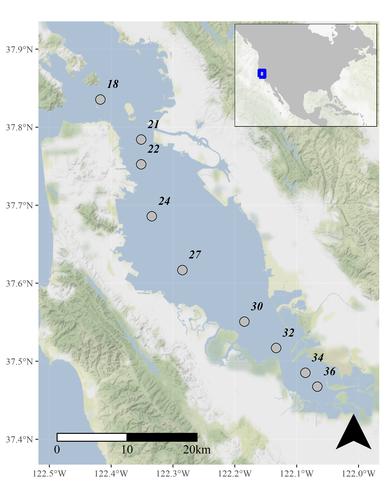
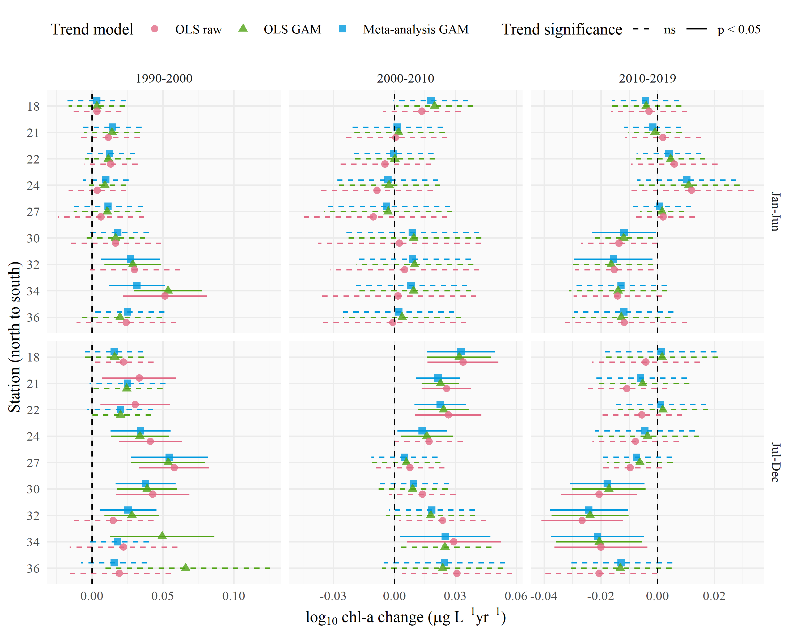

```{r setup, echo = F, warning = F, message = F, results = 'hide'}
# figure path, chunk options
knitr::opts_chunk$set(fig.path = 'figs/', warning = F, message = F, echo = F, cache = F, dev.args = list(family = 'serif'), dpi = 300, warning = F,
  fig.process = function(x) {
  x2 = sub('-\\d+([.][a-z]+)$', '\\1', x)
  if (file.rename(x, x2)) x2 else x
  })

# libraries
library(Jabbrev)
library(tidyverse)
library(wqtrends)
library(officer)
library(ggmap)
library(sf)
library(ggsn)
library(USAboundaries)
library(rworldmap)
library(hrbrthemes)
library(patchwork)
library(lubridate)
library(colorspace)

data(locs)
data(modprf)
data(seastrnd)
data(seastrnd2)
data(cmptrnd10)
data(modstr)
data(modslog_chl18)
data(modslog_chl24)
data(modslog_chl27)
data(modslog_chl32)
data(modslog_chl34)

source('R/funcs.R')

locs <- locs %>% 
  rename(station = Station)

nsims <- 1e4

# # extract bib entries from online
# bib_scrp('manu_draft.Rmd', 'refs.bib')
```

`r paste('Last manuscript build', Sys.time())`

```{r echo = F, cache = F, eval = F}
spelling::spell_check_files('manu_draft.Rmd')
```

# Abstract

Accurate and flexible trend assessment methods are valuable tools for describing historical changes in environmental monitoring datasets.  A key requirement is complete propagation of uncertainty through the analysis.  However, this is difficult when there are mismatches between time scales of monitoring data and trends of interest. Here, we propose a novel application of generalized additive models (GAMs) to model seasonal and multi-decadal changes in a long-term monitoring dataset of chlorophyll-a concentrations in the San Francisco Estuary.  GAMs have shown promise in water quality trend analysis to separate long-term (i.e., annual or decadal) trends from seasonal variation.  Our proposed methods estimate seasonal averages in a response variable with GAMs and then use the uncertainty measures with mixed-effects meta-analysis regression to quantify inter-annual trends that account for full propagation of error across methods.  We first demonstrate that nearly identical descriptions of temporal changes can be obtained using different smoothing splines for annual or seasonal components of the time series.  We then extract seasonal averages and their standard errors for an *a priori* time period within each year from the GAM results.  Finally, we demonstrate how across-year trends in seasonal averages can be modeled with mixed-effects meta-analysis regression that propagates uncertainties from the GAM fits to the across-year analysis. Overall, this approach leverages GAMs to smooth data with missing observations or varying sample effort across years to estimate seasonal averages and meta-analysis to estimate trends across years.  Methods are provided in the *wqtrends* R package.    

*Key words*: chlorophyll, Generalized Additive Models, meta-analysis, San Francisco Estuary, Trend analysis

# Introduction

Accurate quantification of trends must consider variation at different temporal scales when ignoring variation at one scale could lead to incorrect conclusions about variation at another scale. Many environmental monitoring programs collect temporally resolved but irregular time series data to quantify trends for regulatory, management, or research purposes.  The mismatch between the scales of monitoring versus analysis questions or management goals can present statistical challenges [@Urquhart98;@Cumming06;@Forbes18]. At short temporal scales typically less than a year, environmental systems exhibit variability caused by multiple factors (e.g., weather events, management, or seasonal changes).  Such fluctuations may not be related to inter-annual trends or may not be well-suited to multi-scale smoothing methods. Many trend analysis methods lack the flexibility to evaluate one to many independent variables in an extendable structure that accommodates hypothesis testing at different time scales of interest. In this paper, we develop methods to estimate across-year trends of within-year features, such as seasonal averages, while accounting for uncertainties across analysis steps.  

Existing methods that begin to address our objectives in water quality trend analysis can be generalized into four basic approaches: seasonal Kendall tests, seasonal trend decomposition (STL), weighted regression on time, discharge, and season (WRTDS), and generalized additive models (GAMs).  Seasonal Kendall tests or related non-parametric approaches have been used for decades in water quality trend assessments to identify monotonic changes over several years while accounting for the predictable patterns among seasons [@Hirsch82;@Helsel20]. @Wan17 showed that non-parametric approaches have been the most commonly used methods in long-term water quality trend analysis despite critical limitations.  For descriptive decomposition of long-term monitoring data, they assume seasonal patterns within years do not change, require regularly spaced or balanced data, do not include additional predictors to explain variation, and do not estimate a model that could be useful for other purposes.  Thus, while these non-parametric approaches have some degree of robustness to assess magnitude and direction of trends, they apply only to narrow goals.

The seasonal trend decomposition using loess (STL) decomposes a time series into additive components of a long-term trend, a seasonal pattern, and residuals [@Cleveland90;@Cloern10;@Stow15].  While useful and widely applied, this method also has important limitations.  STL decomposition does not incorporate explanatory variables besides time, it is defined more as an algorithm of statistical steps than as a coherent statistical model [e.g., @Wan17], and it does not usually estimate standard errors to allow hypothesis testing [but see @Hafen10].  STL methods may also over-simplify trends into stationary components that do not change over time, e.g., a seasonal estimate that is constant across years.  This limitation presents challenges when addressing questions relevant to long-term water quality data, such as timing of seasonal peaks that can suggest system response to changing  environmental conditions [@Cloern10;@Navarro12].

The weighted regression on time, discharge, and season (WRTDS) method addresses the problem of inflexibility in STL by using a more general local regression scheme [@Hirsch10;@Beck15;@Beck18b].  Designed for evaluating water quality in rivers where separating the effect of discharge on constituent concentration is important, WRTDS estimates a moving window regression model with components that allow parameters to vary smoothly in relation to both time and discharge.  This yields parameters that are specific to season, year, and flow regime.  The WRTDS approach is conceptually similar to local kernel smoothing methods, with specific application to explanatory variables relevant for water quality constituents (i.e., season, year, and discharge). Standard error estimates of predictions from WRTDS are available through a block bootstrap approach applied to the model results [@Hirsch15]. Although a useful addition to the original method [@Hirsch10], the approach requires extensive resampling using a previously fitted model.  Alternative methods that include standard error estimates simultaneously with model output may be preferred for intensive or more iterative applications.

Generalized additive models (GAMs) are central to this paper and form the basis of the fourth method to separate fluctuations on different time scales.  GAMs combine one or more smoothing splines to model patterns in data and may be seen as generalizing the concepts behind STL and WRTDS [@He06;@Morton08;@Pearce11;@Haraguchi15;@Murphy19]. The basis functions used to formulate GAMs can be customized based on expected patterns in the data. One example includes cyclic splines, which can be used to model seasonal patterns, and low-dimensional interactions.  GAMs have added flexibility because they can include both parametric (e.g., linear or quadratic) components and non-parametric (spline) components.  Multiple approaches have been developed to determine the optimal degree of smoothness.  These approaches are based on optimization of out-of-sample prediction error, which addresses a key concern around methods like WRTDS that do not have analogs for choosing optimal degrees of smoothing.  GAMs can also produce comparable results similar to those provided by WRTDS [@Beck17] and have readily obtainable uncertainty estimates. Further, GAMs have natural frequentist and Bayesian interpretations, are naturally extensible to include random effects (i.e., generalized additive mixed models or GAMMs), and have computationally efficient implementations [@Wood17].

GAMs have been applied previously to evaluate trends in water quality time series from long-term monitoring programs [@Haraguchi15;@Murphy19]. For example, @Murphy19 used GAMs to decompose water quality time series from Chesapeake Bay into long-term and seasonal trends [@Murphy19] and test trend hypotheses between two points in time.  Other studies of environmental time series with GAMs have addressed the use of transformed response data [@Yang20], serial correlation in high resolution data [@Morton08;@Yang20], and quantifying time lags in relationships between response and predictor variables [@Lefcheck17]. The study herein generalizes the approach to analyzing trends of seasonal spline features, describes the relationships among alternative spline formulations when spline flexibility is allowed to vary [@Wood03;@Wood17] rather than being constrained *a priori* for different time scales, and prioritizes full incorporation of uncertainty.  

Our motivating problem has several characteristics that are only partially addressed by previous methods and can further build on  GAMs as a starting point. Our general goal is to understand interannual changes in seasonally averaged water quality metrics, such as chlorophyll.  However, the seasonal average within each year must be robust to inconsistent sampling times and intervals, and any trend analysis must consider the uncertainties in seasonal averages.  The critical need is the ability to obtain an accurate estimate of uncertainty (e.g., a standard error) of seasonal averages, even with irregular sampling and serial correlation, which is common in time series data.  This paper develops the use of GAMs with mixed-effects meta-analysis [@Gasparrini12;@Sera19] to address multi-scale trend analysis questions for which seasonal Kendall tests and the more complex STL and WRTDS methods are not well-suited. Herein, "meta-analysis" refers to the use of seasonal features and their uncertainty estimates for trend analysis, as compared to meta-analysis for the aggregation of results from multiple studies for analysis of effect sizes or other synthesis results [i.e., @Lortie14].

We describe and demonstrate the proposed methods by analyzing water quality monitoring data from the southern portion of the San Francisco Estuary, California, USA.  Approximately twice-monthly monitoring has been conducted for several decades at fixed locations (stations) on the longitudinal axis of the Bay.  Analysis of these data is complicated by irregularities in timing and consistency of data collection, which can generate artifacts affecting simple seasonal averages of the data.  We were interested in questions such as: Are there significant trends in spring mean chlorophyll at multi-year time-scales?  At what across-year scale do summer-fall mean chlorophyll levels change? Is there a spatial difference in chlorophyll trends? We provide examples illustrating how these questions can be addressed using GAMs to estimate seasonal trends and evaluated between years using meta-analysis methods. This approach is new to environmental trend-detection problems and is provided in the *wqtrends* R package developed by the authors [@Beck21, available at https://tbep-tech.github.io/wqtrends, including an online dashboard for viewing results at https://nutrient-data.sfei.org/apps/SFbaytrends/].

# Methods

## Study area and data sources

The San Francisco Estuary (SFE) is the largest estuary on the Pacific Coast of North America.  Its watershed covers 200 thousand km$^2$ in the US state of California. Major freshwater inputs enter the system through the Sacramento-San Joaquin Delta complex upstream of Suisun Bay.  Salinity ranges from 0 to 15 ppt in the northern subembayments and from 5 to 35 ppt in southern subembayments closer to the Pacific Ocean, depending on the tidal cycle, effluent discharge from wastewater treatment plants, and stormwater runoff [@Cloern12].  An estimated 73.8 metric tons dy$^{-1}$ of inorganic nitrogen are discharged into the Bay, primarily from wastewater [@Novick14]. Agricultural runoff from the upper watershed contributes 30 metric tons dy$^{-1}$ of nitrogen to the SFE via the Delta.

Nitrogen and phosphorus levels in the SFE usually exceed concentrations that cause eutrophication in other estuaries.  However, the SFE has demonstrated resistance to eutrophication, which has been attributed to high concentrations of suspended sediment that reduce light penetration in the water column, low residence time caused by vigorous river flushing, and removal of primary producers by abundant suspension feeding bivalves [@Cole84;@Alpine88;@Jassby08;@Kimmerer14;@Lehman17].  The Regional Water Quality Control Board has showed renewed interest in understanding the potential for nutrient loading to negatively affect water quality for more southern areas of the SFE where harmful algal blooms, elevated summer-fall chlorophyll concentrations, and low dissolved oxygen concentrations began around 1999 (Figure \@ref(fig:obsdat)) [@Cloern20]. Although changes in the data are visually apparent, statistical analyses to quantify these changes have been insufficient particularly with respect to seasonal differences between years.

We evaluated near-surface chlorophyll (chl-a) data measured biweekly to monthly from 1990 to 2019 along the longitudinal axis of the SFE extending from Central Bay (stations 18-23), South Bay (stations 24-32), and Lower South Bay (stations 34-36) (Table \@ref(tab:sumtab), Figure \@ref(fig:sitemap)). Monitoring data were obtained from the SFE Research Program of the US Geological Survey [@Cloern16;@Schraga20]. Sampling frequency varied somewhat over time and by station. Approximate monthly or biweekly sampling with coverage of at least a decade is common for many long-term monitoring programs and is the intended use case for the methods herein. Every observation was included directly in the statistical models without spatial or temporal binning or averaging. Log$_{10}$-transformed chl-a was used for all analyses to meet assumptions of normally-distributed residuals. Methods for back-transformation of model results are provided in the supplement.

## GAMs with uncertainty propagation

We implemented our analysis in three stages.  First, we used a GAM to estimate a smooth temporal pattern in the raw data along with its uncertainty.  Second, we calculated a feature of interest from the estimated GAM, along with its propagated uncertainty. For this example, the seasonal averages were extracted, whereas other features could be the timing or magnitude of a seasonal peak, but those are not developed here.  Third, we used a mixed-effects meta-analysis to estimate trends and test hypotheses about the change in seasonal averages across years.  While meta-analysis methods arose from analyses of results from multiple studies, their distinguishing characteristic is propagation of uncertainty [@Gasparrini12;@Sera19].  Meta-analysis uses response data that includes standard errors (uncertainties) as needed to address our questions.

### First-stage analysis: GAM estimation

We considered four different GAMs to smooth the raw data across time. Although they can achieve similar fits, they do so by partitioning variation in the time series differently (Table \@ref(tab:modsumtab)). We discuss all four to clarify their relationships and interpretations.  All models were created using the `mgcv` R package [@Wood17;@RCT20], with utility functions included in the `wqtrends` package created by the authors [@Beck21]. 

The simplest GAM for this purpose is expressed as:

\begin{equation}
\textrm{Model S:} y_i \sim\ \beta_0 + f_1\left(cont\_year_i\right) + \epsilon_i
(\#eq:Smod)
\end{equation}

where `y` is the time series of interest, such as chl-a, for observation $i$ explained by an intercept-term $\beta_0$ and a smooth function $f_1()$ for `cont_year` as "continuous year" represented as a continuous numerical date (e.g., July 1st 2019 would be 2019.5). The $f_1()$ function is a smoothing spline composed of the sum of multiple "basis functions" describing the relationship of $cont\_year$ with $y$ [@Wood17].  The smoothing splines includes a user-specified number of knots or "connections" along the spline. The $\epsilon$ term is for model errors having normal distribution with mean zero and constant variance.

Smoothing was determined using generalized cross-validation (GCV, as implemented in `mgcv`), which approximately minimizes out-of-sample prediction error.  GCV works by penalizing the net curvature of a spline [@Wood04].  To allow GCV (or other alternatives) to work as intended, the number of knots that determine the maximum degrees of freedom chosen by the analyst must be sufficiently large so that the curvature penalty, rather than the number of knots, determines smoothness.  Results should not be sensitive to the number of knots; if they are, the number of knots should be increased.  In the examples below, we chose the number of knots for $f_1()$ as 12 times the number of years in the time series, i.e., one knot per month. If the data were too sparse to fit 12 knots per year, the number of knots was reduced by one knot per year until the model could be estimated (i.e., 12 * years, 11 * years, etc.).   

The next three spline formulations (Model SY, SYD, and SYDI) provide progressively increasing complexity in how spline terms compose a model to smooth the raw data.  Model SY describes the time series using a linear trend plus a spline for `cont_year`:

\begin{equation}
\textrm{Model SY:} y_i \sim\ \beta_0 + \beta_1 cont\_year_i + f_1\left(cont\_year_i\right) + \epsilon_i
(\#eq:SYmod)
\end{equation}

where equation \@ref(eq:SYmod) is the same as equation \@ref(eq:Smod) with the addition of a linear term for $cont\_year$ related to $y_i$ by the $\beta_1$ slope parameter.

This model is mathematically equivalent to model S (Table \@ref(tab:modstrtab)).  The $f_1()$ spline for `cont_year` includes an unpenalized linear trend, so a trend will be estimated in model S.  When `cont_year` is included explicitly as a linear term in model SY, `mgcv` adjusts the basis functions for the spline to exclude the linear term, thereby not over-parameterizing the model. Whereas an estimated linear trend in `cont_year` and its uncertainty can be extracted from the fitted spline in model S, model SY provides this trend directly, giving the equivalent result.  Further, package `mgcv` can penalize linear trends in splines to provide a method for variable selection (option `select = TRUE`), such as when numerous splines are included in the model formulation for variables that may or may not be important.  For our approach, this option is not used and all models specify `select = FALSE`.  Details in the supplement explain this justification. 

Model SYD adds an average within-year cyclic pattern as a separate spline:

\begin{equation}
\textrm{Model SYD:} y_i \sim\ \beta_0 + \beta_1 cont\_year_i + f_1\left(cont\_year_i\right) + f_2\left(doy_i) + \epsilon_i
(\#eq:SYDmod)
\end{equation}

where equation \@ref(eq:SYDmod) is the same as equation \@ref(eq:SYmod) with the addition of a smoothing spline for "day-of-year" ($doy$, i.e., Julian date, a count starting January 1 for each year).  The $f_2()$ spline is cyclic (using `bs = 'cc'` in `mgcv`) to constrain the start and end at the same value.  A user-specified number of knots is also included in $f_2()$. While model SYD is not mathematically equivalent to models S and SY, it should produce nearly identical results.  The `doy` spline in model SYD gives the average within-year pattern and changes the interpretation of the `cont_year` spline to represent smoothed deviations from that pattern.

Models S, SY, and SYD can all potentially extract a similar signal from the raw data (Table \@ref(tab:modstrtab)).  What differs between the models is the allocation of penalties for curvature used to determine smoothness for each spline.  In model SYD, there are separate penalties for the two splines, as compared to S and SY that include penalties only for the `cont_year` spline. This is important because variation in the response variable can be differently attributed to each spline depending on the model, even while the sum of components for each model produces similar results between models.  Our goal is to extract seasonal averages from the fitted time series, which is not sensitive to different allocation of penalties among the splines in each model.  

If the fits were to differ substantially between model SYD and models S or SY, an interpretation could be difficult because the penalties for smoothing splines based on curvature are heuristic [@Wood17]. For example, if a lower AIC is achieved in one model compared to another, assuming both use sufficient knots, this may just reflect the outcome of alternative penalization heuristics implied by the different formulations and does not imply one model fit is better. In the examples here, model SYD achieves nearly identical fits to model S or SY, where the latter by definition also achieve identical fits.

Model SYD has the appealing feature that, if some parts of some years have limited data, model SYD will impute an average seasonal pattern with the `doy` spline, thereby considering data from the same period in other years in the prediction of the period with missing data. However, an interpretation of these imputations may be challenging.  For example, the spring chl-a peak is a notable feature every year in the SFE.  If the peak occurs at the same time every year but the magnitude varies, then the average within-year pattern can be interpreted as the average magnitude. However, if the magnitude is the same but the timing varies across years, then the magnitude of the average peak cannot be similarly interpreted and instead underestimates the magnitude that usually occurs.  Moreover, the width or duration of the peak will be longer than typically occurs in a given year.

Finally, the raw data can be smoothed using a bivariate spline representing an interaction between `cont_year` and `doy`. This can be expressed as:

\begin{equation}
\textrm{Model SYDI:} y_i \sim\ \beta_0 + \beta_1 cont\_year_i + f_1\left(cont\_year_i\right) + f_2\left(doy_i) + f_3\left(cont\_year_i, doy_i\right) + \epsilon_i
(\#eq:SYDImod)
\end{equation}

where equation \@ref(eq:SYDImod) is the same as equation \@ref(eq:SYDmod) with the addition of a tensor-product smoothing spline (`ti()` in `mgcv`) that varies smoothly as a function of both $cont\_year$ and $doy$.  Both $cont\_year$ and $doy$ include their own number of knots, such that the total number of knots for the spline is the product of the two. The need for sufficient knots in SYDI can be satisfied either by sufficiently large values for $f_3()$ or a sufficiently large value for knots in $f_1()$ and $f_2()$, but not both given limits on the model degrees of freedom.

Following the rationale above, the relationship of model SYDI to model S is similar to that of model SYD to model S.  Model SYDI differs from model S to a greater extent than model SYD, but all of the splines use the same inputs to smooth the same data.  The univariate splines in `cont_year` and `doy` will likely not capture as much variation in model SYDI compared to model S given the fewer knots that are available to the former.  The tensor-product spline represents an interaction by allowing the pattern in `cont_year` to vary by `doy` and vice-versa.  The interaction term in model SYDI provides an appearance that this model is fundamentally different from those provided by the other models.  However, models S, SY, and SYD all allow within-year fluctuations to vary across years by allowing a spline to be fit through the entire time series.  Although model SYDI is the only model that includes an explicit interaction term, all of the models support the interaction conceptually. By providing this term with sufficient knots, the raw data can be fully smoothed with model SYDI to a similar degree as for the other models.  However, a very large number of knots in both the `cont_year` spline *and* in both dimensions of the interaction spline is impossible to achieve. The distinct aspect of model SYDI is the anticipation that within-year fluctuations will vary smoothly from year to year, which is unlikely for the SFE data and chl-a dynamics in many estuaries because bloom size typically varies between years. Thus, the conceptual motivation for model SYDI and its practical application are not supported for this analysis.

@Murphy19 used spline formulations for Chesapeake Bay water quality related to those proposed here, but for different goals and with different handling of smoothness.  They evaluated a "`gam0`" with only a cyclic spline for `doy` and linear `cont_year` terms, a "`gam1`" like our SYD, and a "`gam2`" like our SYDI.  In application, only "`gam2`" was used, including the addition of splines as functions of hydrologic variables to account for finer-scale variation. Murphy et al. allowed a maximum number of knots for the `cont_year` spline ($f_1()$) of 2/3 times the number of years and do not explicitly consider the number of knots in the interaction spline, following an *ad hoc* allocation of variation in the data to different components based on previous interpretations of water quality dynamics in the system. Constraining splines with insufficient knots could inflate Type I error rates for temporal changes and we seek to lower this risk by increasing the upper limit for the knots for the $f_1()$ term.  Finally, @Murphy19 present large AIC differences between their spline formulations.  We instead emphasize that, given sufficient knots, the models represent alternative formulations of conceptually similar explanations for the data and yield similar fits (Table \@ref(tab:modstrtab)), resulting in near ties for AIC between models. 

We visually compare chl-a estimates from models SY, SYD, and SYDI to emphasize that similar fits can be achieved by all of the presented models (Figure \@ref(fig:modsumfig), SY is identical to S and is not shown).  Models S, SYD, and SYDI were fit to chl-a data from station 34 using a sufficiently high number of knots for the respective splines for each model.  Predictions by day of year from each model are visually similar (Figure \@ref(fig:modsumfig)a) and closely follow the 1:1 line (Figure \@ref(fig:modsumfig)b).  However, when contrasting the estimates using only the continuous year smoother ($f_1()$), the fits differ substantially because of how each model allocates variation to the splines.  These results are also reflected in differences in the effective degrees of freedom among the additive components of each model (Table \@ref(tab:modstrtab)). Accordingly, even though the models differ by which structural component describes variation in the chl-a time series, they provide similar predictions. 

For all results, model S was used with enough knots in $f_1()$ to evaluate chl-a trends across the monitoring stations in the SFE.  This model was chosen because of the relatively faster processing time to fit the model, while providing nearly identical explanatory power as compared to the other models (Table \@ref(tab:modstrtab)). 

### Second-stage analysis: Seasonal features with uncertainties

\newcommand{\hm}{\hat{\mu}}
\newcommand{\hmt}{\hat{\mu}_t}
\newcommand{\mt}{\mu_t}
\newcommand{\hmr}{\hat{\mu}_r}
\newcommand{\hshmt}{\hat{\sigma}_{\hat{\mu}, t}}
\newcommand{\hshmr}{\hat{\sigma}_{\hat{\mu}, r}}
\newcommand{\hshm}{\hat{\sigma}_{\hat{\mu}}}
\newcommand{\hsshm}{\hat{\sigma}^2_{\hat{\mu}}}
\newcommand{\hsshmt}{\hat{\sigma}^2_{\hat{\mu}, t}}
\newcommand{\bX}{\mathbf{X}}
\newcommand{\hby}{\hat{\mathbf{y}}}
\newcommand{\hbb}{\hat{\boldsymbol{\beta}}}
\newcommand{\hShb}{\hat{\Sigma}_{\hat{\beta}}}
\newcommand{\hShy}{\hat{\Sigma}_{\hat{\mathbf{y}}}}
\newcommand{\sbs}{\sigma_b^2}

In the second-stage analysis, we estimated a seasonal average, such as the mean spring chl-a concentrations, with the associated uncertainty in each year.  We defined $\mu_t$ as the seasonal average in year $t$, $\hmt$ as an estimate of $\mu_t$, and $\hshmt$ as the estimated standard error of $\hmt$. The season includes $n$ days.  For simplicity, the following text omits subscript $t$.

Point estimates of response values for the fitted GAM take the form $\hby = \bX \hbb$, where $\hbb$ is the vector of parameter estimates and $\mathbf{X}$ is a model matrix of explanatory variables, including spline basis function values.  Vector $\hbb$ includes both fixed effect parameters and spline parameters, and $\bX$ contains columns corresponding to each.  For example, using model SY, if a point estimate for chl-a is needed for a single day, given as `cont_year` = $r$, then $\bX$ would have a row with $1$ in the first column (for the intercept parameter), $r$ (for the linear time trend) in the second column, and an evaluation of each spline basis function at $r$ in the remaining columns. The number of spline basis functions is related to the number of knots. Note that $r$ can be any time, not necessarily the time of an observation.

To obtain a vector, $\hby$, of fitted point estimates for every day in a season, $\bX$ would have one row for each day.  Here, the seasonal averages used in our examples were calculated at the resolution of days.  The estimated spline yields both $\hbb$ and $\hShb$, an estimate of the covariance matrix of the sampling distribution of $\hbb$.  The scalar standard errors of $\hbb$ are the square roots of the diagonal elements of $\hShb$, whereas the off-diagonal elements are the correlations among the elements of $\hbb$.  Since parameter estimates are correlated, the covariance of $\hby$ is $\hShy = \bX \hShb \bX^T$.

The estimated seasonal average was calculated from the vector of daily values for each of the $n$ days in the season of interest with $\hm = A^T \hby$, where $A^T$ is a row vector with all values equal to $1/n$.  The variance of $\hm$ is $\hsshm = A^T \hShy A$ and standard error is $\hshm$.  Each of these estimates are from the approximate multivariate normality of the sampling distribution of $\hbb$.

### Third-stage analysis: Trend analysis of seasonal features with uncertainties

In stage three of the analysis, we used a meta-analysis method to evaluate linear trends across years of seasonal-average water quality, characterized by the within-year means ($\hmt$) and their standard errors ($\hshmt$) that we estimated in stage two of the analysis. This analysis provided a direct answer to the question: Is there a significant linear trend across a group of years in a seasonal average?  For example, is there a trend in the spring chl-a average from 1990 to 2000? This question can also be posed in a moving-window manner across a time series (e.g., spring average trend from 1990-2000, 1991-2001, etc.). For all analyses, the response data of interest are $\hmt$, $t = 1, \ldots, N$, with their associated standard errors, $\hshmt$.  $N$ is the number of years of the study. 

A mixed-effects meta-analysis model can estimate linear trends when each observation has an associated standard error, which is the case with our estimates $\hmt$ and $\hshmt$.  Differences in standard errors, which may result from different monitoring effort between years, are explicitly considered in the analysis.  The model can be expressed using notation similar to @Sera19:

\begin{equation}
\hmt = \beta_0 + \beta_t t + b_t + \epsilon_t
(\#eq:mixmet)
\end{equation}

where $\beta_0$ is the intercept, $t$ is the year, $\beta_t$ is the slope, $b_t$ is the random effect for year $t$, and $\epsilon_t$ is the residual for year $t$. Accordingly, the seasonal average for year $t$ is $\mu_t = \beta_0 + \beta_t t + b_t$.  The "residual", $\epsilon_t$, represents estimation error in $\hmt$, namely $\hmt - \mt$.  The residuals are assumed to be independent and normally distributed with mean 0 and variance $\hsshmt$, where the latter is estimated from the calculations above.  The random effect, $b_t$, is the difference between $\mt$ and $\beta_0 + \beta_t t$ and is considered the "residual" in the sense of unexplained variation not due to the estimation error.  The random effect follows a normal distribution with mean 0 and variance, $\sbs$, to be estimated.

We estimated the model (equation \@ref(eq:mixmet)) using the *mixmeta* package in R [@Sera19]. Results from *mixmeta* have a similar interpretation as those from regression analysis, but parameter estimates and their standard errors incorporate the known standard errors of the response values. The default estimation method for *mixmeta*, restricted maximum likelihood (REML), was used. The meta-analysis models were applied to a chosen sequence or "window" of years for estimating the linear trend.

### Trend comparisons

The above methods were applied to each station by evaluating changes in seasonal averages from January to June and July to December for approximately ten year moving windows from 1991 to 2019. The choice of within-year seasons are relevant to phytoplankton bloom phenology in the SFE [@Cloern20]. The moving-window approach applied the meta-analysis to each decadal window (e.g., 1991-2001, 1992-2002, etc.), allowing changes in slope and its significance to be interpreted as the window is shifted one year at a time.  We interpret the slope as representative for the central year for each block, but a predictive trend for the final year of the window could also be interpreted. For some results, we focus on the windows 1991-2000, 2000-2010, and 2010-2019. 

Finally, trend results from the meta-analysis regression method for each season and different time periods were compared to "naive" across-year regressions that do not propagate uncertainty to demonstrate how different and potentially misleading conclusions can be obtained.  Trend estimates were compared to 1) trends from ordinary least squares (OLS) regression applied to seasonal averages from the raw data and 2) trends from OLS regression applied to GAM seasonal averages. Select examples were used where differences were pronounced to illustrate false positive or negatives that may occur with alternative methods. This analysis was then applied to all stations.

# Results

## Model performance and predictions

```{r, eval = T}
aver2 <- round(100 * mean(modprf$R2), 0)
minr2 <- round(100 * min(modprf$R2), 0)
maxr2 <- round(100 * max(modprf$R2), 0)
minst <- modprf$station[which.min(modprf$R2)]
maxst <- modprf$station[which.max(modprf$R2)]
```

Model predictions for chl-a trends across all stations had an average R-squared value of `r aver2`%  (Table \@ref(tab:modprftab)) and ranging from `r minr2`% (station `r minst`) to `r maxr2`% (station `r maxst`). GAM predictions from north to south showed more pronounced annual and seasonal changes in chl-a towards the more southern stations (Figures S1-S9). All the models suggested 1) increasing chl-a from 1990 until 2005 to 2010, followed by decreasing chl-a until the end of the record in 2019, 2) a spring chl-a peak, particularly at southern stations, and 3) a fall chl-a peak that was smaller than the spring peak.  The magnitude of the fall peak did not vary noticeably by location (Figures S1-S9).  

## Inter-annual trend estimates

Estimates of linear trends in seasonal averages across roughly ten-year windows for different seasons are shown for station 34 (Figure \@ref(fig:trnddat)). Plots a-c show trends in January to June averages while plots d-f show trends in July to December averages.  The seasonal trend analyses showed that January to June chl-a increased (log$_{10}$ chl-a slope 0.03 $\mu$g L$^{-1}$ yr$^{-1}$, 0.01-0.05 95\% confidence interval) from 1991 to 2000, whereas July to December chl-a did not change significantly.  Chl-a also increased from 2000 to 2010, but only for July to December (log$_{10}$ slope 0.03, 0-0.05 95\% confidence interval).  Finally, chl-a decreased from 2010 to 2019 but only for July to December (log$_{10}$ chl-a slope -0.02, -0.04-0 95\% confidence interval).  Because the trends were confined to certain times of the year, the seasonal estimates provide additional information beyond coarser estimates that cover the entire year.  

Temporal changes varied among regions of the Bay and were more pronounced at southern stations.  Figure \@ref(fig:trndmap) shows results from similar analyses as those in Figure \@ref(fig:trnddat), but applied to all stations. Mixed-effects meta-analysis regressions applied to seasonal averages showed that increases (based on $p < 0.05$) for the January to June period were observed at stations 32 and 34 from 1991 to 2000; decreases were observed at stations 30 and 32 from 2010 to 2019. For the July to December period, increases were observed at stations 24, 27, 30, and 32 from 1991 to 2000 and stations 18, 21, 22, 24, and 34 from 2000 to 2010, whereas decreases were observed at stations 30, 32, and 34 from 2010 to 2019.

Results from a ten-year moving window comparison of seasonal trends provided additional context on when significant changes were occurring at each station (Figure \@ref(fig:winchg)).  Trends were observed at all stations that followed a general pattern of increases early in the record followed by decreases later in the record.  Increases and decreases were observed in both the January to June and July to December seasonal periods, with some notable exceptions.  In particular, the most southern stations (32, 34, 36) had increasing trends prior to 2005 that were more often observed in the July to December period.  Additionally, chl-a at the more northern stations has not changed in recent years for both seasonal periods. For most stations and seasonal periods, a change from increasing to decreasing chl-a occurred around 2007.

## Importance of uncertainty propagation 

Results showing trend estimates from meta-analysis on GAM seasonal estimates provided different conclusions than those from either OLS regression through seasonal averages from raw data (Figure \@ref(fig:trndcmpex) row 1) or OLS regression through GAM estimates without uncertainty propagation (Figure \@ref(fig:trndcmpex) row 2). Figure \@ref(fig:trndcmpex)a shows trend estimates for station 30 for January to June averages from 2000 to 2010.  Only the meta-analysis regression results show a trend in this example (based on $p < 0.05$).  The OLS regression on observed estimates (top plot) and OLS regression on GAM estimates (middle plot) did not identify trends.  Figure \@ref(fig:trndcmpex)b shows trend estimates station 34 for July to December averages from 1991 to 2000.  Unlike the first example, only the middle figure shows a trend, whereas the top and bottom plots do not show trends.  In both cases, only the meta-analysis results give reliable conclusions because of full propagation of uncertainty across methods. Even in cases where the p-value threshold is not of interest, the confidence intervals from the alternative methods will be inaccurate.

Applying the same comparison to all stations showed that different trend analysis methods provided conflicting information on the magnitude and significance of the seasonal chl-a changes in each decade (Figure \@ref(fig:trndcmp10)).  In many cases, the slope estimates were similar in magnitude, with some exceptions at the more southern stations where the OLS estimates suggested a larger trend than the meta-analysis methods. More importantly, differences in the magnitude of the confidence intervals between the OLS models applied to the GAM averages and the meta-analyses were also observed, reflecting the ability of the latter to more accurately assess significance of trends by accounting for uncertainty in the average estimates.

# Discussion

Propagation of uncertainty from within-year features of estimated GAMs to across-year trends using mixed-effects meta-analysis is a new approach that can address different questions than previous methods. Our approach has several advantages over more conventional approaches for analysis of water quality data from long-term monitoring programs. GAMs are capable of modelling time series with missing observations or irregular sampling which can complicate trend assessment and comparison of trends between locations [@Junninen04;@Racault14].  As noted above, non-parametric approaches (i.e., seasonal Kendall tests) are by far the most common trend analysis methods applied to long-term water quality data [@Hirsch82;@Helsel20].  These methods only assess the direction and significance of comparisons between year pairs, and importantly, do not account for full propagation of uncertainty inherent in raw observations if the raw data are aggregated to meet test requirements.  Aggregation of raw data, e.g., averaging of observations within a year or season to comply with the requirements of Kendall tests, risks loss of information by removing variation between observations at smaller time scales. The logical outcome is increased risk of incorrect conclusions from test results.

Incorrect conclusions on trends can have dramatic consequences for regulated parties under existing water quality compliance frameworks [@Smith01]. Our examples in Figures \@ref(fig:trndcmpex) and \@ref(fig:trndcmp10) demonstrate these risks if propagation of uncertainty from raw observations across methods is unaccounted for in trend assessment.  Our assessment of trends using OLS regression applied to seasonal averages from the raw observations is effectively like averaging results within a year and applying a simple Kendall test. In many cases the results may be similar, but loss of information with averaging can lead to increased Type I or II error rates depending on characteristics of the raw data and the method used for their evaluation [@Shabman03].  Moreover, use of methods that fully account for uncertainty in sampling design is recommended over more conventional analyses given the certainty of conclusions in the former.  Our examples demonstrated the increased potential for incorrect conclusions at specific monitoring locations and at much larger spatial scales across all stations if simpler trend analyses are used. Even though simpler methods may produce the same result, particularly with frequent sampling and similar effort between years, decision-makers require certainty of conclusions when incorrect results can have major consequences for environmental management.

Results here also show that GAM structure (i.e., choice of smoothing terms) was less important than allowing the model sufficient freedom to fit the data. This is an important conclusion that provides guidance on how GAMs could be used to model time series from long-term environmental monitoring programs.  Models with separate smoothers for continuous year and day of year can produce nearly identical results in the predicted trends if the knots are sufficiently high to allow the GAMs to be fit as intended by the methods in the mgcv package (Figure \@ref(fig:modsumfig)).  The approach presented here leverages the ability of GAMs to objectively estimate smoothed trends across years by identifying an optimal level of smoothing using generalized cross-validation to extract an underlying signal in the observed data [@Wood04;@Wood17]. 

The underlying cross-validation methods used by GAMs in the mgcv package also reduce the decisions that may be necessary for the implementation of alternative trend assessment methods.  For example, WRTDS and similar smoothing approaches (e.g., LOESS) require decisions on appropriate window widths or bandwidths to define the neighborhood of observations for smoothing [@Hirsch10;@Wan17].   This is especially problematic for policy analysis or regulatory decisions if the results change based on arbitrary decisions of the analyst.  Because these decisions are not needed for GAMs, the results can be considered a more objective and potentially "true" signal of actual trends that are minimally influenced by process or observation error present in the raw data.  

## Future work

Additional work could be conducted to further strengthen the conclusions based on trends from meta-analysis regression applied to the GAM seasonal averages.  Our third stage analyses require *a priori* decisions on long-term time scales of interest and future work could generalize these choices.  Although there are undoubtedly many scenarios where years of interest can be chosen objectively by the needs of an analysis (e.g., regulatory compliance periods, time since management intervention), a more general question of "when" changes occur independent of user decisions is also important to address.  Additional methods could be developed using objective criteria to identify inflection points or other important periods where changes occur independent of a user choice.  Assessing water quality changes beyond an evaluation of seasonal averages could also be possible with our approach, such as assessing changes in the timing or magnitude of a seasonal peak across years.

Additional explanatory variables could be identified that may be associated with the trend after the trend has been adequately described.  This information has obvious implications for management decisions on factors that influence water quality changes, e.g., wastewater treatment upgrades, large-scale climatic factors, or flow regulation practices.  An advantage of GAMs is their flexibility in including alternative predictors, such that the significance of a predictor or comparison of nested models with and without different predictors can provide evidence of which predictors are driving the observed trends [@Wood02;@Zuur09]. In such cases, considerations of model structure can have direct implications on conclusions given how GAMs could be used to assess different questions. Our goal was to describe chl-a changes relative to time, where the predictors were variations on a general theme (e.g., season vs. year).  This is a different application from using GAMs with predictors selected to explain those changes over time.  Therefore, using our approach to evaluate explanatory variables will require testing of different model structures.

Finally, the evaluation of trends for alternative water quality variables in addition to chl-a is a simple and logical extension of the methods proposed in this study.  The long-term monitoring program maintained by USGS includes multiple parameters in addition to chl-a that can provide additional context into broader water quality trends in the SFE [@Cloern16;@Schraga20]. These parameters include salinity, temperature, light attenuation, dissolved oxygen, suspended particulate matter, and dissolved inorganic nutrients, which collectively can be used to provide a broader understanding of potential eutrophication patterns or ecosystem shifts at seasonal and multi-decadal scales.  Chl-a measurements can also be used to estimate gross primary production to assess process rates that may be more indicative of system function [@Jassby02;@Cloern07].  The open-source wqtrends R package [@Beck21] developed for this manuscript can be used for these analyses to provide additional insight into potential drivers of water quality change in the SFE and other estuarine systems.

# Acknowledgments

We thank the staff of the US Geological Survey that collect and maintain long-term monitoring data in San Francisco Bay.  This work benefited from discussions with the San Francisco Bay Nutrient Technical Workgroup and Steering Committee.  We thank James D. Hagy III for reviewing an earlier draft of this manuscript.

# Figures

```{r, results = 'hide', message = F}
# treatment colors
cls1 <- RColorBrewer::brewer.pal(9, 'Greys')
cls2 <- RColorBrewer::brewer.pal(3, 'BrBG')

toplo1 <- rawdat %>%
  filter(param %in% 'chl') %>% 
  filter(mo %in% c('Aug', 'Sep', 'Oct', 'Nov', 'Dec')) %>% 
  # filter(station %in% c(24, 27, 30, 32)) %>% 
  group_by(yr) %>% 
  mutate(Median = median(value, na.rm = TRUE)) %>% 
  ungroup() 

toplo2 <- rawdat %>%
  filter(param %in% 'chl') %>% 
  mutate(
    yrcat = case_when(
      yr < 2000  ~ '1990-2000', 
      yr >= 2000 & yr < 2010 ~ '2000-2010', 
      yr >= 2010 ~ '2010-2019'
    ), 
    yrcat = factor(yrcat, levels = c('1990-2000', '2000-2010', '2010-2019'))
  )

ylab <- expression(paste("Chl-a (", italic(mu), "g ", L^-1, ")"))

p1 <- ggplot(toplo1, aes(x = yr, y = value, fill = Median, group = yr)) + 
  geom_violin(draw_quantiles = 0.5)  + 
  scale_fill_gradientn(colours = cls1) + 
  scale_y_log10() +
  theme_minimal(base_family = 'serif') +
  theme(
    axis.title.x = element_blank()
  ) +
  labs(
    y = ylab, 
    subtitle = '(a) Annual summer/fall concentrations'
  )

p2 <- ggplot(toplo2, aes(x = mo, y = value, fill = yrcat)) + 
  geom_violin(draw_quantiles = 0.5)  + 
  scale_y_log10(ylab) +
  facet_wrap(~yrcat, ncol = 3) + 
  theme_minimal(base_family = 'serif') +
  scale_fill_manual(values = cls2) +
  theme(
    legend.title = element_blank(), 
    legend.position = 'none', 
    axis.title.x = element_blank(), 
    axis.text.x = element_text(angle = 45, hjust = 1), 
    strip.background = element_blank()
  ) +
  labs(
    y = ylab, 
    subtitle = '(b) Monthly concentrations by decade'
  )

p <- p1 + p2 + plot_layout(ncol = 1)

# save as tiff
tiff('submission/Fig1.tiff', height = 7, width = 8, family = 'serif', units = 'in', res = 600, compression = 'lzw')
print(p)
dev.off()

# save as png
png('figs/obsdat.png', height = 7, width = 8, family = 'serif', units = 'in', res = 400)
print(p)
dev.off()
```
```{r obsdat, fig.cap = "Observed chl-a concentrations for all stations in central and south San Francisco Estuary (18-36, Figure \\@ref(fig:sitemap)), with (a) annual summer/fall concentrations (Aug - Dec) and (b) monthly concentrations by decade."}
knitr::include_graphics('figs/obsdat.png')
```

```{r, results = 'hide', message = F}

# for buffer, see https://github.com/r-spatial/sf/issues/1692
sflocs <- locs %>% 
  st_as_sf(coords = c('lon', 'lat'), crs = 4326)

# for inset
states <- us_states() %>% 
  filter(!name %in% c('Alaska', 'Hawaii', 'Puerto Rico'))
castate <- states %>% 
  filter(name %in% 'California')
continent <- getMap(resolution = 'low') %>% 
  st_as_sf %>% 
  filter(continent %in% c('North America', 'South America')) %>% 
  st_transform(crs = st_crs(states)) %>% 
  st_make_valid() %>% 
  st_buffer(dist = 0) %>% 
  st_union()
locbuff <- st_buffer(sflocs, dist = units::set_units(0.1, degree))
locbuff2 <- st_buffer(sflocs, dist = units::set_units(0.07, degree))
insetbb <- st_buffer(sflocs, dist = units::set_units(1.5, degree)) %>% 
  st_bbox() %>% 
  st_as_sfc(crs = 4326)
statebuff <- st_buffer(states, dist = 10)
insetylim <- st_bbox(statebuff)[c('ymin', 'ymax')]
insetxlim <- st_bbox(statebuff)[c('xmin', 'xmax')]

# basemap
dat_ext <- unname(st_bbox(locbuff))
bsmap1 <- get_stamenmap(bbox = dat_ext, maptype = 'terrain-background', zoom = 11)

# change opacity of basemap
mapatt <- attributes(bsmap1)
bsmap1_transparent <- matrix(adjustcolor(bsmap1, 
                                         alpha.f = 0.75), 
                             nrow = nrow(bsmap1))
attributes(bsmap1_transparent) <- mapatt

# basemape plus stations
p1 <- ggmap(bsmap1_transparent) +
  geom_sf(data = sflocs, inherit.aes = F, col = 'black', pch = 21, fill = 'grey', size = 4) + 
  geom_text(data = locs, aes(x = lon + 0.02, y = lat + 0.02, label = station), fontface = 'bold.italic') + 
  theme(
    axis.title = element_blank()
  ) + 
  north(locbuff, scale = 0.15, symbol = 10, location = 'bottomright') +
  scalebar(locbuff2, dist = 10, dist_unit = 'km', location = 'bottomleft', transform = T, 
           st.color = 'black', border.size = 0.5, st.dist = 0.02, st.size = 4) 

p2 <- ggplot() + 
  geom_sf(data = continent, fill = 'grey', colour = 'grey') + 
  # geom_sf(data = states, fill = 'grey', colour = 'grey') + 
  geom_sf(data = insetbb, fill = NA, color = 'blue', size = 1.5) +
  coord_sf(ylim = insetylim, xlim = insetxlim) + 
  theme_void() +
  theme( 
    panel.background = element_rect(fill = '#FFFFFF99', colour = 'white'), 
    panel.border = element_rect(colour = 'black', fill = 'transparent')
  )

# final map
p <- p1 + 
  inset(ggplotGrob(p2), xmin = -122.2, xmax = -121.97, ymin = 37.75, ymax = 37.983)

# save as tiff
tiff('submission/Fig2.tiff', height = 6.5, width = 5, units = 'in', family = 'serif', res = 600, compression = 'lzw')
print(p)
dev.off()

# save as png
png('figs/sitemap.png', height = 6.5, width = 5, units = 'in', family = 'serif', res = 400)
print(p)
dev.off()
```
```{r sitemap, fig.cap = 'Station locations in the central and south San Francisco Estuary used for analysis.  See Table \\@ref(tab:sumtab) for station descriptions.  Full dataset described in @Schraga20.'}

```

```{r, results = 'hide'}
# use previously fitted list of models
mods <- modstr[c(1, 3, 4)]

thm <-theme_minimal() + 
  theme(
    legend.title = element_blank(),
    legend.position = 'right', 
    panel.grid.minor = element_blank()
  )
lncol <- 'tomato1'
alph <- 0.5
ylm <- c(0.8, 110)

p1a <- show_prddoy(mods[[1]], ylab = 'S: Chl-a (ug/L)', size = 0.8, alpha = 0.8) + 
  guides(colour = ggplot2::guide_colourbar(barheight = 15, barwidth = 1)) +
  scale_colour_gradient(low = "white", high = "black") + 
  coord_cartesian(ylim = ylm) +
  theme_minimal() + 
  theme(
    legend.position = 'none', 
    axis.title.x = element_blank()
  ) +
  labs(
    title = '(a) Model predictions by day of year'
  )
p1b <- show_prddoy(modstr[[2]], ylab = 'SYD: Chl-a (ug/L)', size = 0.8, alpha = 0.8) + 
  guides(colour = ggplot2::guide_colourbar(barheight = 15, barwidth = 1)) +
  scale_colour_gradient(low = "white", high = "black") + 
  coord_cartesian(ylim = ylm) +
  theme_minimal() + 
  theme(
    legend.position = 'none'
  )
p1c <- show_prddoy(mods[[3]], ylab = 'SYDI: Chl-a (ug/L)', size = 0.8, alpha = 0.8) + 
  guides(colour = ggplot2::guide_colourbar(barheight = 8, barwidth = 1)) +
  scale_colour_gradient('Year', low = "white", high = "black") + 
  coord_cartesian(ylim = ylm) +
  theme_minimal() + 
  theme(
    legend.position = 'right', 
    axis.title.x = element_blank()
  )

p1 <- p1a + p1b + p1c + plot_layout(ncol = 3, widths = c(1, 1, 1))
prds <- lapply(modstr, anlz_prd, annual = T) %>% 
  enframe('model', 'dat') %>%
  unnest('dat')

toplo2 <- prds %>% 
  select(model, date, value) %>% 
  spread(model, value)

toplo3 <- prds %>% 
  select(model, date, annvalue) %>% 
  spread(model, annvalue)

p2a <- ggplot(toplo2, aes(x = S, y = SYD)) + 
  geom_point(alpha = alph) +
  coord_trans(x = 'log10', y = 'log10', xlim = ylm, ylim = ylm) + 
  scale_y_continuous(breaks = c(1, 10, 100))  +
  scale_x_continuous(breaks = c(1, 10, 100)) +
  geom_abline(intercept = 0, slope = 1, color = lncol) +
  thm + 
  labs(
    title = '(b) Estimated chl-a between models'
  )
p2b <- ggplot(toplo2, aes(x = SYD, y = SYDI)) + 
  geom_point(alpha = alph) + 
  coord_trans(x = 'log10', y = 'log10', xlim = ylm, ylim = ylm) + 
  scale_y_continuous(breaks = c(1, 10, 100))  +
  scale_x_continuous(breaks = c(1, 10, 100)) +
  geom_abline(intercept = 0, slope = 1, color = lncol) +
  thm
p2c <- ggplot(toplo2, aes(x = S, y = SYDI)) + 
  geom_point(alpha = alph) + 
  coord_trans(x = 'log10', y = 'log10', xlim = ylm, ylim = ylm) + 
  scale_y_continuous(breaks = c(1, 10, 100))  +
  scale_x_continuous(breaks = c(1, 10, 100)) +
  geom_abline(intercept = 0, slope = 1, color = lncol) +
  thm

p2 <- p2a + p2b + p2c + plot_layout(ncol = 3)


p3a <- ggplot(toplo3, aes(x = S, y = SYD)) + 
  geom_point(alpha = alph) + 
  coord_trans(x = 'log10', y = 'log10', xlim = ylm, ylim = ylm) + 
  scale_y_continuous(breaks = c(1, 10, 100))  +
  scale_x_continuous(breaks = c(1, 10, 100)) +
  geom_abline(intercept = 0, slope = 1, color = lncol) +
  thm +
  labs(
    title = '(c) Estimated smoother for continuous year between models'
    )
p3b <- ggplot(toplo3, aes(x = SYD, y = SYDI)) + 
  geom_point(alpha = alph) + 
  coord_trans(x = 'log10', y = 'log10', xlim = ylm, ylim = ylm) + 
  scale_y_continuous(breaks = c(1, 10, 100))  +
  scale_x_continuous(breaks = c(1, 10, 100)) +
  geom_abline(intercept = 0, slope = 1, color = lncol) +
  thm
p3c <- ggplot(toplo3, aes(x = S, y = SYDI)) + 
  geom_point(alpha = alph) + 
  coord_trans(x = 'log10', y = 'log10', xlim = ylm, ylim = ylm) + 
  scale_y_continuous(breaks = c(1, 10, 100))  +
  scale_x_continuous(breaks = c(1, 10, 100)) +
  geom_abline(intercept = 0, slope = 1, color = lncol) +
  thm

p3 <- p3a + p3b + p3c + plot_layout(ncol = 3)

out <- p1 / p2 / p3

# save as tiff
tiff('submission/Fig3.tiff', height = 7, width = 8, units = 'in', family = 'serif', res = 600, compression = 'lzw')
print(out)
dev.off()

# save as png
png('figs/modsumfig.png', height = 7, width = 8, units = 'in', family = 'serif', res = 400)
print(out)
dev.off()
```
```{r modsumfig, fig.cap = "GAM output of estimated chl-a at station 32 for models S, SYD, and SYDI.  Model SY is identical to S and is not shown.  Plots in (a) show model predictions by day of year with separate lines for each year.  Plots in (b) show pairwise comparisons of predicted chl-a between the models and plots in (c) show the same comparisons as in (b) but only for results from the estimated smoother for the `cont_year` variable.  The plots demonstrate that results between the models are similar except for a few observations at extreme values (a, b), but they vary in how they allocate contributions to the predictions among different additive splines (c).  The 1:1 lines are in red to facilitate comparisons."}
knitr::include_graphics('figs/modsumfig.png')
```

```{r, results = 'hide', message = F}
mod <- modslog_chl34 %>%
  pull(model) %>% 
  deframe()

seas <- tibble(
  doystr = c(1, 1, 1, 182, 182, 182), 
  doyend = c(182, 182, 182, 364, 364, 364), 
  yrstr = c(1991, 2000, 2010, 1991, 2000, 2010), 
  yrend = c(2000, 2010, 2019, 2000, 2010, 2019)
  ) %>% 
  mutate(
    est = purrr::pmap(list(doystr, doyend, yrstr, yrend), function(doystr, doyend, yrstr, yrend){
      
      mixmet <- anlz_metseason(mod, doystr = doystr, doyend = doyend, nsim = nsims) %>% 
        anlz_mixmeta(yrstr = yrstr, yrend = yrend)

      slope <- summary(mixmet)$coefficients[2, c(1, 5, 6)]
      slope <- round(slope, 2)
      slope <- paste0(slope[1], ' (', slope[2], ', ', slope[3], ')')
      
      pval <- mixmet %>% summary %>% coefficients %>% .[2, 4]
      
      out <- data.frame(est = slope, pval = pval)
     
      return(out)
      
    })
  ) %>% 
  unnest(est) %>% 
  mutate(
    lets = c('(a)', '(b)', '(c)', '(d)', '(e)', '(f)'), 
    doystr = ifelse(doystr == 1, 'Jan', 'Jul'), 
    doyend = ifelse(doyend == 182, 'Jun', 'Dec'), 
    pval = p_ast(pval)
  ) %>% 
  unite('seas', doystr, doyend, sep = '-') %>% 
  unite('yrs', yrstr, yrend, sep = '-') %>% 
  unite('lets', lets, yrs, sep = ' ') %>% 
  unite('lets', lets, seas, est, pval, sep = ', ') %>% 
  deframe

ylim <- c(0, 21)
ylab <- expression(paste("Chl-a (", mu, "g ", L^-1, ")"))

p1 <- show_metseason(mod, doystr = 1, doyend = 182, yrstr = 1991, yrend = 2000, ylab = ylab, nsim = nsims) +
  coord_cartesian(ylim = ylim) + 
  labs(
    subtitle = seas[[1]],
    title = NULL
  )
p2 <- show_metseason(mod, doystr = 1, doyend = 182, yrstr = 2000, yrend = 2010, ylab = NULL, nsim = nsims) +
  coord_cartesian(ylim = ylim) + 
  labs(
    subtitle = seas[[2]], 
    title = NULL
  )
p3 <- show_metseason(mod, doystr = 1, doyend = 182, yrstr = 2010, yrend = 2019, ylab = NULL, nsim = nsims) +
  coord_cartesian(ylim = ylim) +  
  labs(
    subtitle = seas[[3]], 
    title = NULL
  )
p4 <- show_metseason(mod, doystr = 182, doyend = 364, yrstr = 1991, yrend = 2000, ylab = ylab, nsim = nsims) +
  coord_cartesian(ylim = ylim) + 
  labs(
    subtitle = seas[[4]], 
    title = NULL
  )
p5 <- show_metseason(mod, doystr = 182, doyend = 364, yrstr = 2000, yrend = 2010, ylab = NULL, nsim = nsims) +
  coord_cartesian(ylim = ylim) + 
  labs(
    subtitle = seas[[5]], 
    title = NULL
  )
p6 <- show_metseason(mod, doystr = 182, doyend = 364, yrstr = 2010, yrend = 2019, ylab = NULL, nsim = nsims) +
  coord_cartesian(ylim = ylim) + 
  labs(
    subtitle = seas[[6]],
    title = NULL
  )

p <- p1 + p2 + p3 + p4 + p5 + p6 + plot_layout(nrow = 2) & 
  theme_minimal(base_family = 'serif', base_size = 12) &
  theme(
    axis.title.x = element_blank(),
    legend.position = 'none'
    )

# save as tiff
tiff('submission/Fig4.tiff', height = 6, width = 11, family = 'serif', units = 'in', res = 600, compression = 'lzw')
print(p)
dev.off()

# save as png
png('figs/trnddat.png', height = 6, width = 11, family = 'serif', units = 'in', res = 400)
print(p)
dev.off()
```
```{r trnddat, fig.cap = "Examples of seasonal averages and trend estimates in ten year blocks from meta-analyses using results of GAM predictions for station 34.  Plots (a), (b), and (c) show trend estimates for January to June averages and (d), (e), and (f) show trend estimates for July to December averages.  The trend lines estimate the rate of change of chl-a per year, reported as the log$_{10}$-slope (+/- 95 % confidence interval) in the sub-plot titles. ns: not significant at $\\alpha$ = 0.05, * p < 0.05"}
knitr::include_graphics('figs/trnddat.png')
```

```{r, results = 'hide', message = F}
# change opacity of basemap
mapatt <- attributes(bsmap1)
bsmap1_transparent <- matrix(adjustcolor(bsmap1, 
                                         alpha.f = 0.4), 
                             nrow = nrow(bsmap1))
attributes(bsmap1_transparent) <- mapatt

leglab <- expression(paste(log[10], " chl-a change (", italic(mu), "g ", L^-1, yr^-1, ")"))

pthm <- theme_bw(base_family = 'serif', base_size = 12) +
  theme(
    legend.position = 'top',
    legend.box = 'vertical', 
    strip.background = element_blank(),
    axis.title = element_blank(), 
    axis.text = element_text(size = 8)
  )

toplo <- seastrnd %>%
  mutate(
    station = as.numeric(station),
    pval = ifelse(pval < 0.05, '*', ''), 
    coefsgn = sign(yrcoef), 
    coefsgn = factor(coefsgn, levels = c('1', '-1'), labels = c('inc', 'dec'))
  ) %>% 
  left_join(locs, by = 'station')

p <- ggmap(bsmap1_transparent) +
  geom_point(data = toplo, aes(x = lon, y = lat, size = abs(yrcoef), shape = coefsgn, fill = yrcoef, colour = pval)) + #, color = 'black') +
  geom_text(data = toplo, aes(x = lon, y = lat, label = pval), nudge_x = 0.04) + 
  facet_grid(seas ~ yrs) + 
  scale_fill_gradient2(leglab, low = 'green', mid = 'white',  high = 'tomato1', midpoint = 0) +
  scale_colour_manual(values = c('black', 'black'), guide = F) +
  coord_map() + 
  scale_shape_manual('Trend', values = c(24, 25)) + 
  pthm +
  scale_size(range = c(1, 6), guide = F) +
  guides(fill = guide_colourbar(barheight = 0.5, barwidth = 8)) 

# save as tiff
tiff('submission/Fig5.tiff', height = 6.5, width = 7.5, family = 'serif', units = 'in', res = 600, compression = 'lzw')
p
dev.off()

# save as png
png('figs/trndmap.png', height = 6.5, width = 7.5, family = 'serif', units = 'in', res = 400)
p
dev.off()
```
```{r trndmap, fig.cap= "Interannual trend estimates of seasonal averages by decade for chl-a at each station. Point type and color represent the direction and magnitude of an estimated trend as the log$_{10}$ slope for chl-a concentration per year.  Trends with $p<0.05$ are marked with an asterisk.  All results are from Model `S`."}
knitr::include_graphics('figs/trndmap.png')
```

```{r, results = 'hide', message = F}

toplo <- seastrnd2 %>% 
  na.omit() %>% 
  mutate(
    subttl = ifelse(doystr < 150, '(a) Jan-Jun', '(b) Jul-Dec'),
    pval = dplyr::case_when(
      pval < 0.05 ~ 'p < 0.05', 
      T ~ 'ns'
    ), 
    pval = factor(pval, levels = c('ns', 'p < 0.05'))
  ) %>% 
  dplyr::filter(yr <= 2014 & yr >= 1996)

p <- ggplot(data = toplo, aes(x = yr, y = yrcoef, fill = pval)) + 
  geom_errorbar(ggplot2::aes(ymin = yrcoef_lwr, ymax = yrcoef_upr, color = pval), width = 0) +
  geom_point(shape = 21, size = 3) +
  scale_x_continuous(limits = c(1996, 2014), breaks = seq(1996, 2014)) +
  # scale_y_continuous(limits = c(-2, 2)) +
  scale_color_manual(values = c('black', 'tomato1'), drop = FALSE) +
  scale_fill_manual(values = c('white', 'tomato1'), drop = FALSE) +
  geom_hline(yintercept = 0) + 
  facet_grid(station ~ subttl) + 
  theme_minimal(base_family = 'serif') + 
  theme(
    axis.title.x = element_blank(), 
    legend.position = 'right', 
    legend.title = element_blank(),
    strip.background = element_blank(), 
    strip.text = element_text(size = 13),
    axis.text.x = element_text(size = 8, angle = 45, hjust = 1),
    panel.grid.major.x = element_blank(),
    panel.grid.minor.x = element_blank(),
    panel.grid.minor.y = element_blank(),
    # panel.grid.major.y = element_blank(), 
    strip.text.x = element_text(size = 12, hjust = 0), 
    axis.ticks = element_line(), 
    panel.spacing.y = grid::unit(1, "lines")
  ) +
  labs(
    y = expression(paste(log[10], ' chl-a change ( ', mu, 'g ', L^-1, yr^-1, ')'))
  )

# save as tiff
tiff('submission/Fig6.tiff', height = 8, width = 8, family = 'serif', units = 'in', res = 600, compression = 'lzw')
print(p)
dev.off()

# save as png
png('figs/winchg.png', height = 8, width = 8, family = 'serif', units = 'in', res = 400)
print(p)
dev.off()
```
```{r winchg, fig.cap='Estimates of log$_{10}$ chl-a change per year (+/- 95\\% confidence interval) from applying the meta-analysis across the seasonal averages for each station.  Stations are arranged top to bottom from north to south.  Plots in (a) show estimates for seasonal averages from January to June and plots in (b) show estimates for seasonal averages from July to December. Results are from a ten-year, centered moving window where each point shows a linear trend estimate from five years prior to five years after each year. Estimates prior to 1996 and after 2014 are not available because of an incomplete ten year record for estimating the trend. Significant estimates are shown in red.'}
knitr::include_graphics('figs/winchg.png')
```

```{r, results = 'hide', message = F}
show_cmpplo <- function(fl, doystr, doyend, yrstr, yrend, ttl, ymax = NULL, 
                        ylab = expression(paste("Chl-a (", italic(mu), "g ", L^-1, ")")), nsim){

  load(file = fl)
  nm <- basename(fl)
  nm <- gsub('\\.RData', '', nm)
  mod <- get(nm) %>%
    pull(model) %>%
    deframe()
  
  # data to model
  tomod1 <- mod$model %>%
    mutate(
      yr = floor(cont_year),
      doy = yday(date_decimal(cont_year))
    ) %>%
    filter(doy >= doystr & doy <= doyend) %>%
    group_by(yr) %>%
    summarise(
      avg = mean(value, na.rm = T),
      sdavg = sd(value, na.rm = T),
      .groups = 'drop'
      ) %>%
    mutate(bt_avg = 10^(avg + (sdavg^2) / 2))
  avgseas <- anlz_metseason(mod = mod, doystr = doystr, doyend = doyend, nsim = nsims) %>% 
    rename(
      bt_avg = bt_met
    )
  tomod2 <- avgseas %>%
    filter(yr <= yrend & yr >= yrstr) %>%
    mutate(S = se^2) %>% 
    rename(
      avg = met
    )
  
  # model
  obmod <- tomod1 %>%
    filter(yr >= yrstr & yr <= yrend) %>%
    lm(avg ~ yr, .)
  lmmod <- lm(avg ~ yr, tomod2)
  mxmod <- mixmeta::mixmeta(avg ~ yr, S = S, random = ~1|yr, data = tomod2, method = 'reml')
  
  # pvalues
  pval1 <- summary(obmod) %>% coefficients %>% .[2, 4]
  pval2 <- summary(lmmod) %>% coefficients %>% .[2, 4]
  pval3 <- summary(mxmod) %>% coefficients %>% .[2, 4]
  pval1 <- paste0('p = ', round(pval1, 2), ', ', p_ast(pval1))
  pval2 <- paste0('p = ', round(pval2, 2), ', ', p_ast(pval2))
  pval3 <- paste0('p = ', round(pval3, 2), ', ', p_ast(pval3))
  
  dispersion <- summary(mod)$dispersion
  s2a <- (summary(obmod)$sigma)^2
  s2b <- (summary(lmmod)$sigma)^2
  
  toplo1 <- data.frame(
      yr = seq(yrstr, yrend, length = 50)
    ) %>%
    dplyr::mutate(
      avg = predict(obmod, newdata = data.frame(yr = yr)),
      se = predict(obmod, newdata = data.frame(yr = yr), se.fit = T)$se.fit,
      bt_lwr = 10^((avg - 1.96 * se) + log(10) * s2a / 2),
      bt_upr = 10^((avg + 1.96 * se) + log(10) * s2a / 2),
      bt_avg = 10^(avg + log(10) * s2a / 2)
    )
  
  toplo2 <- data.frame(
    yr = seq(yrstr, yrend, length = 50)
    ) %>%
    dplyr::mutate(
      avg = predict(lmmod, newdata = data.frame(yr = yr)),
      se = predict(lmmod, newdata = data.frame(yr = yr), se.fit = T)$se.fit,
      bt_lwr = 10^((avg - 1.96 * se) + log(10) * dispersion / 2),
      bt_upr = 10^((avg + 1.96 * se) + log(10) * dispersion / 2),
      bt_avg = 10^(avg + log(10) * dispersion / 2)
    )
  
  toplo3 <- data.frame(
    yr = seq(yrstr, yrend, length = 50)
    ) %>%
    dplyr::mutate(
      avg = predict(mxmod, newdata = data.frame(yr = yr)),
      se = predict(mxmod, newdata = data.frame(yr = yr), se = T)[, 2],
      bt_lwr = 10^((avg - 1.96 * se) + log(10) * dispersion / 2),
      bt_upr = 10^((avg + 1.96 * se) + log(10) * dispersion / 2),
      bt_avg = 10^(avg + log(10) * dispersion / 2)
    )
  
  # y axis limits
  ylim <- c(0, ymax)
  if(is.null(ymax))
    ylim <- c(0, max(avgseas$bt_upr))
  
  # plots
  p1 <- ggplot(data = tomod1, aes(x = yr, y = bt_avg)) +
    geom_point(colour = 'deepskyblue3') +
    geom_ribbon(data = toplo1, aes(ymin = bt_lwr, ymax = bt_upr), fill = 'grey', alpha = 0.4) +
    geom_line(data = toplo1, color = 'grey') +
    theme_minimal(base_family = 'serif') +
    coord_cartesian(ylim = ylim, xlim = c(1990, 2020)) +
    theme(
      axis.title.x = element_blank(),
      axis.text.x = element_blank()
    ) +
    labs(
      title = ttl,
      subtitle = paste('OLS regression on raw data,', pval1),
      y = NULL
    )
  
  p2 <- ggplot(data = avgseas, aes(x = yr, y = bt_avg)) +
    geom_point(colour = 'deepskyblue3') +
    geom_ribbon(data = toplo2, aes(ymin = bt_lwr, ymax = bt_upr), fill = 'lightgreen', alpha = 0.4) +
    geom_line(data = toplo2, color = 'green') +
    theme_minimal(base_family = 'serif') +
    coord_cartesian(ylim = ylim, xlim = c(1990, 2020)) +
    theme(
      axis.title.x = element_blank(),
      axis.text.x = element_blank()
    ) +
    labs(
      subtitle = paste('OLS regression on GAM estimates,', pval2),
      y = ylab
    )
  
  p3 <- ggplot(data = avgseas, aes(x = yr, y = bt_avg)) +
    geom_point(colour = 'deepskyblue3') +
    geom_errorbar(aes(ymin = bt_lwr, ymax = bt_upr), colour = 'deepskyblue3') +
    geom_ribbon(data = toplo3, aes(ymin = bt_lwr, ymax = bt_upr), fill = 'pink', alpha = 0.4) +
    geom_line(data = toplo3, color = 'pink') +
    theme_minimal(base_family = 'serif') +
    coord_cartesian(ylim = ylim, xlim = c(1990, 2020)) +
    theme(
      axis.title.x = element_blank()
    ) +
    labs(
      subtitle = paste('Meta-analysis regression on GAM estimates', pval3),
      y = NULL
    )
  
  p <- p1 + p2 + p3 + plot_layout(ncol = 1)
  
  return(p)

}

p1 <- show_cmpplo('data/modslog_chl30.RData', doystr = 1, doyend = 182, yrstr = 2010, yrend = 2019, 
                  ttl =  '(b) Station 30, Jan-Jun chl. averages', ymax = NULL, ylab = NULL, nsim = nsims)
p2 <- show_cmpplo('data/modslog_chl34.RData', doystr = 182, doyend = 364, yrstr = 1991, yrend = 2000, 
                  ttl =  '(a) Station 34, Jul-Dec chl. averages', ymax = 16, nsim = nsims)
# p3 <- show_cmpplo('data/modslog_chl34.RData', doystr = 274, doyend = 364, yrstr = 2010, yrend = 2019, 
#                   ttl =  '(c) Station 34, Oct-Dec chl. averages', ymax = 15, ylab = NULL, nsim = nsims)

p <- (p1 |  p2) + plot_layout(ncol = 2)

# save as tif
tiff('submission/Fig7.tiff', height = 6.5, width = 7.75, family = 'serif', units = 'in', res = 600, compression = 'lzw')
p
dev.off()

# save as png
png('figs/trndcmpex.png', height = 6.5, width = 7.75, family = 'serif', units = 'in', res = 400)
p
dev.off()
```
```{r trndcmpex, fig.cap = 'Trend estimate comparisons (arithmetic scale) for three models applied to seasonal averages of chl-a in different annual periods at stations (a) 30 and (b) 34. The first row shows OLS (ordinary least squares) regression applied to seasonal averages of chl-a from the raw data, the second row shows OLS regression applied to seasonal averages of chl-a from the GAM (without error propagation), and the third row shows meta-analysis regression applied to the seasonal averages of chl-a from the GAM.  Regressions in each plot are fit through the seasonal estimates indicated in the plot titles for a specified year range.'}
knitr::include_graphics('figs/trndcmpex.png')
```

```{r, results = 'hide', message = F}
toplo <- cmptrnd10
p <- ggplot(toplo, aes(y = station, x = yrcoef, linetype = pval, shape = modtyp, colour = modtyp)) + 
  facet_grid(seas ~ yrs, scales = 'free_x') + 
  geom_point(size = 2, position = position_dodge(width = 0.6), alpha = 0.8) + 
  geom_errorbarh(aes(xmin = yrcoeflwr, xmax = yrcoefupr), position = position_dodge(width = 0.6), height = 0) +
  scale_linetype_manual('Trend significance', values = c('dashed', 'solid')) + 
  scale_colour_discrete_qualitative(name = 'Trend model', palette = 'Dark3') +
  scale_shape(name = 'Trend model') + 
  geom_vline(xintercept = 0, linetype = 'dashed') + 
  # scale_x_continuous(limits = c(-1.14, 1.14)) +
  guides(
    color = guide_legend(override.aes = list(linetype = 0))
  ) +
  theme_minimal() + 
  theme(
    strip.background = element_blank(),
    panel.background = element_rect(fill = 'gray98', colour = NA), 
    panel.border = element_blank(), 
    legend.position = 'top'
  ) +
  labs(
    y = 'Station (north to south)', 
    x = expression(paste(log[10], " chl-a change (", italic(mu), "g ", L^-1, yr^-1, ")"))
  )

# save as tiff
tiff('submission/Fig8.tiff', height = 6, width = 7.5, family = 'serif', units = 'in', res = 600, compression = 'lzw')
p
dev.off()

# save as png
png('figs/trndcmp10.png', height = 6, width = 7.5, family = 'serif', units = 'in', res = 400)
p
dev.off()
```
```{r trndcmp10, fig.cap = 'Trend estimate comparisons for three models applied to seasonal averages of chl-a in different annual periods at each station. The "OLS raw" trend model is based on an ordinary least squares (OLS) regression fit to the seasonal averages of chl-a from the raw data, the "OLS GAM" trend model is based on an OLS regression fit to the seasonal averages of chl-a from the GAM model (without error propagation), and the "Meta-analysis GAM" trend model is based on a meta-analysis regression fit to the seasonal averages of chl-a from the GAM model.  Values for each model are the log$_{10}$-slope estimates (+/- 95\\% confidence interval) as annual change per year within each season, with line style denoting trend significance.'}

```

# Tables

```{r sumtab}
totab <- rawdat %>% 
  filter(param %in% c('chl')) %>% 
  group_by(station, param) %>% 
  summarise(
    n = n(), 
    medv = median(value, na.rm = T), 
    minv = min(value, na.rm = T), 
    maxv = max(value, na.rm = T)
  ) %>% 
  ungroup() %>% 
  gather('var', 'val', n, medv, minv, maxv) %>% 
  unite('var', param, var) %>% 
  mutate(var = factor(var, levels = c('chl_n', 'chl_medv', 'chl_minv', 'chl_maxv'))) %>% 
  left_join(locs, by = 'station') %>% 
  spread(var, val) %>% 
  mutate_at(c('chl_medv', 'chl_minv', 'chl_maxv'), round, 1) %>% 
  mutate_at(c('lat', 'lon'), round, 3) %>% 
  select(
    Station = station, 
    Latitude = lat, 
    Longitude = lon, 
    n = chl_n, 
    `Med.` = chl_medv, 
    `Min.` = chl_minv,
    `Max.` = chl_maxv
  )

# table stuff
cap.val <- 'Station locations, sample sizes (from 1991 to 2019), and summary values (median, minimum, maximum) for chl-a ($\\mu$g L$^{-1}$).  Stations are arranged from north to south.'

tab <- totab

# table
knitr::kable(tab, booktabs = T, caption = cap.val)
```

```{r modsumtab, eval = T}
tab <- tibble(
  GAM = c('`S`', '`SY`', '`SYD`', '`SYDI`'),
  `Additive components` = c(
    '`f_1(cont_year)`', 
    '`\beta_0cont_year + f_1(cont_year)`',
    '`\beta_0cont_year + f_1(cont_year) + f_2(doy)`', 
    '`\beta_0cont_year + f_1(cont_year) + f_2(doy) + f_3(cont_year, doy)`'
  ),
  Details = c(
    'A single smoother over a continuous year variable', 
    'A linear continuous year variable and a single smoother over a continuous year variable', 
    'A linear continuous year variable, a smoother over a continuous year variable, and a smoother over a day of year variable',
    'A linear continuous year variable, a smoother over a continuous year variable, a smoother over a day of year variable, and an interaction smoother across continuous year and day of year variables')
  )

# table stuff
cap.val <- 'Summary and details for each of the GAM structures.  In practice, a sufficiently large number of knots provided to the additive terms will produce identical or comparable estimates for a response variable.  The models differ in the allocation of penalties for the smoothness of each spline (`s()`).'

# table
knitr::kable(tab, booktabs = T, caption = cap.val)
```

```{r modstrtab}
totab <- modstr %>% 
  enframe() %>% 
  mutate(value = purrr::map(value, function(x){
    
    AIC <- AIC(x)
    GCV <- as.numeric(x$gcv.ubre)
    R2 <- summary(x)$r.sq 
    smooths <- summary(x)$s.table %>% data.frame %>% tibble::rownames_to_column('smoother')
    
    out <- data.frame(AIC = AIC, GCV = GCV, R2 = R2, smooths)
    
    return(out)
    
  })) %>% 
  unnest('value') %>% 
  select(-Ref.df) %>% 
  mutate(p.value = p_ast(p.value)) %>% 
  mutate_if(is.numeric, round, 2) %>% 
  mutate(
    AIC = ifelse(duplicated(name), '', AIC),
    GCV = ifelse(duplicated(name), '', GCV),
    R2 = ifelse(duplicated(name), '', R2),
    name = ifelse(duplicated(name), '', name)
  ) %>% 
  rename(
    model = name, 
    `p-val` = p.value
  )

# table stuff
cap.val <- 'Comparison of the four model structures (S, SY, SYD, SYDI) described in the first stage analysis of GAM estimation.  The four models provide either identical or comparable ability to describe chl-a trends at an example station (32) in the southern end of the San Francisco Estuary.  The models differ in additive smoothers and the amount of effective degrees of freedom (edf) in the smoothers (measure of wiggliness in each component), but the overall model predictions are similar. AIC: Akaike Information Criterion, GCV: generalized cross-validation score, R2: r-squared values for predictions, edf: effective degrees of freedom, F: F-statistic, p-val: probability value, ** p < 0.001'

# table
knitr::kable(totab, booktabs = T, caption = cap.val)
```

```{r modprftab}
totab <- modprf %>% 
  mutate_if(is.numeric, round, 2) %>% 
  rename(`R-squared` = R2)

cap <- 'Model performance statistics for each station as Akaike Information Criterion scores (AIC), generalized cross-validation scores (GCV), and r-squared values.'

knitr::kable(totab, booktabs = T, caption = cap)
```

# References
