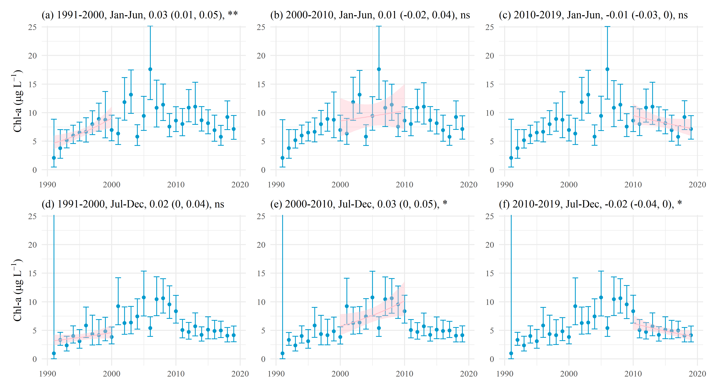
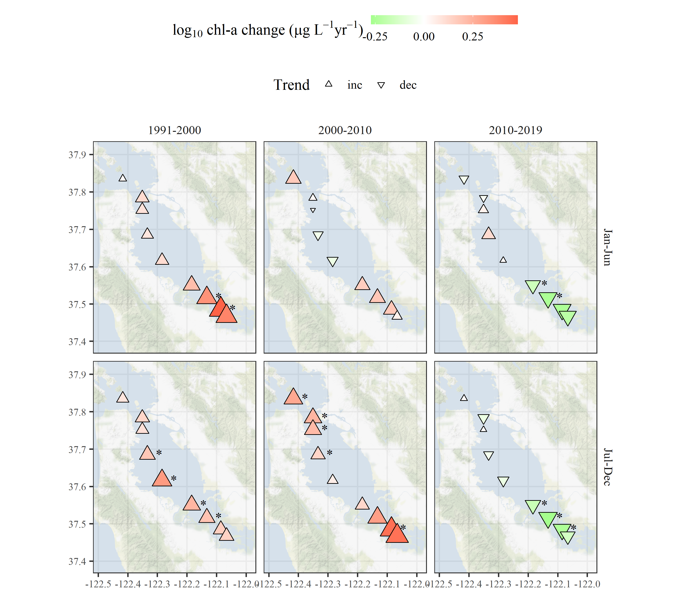

```{r setup, echo = F, warning = F, message = F, results = 'hide'}
# figure path, chunk options
knitr::opts_chunk$set(fig.path = 'figs/', warning = F, message = F, echo = F, cache = T, dev.args = list(family = 'serif'), dpi = 300, warning = F, cache.path = 'manu_draft_cache/',
  fig.process = function(x) {
  x2 = sub('-\\d+([.][a-z]+)$', '\\1', x)
  if (file.rename(x, x2)) x2 else x
  })

# libraries
library(Jabbrev)
library(tidyverse)
library(wqtrends)
library(flextable)
library(officer)
library(ggmap)
library(sf)
library(ggsn)
library(USAboundaries)
library(hrbrthemes)
library(patchwork)
library(lubridate)
library(colorspace)

data(locs)
data(modprf)
data(seastrnd)
data(seastrnd2)
data(chgtrnd)
data(mods_chl18)
data(mods_chl24)
data(mods_chl27)
data(mods_chl32)
data(mods_chl34)

source('R/funcs.R')

locs <- locs %>% 
  rename(station = Station)

# # extract bib entries from online
# bib_scrp('manu_draft.Rmd', 'refs.bib')
```

`r paste('Compiled', Sys.time())`

```{r echo = F, cache = F, eval = F}
spelling::spell_check_files('manu_draft.Rmd')
```

# Abstract

# Introduction

Cloern et al. 2020 [link](https://link.springer.com/article/10.1007/s12237-020-00737-w)

# Methods

## Study area and data sources

The San Francisco Estuary (SFE) is the largest estuary on the Pacific Coast of North America and drains an area of approximately 200 thousand km$^2$ in the US state of California.  The estuary is subdivided into six sub-embayments having distinct geomorphological characteristics: Suisun Bay, San Pablo Bay, North Central Bay, Central Bay, South Bay,and Lower South Bay.  Major freshwater inputs enter the system through the Sacramento-San Joaquin Delta complex upstream of Suisun Bay, where the combined inflow from both rivers is approximately 28 km$^3$ per year.  The northern subembayments are river-dominated (salinity ranging from 0 to 15 ppt) with seasonal freshwater pulses primarily occurring in the winter and spring during the rainy season and subsequent snowmelt in the upper watershed.  The southern subembayments are marine-dominated with salinity ranging from 5 to 35 ppt depending on the tidal cycle, effluent discharge from wastewater treatment plants, and stormwater runoff.  South Bay is heavily urbanized and includes thirty-seven wastewater treatments plants that serve 7.2 million people.  Secondary treatment occurs at a majority of the treatment plants and the remaining effluent is discharged into the SFE.  Agricultural runoff from the upper watershed also contributes to nutrient loading in the SFE with the annual nutrient export estimated as approximately 30 thousand kg dy$^{-1}$ of nitrogen from the Delta. 

Nitrogen and phospohorus levels in SFE generally exceed concentrations that have been observed to promote excess primary production in other large estuarine systems.  However, eutrophic conditions have not been regularly observed since routine monitoring began in the 1970s.  The resistance of SFE to eutrophication has been attributed to several factors, including elevated suspended sediments that reduce light penetration in the water column, regular exchange and mixing with low-nutrient marine waters and export of estuarine nutrients to the Pacific Ocean, and benthic grazing by filter-feeding bivalves that reduce algal concentrations.  Renewed interest in the potential for nutrient loading to negatively affect water quality has occurred recently, particularly in South Bay, where harmful algal blooms (HABs), increases in summer-fall chlorophyll concentrations, and low dissolved oxygen concentrations were observed beginning in 1999 (Figure \@ref(fig:obsdat)).  These relatively recent occurrrences motivated the San Francisco Regional Water Quality Control Board and stakeholders to establish a Nutrient Management Strategy, with the purpose, among others, to develop a framework for assessing water quality condition.  Critical questions that were to be addressed by the NMS included identifying water quality conditions to be considered healthy and protective of beneficial uses, describing how current conditions compare to desirable water quality conditions, and identifying what potential management actions are needed to achieve desired conditions if they currently do not persist.  Although visual changes in observed data were apparent, statistical analyses to quantify current status and to provide estimates of annual and seasonal trends with appropriate bounds on uncertainty have not been sufficiently developed. 

The SFE Research Program of the US Geological Survey has been collecting water quality data at fixed locations in the bay since 1969 [@Cloern16;@Schraga20].  This dataset is one of the longest continuous monitoring datasets available in a North American estuary and includes at least monthly sampling at 37 fixed sampling locations along a 145 km longitudinal transect from the lower Sacramento River in the Delta to lower South Bay.  Water quality constituent measurements available for each station include salinity, temperature, light attenuation, chlorophyll-a, dissolved oxygen, suspended particulate matter, and dissolved inorganic nutrients. The current analysis focused on near-surface chlorophyll-a data collected biweekly to monthly along the South Bay axis extending from Central Bay (stations 18-23), South Bay (stations 24-32), and Lower South Bay (stations 34-36) (Table \@ref(tab:sumtab), Figure \@ref(fig:sitemap)). Discrete chlorophyll concentrations at each station were determined by fluoremetric analysis with 90% acetone pigment extraction on GFF filters. Data collected between 1990-2017 were selected for analysis because it represented a suitable balance among three factors relevant to testing the statistical approaches, including sufficient length of record, consistent biweekly-monthly sampling, and a diverse set of stations covering the salinity gradient across multiple subembayments.  While sampling frequency varied somewhat over time or by station, all data were treated as unique time series within the statistical models (i.e., no spatial or temporal binning or averaging was done).

## GAM application

Generalized Additive Models are an extension of linear models that can incorporate additive smoothed terms to model non-linear effects. The basic structural form is [@Hastie90]: 

\begin{equation}
E\left(Y|X_1, X_2, ..., X_p\right) = s_0 + \sum_{j=1}^{p} s_j\left(X_j\right) 
(\#eq:gengam)
\end{equation}

where the expected value of a dependent variable $Y$ conditional on predictors X$_1$ through X$_p$ is the sum of $s_j\left(.\right)$ smoothing functions for each predictor plus an interecept term $s_0$.  The smoothing functons are standardized and have expected values equal to zero so that $Es_j\left(X_j\right) = 0$.  Because GAMs are an extension of Generalized Linear Models, they can also include linear predictors in addition to the smoothed functions.  All methods herein use functions provided by the *mgcv* R package to fit GAMs using multiple parameter smoothing estimation methods [@Wood17]. 

The flexibility of the smoothing functions is a powerful component of GAMs that uses localized, non-linear spline functions to approximate the relationship of $Y$ with predictor $X_j$.  A spline is a piecewise function, such as a polynomial, that is connected at knots (or *k*-values) that smoothly join the separate pieces of the function.  Increasing the number of knots creates a smoother fit of the response variable against the predictor at the risk of overfitting, whereas choosing a small number of knots creates a more rigid function that may underfit the data.  There are several smoothing functions available in the *mgcv* package and the default method uses a thin-plate spline as a computationally efficient approach to estimating the smoother [@Wood03].  The thin-plate spline can provide a balance between over- and under-fitting to the bivariate smoother by identifying the optimal number of knots through generalized cross validation (GCV).  In addition to providing an overall summary statistic of model performance, the GCV optimization informs the number of knots for the spline by balancing the fit subject to a smoothing penalty. This frees the user from manually selecting knots, and therefore, the degree of smoothness modelled by the function. However, the *mgcv* package requires the user to specify an upper limit as a reasonable expection for the number of knots applied to each spline.  The effect of this choose on model fit is described below. 

An additional smoother provided by *mgcv* is the cubic spline, which provides similar functionality as the thin-plate spline, but has an explicit form as a cubic polynomial function that is continuous to the second derivative at each knot location. Although visually, smooth fits for different spline types may appear similar if the number of knots are sufficiently high, the cubic spline is useful for modelling periodic variation, such as seasonal changes on the annual scale or diurnal variation at shorter scales.  A slight modification of the cubic spline is the *cyclic* cubic spline that has the added constrainst of values being equal at the beginning and end of a component being modelled.  This allows the seasonal component to not only be modelled as a separate component of an overall time series, but the seasonal estimates are joined continuously across years.  In others words, not using a cyclic cubic spline to model season would cause a non-continous function across the time series with step increases or decreases for the seasonal estimates between the years.  This discrepancy can likely lead to inaccurate or ambiguous trend estimates when evaluating seasonal differences.  

To evaluate GAMs with SFE chloropyll data, we followed an approach that built on past work by the Chesapeake Bay Program [@Murphy19], including incorporation and adaptation of their hierarchical model structure to evaluate long-term time series.  These hierarchical models vary the functional form for time in relation to chlorophyll by adding smoothers and linear predictors with increasing flexibility in the GAM functions.  This is a powerful approach for time series analysis because separate components can be explicitly modelled with different smoothing terms and the results can be idendependently evaluated and further tested from the model output.  Varying degrees of model complexity also provides a balance between descriptive power and computational efficiency, where simpler models may be preferred in routine reporting or more complex models may be preferred for hypothesis testing.  We present four GAM structures, following a similar format as @Murphy19.  The notation for gam3, gam4, and gam5 are not used because these describe models in @Murphy19 that were developed for purposes specific to Chesapeake Bay.

\begin{equation}
\boldsymbol{gam0:}\ g\left(chl\right) = s_0 + \beta_1 year + s_1\left(doy\right) + \epsilon 
(\#eq:gamzero)
\end{equation}

\begin{equation}
\boldsymbol{gam1:}\  g\left(chl\right) = s_0 + \beta_1 year + s_1\left(doy\right) + s_2\left(year\right) + \epsilon 
(\#eq:gamone)
\end{equation}

\begin{equation}
\boldsymbol{gam2:}\ g\left(chl\right) = s_0 + \beta_1 year + s_1\left(doy\right) + s_2\left(year\right) + ti_1(doy, year) + \epsilon
(\#eq:gamtwo)
\end{equation}

\begin{equation}
\boldsymbol{gam6:}\  g\left(chl\right) = s_0 + \beta_1 year + s_1\left(doy\right) + s_2^*\left(year\right) + \epsilon
(\#eq:gamsix)
\end{equation}

For each GAM, chlorophyll is modelled using a link function $g()$ that relates the response variable to the independent variables $year$ and day of year ($doy$) (Table \@ref(tab:modsumtab), Figure \@ref(fig:modsumfig)).  The $year$ variable is a continuous measure for date in decimal time, where date is expressed as a continuous numeric value with year on the left of the decimal and date within the year to the right of the decimal (e.g., July 1st 2019 would be 2019.5).  The $doy$ variable is an integer value for the Julian day in each year (from 1 to 366) that represents the seasonal component of the time series. The estimate $s_0$ is an intercept value and $\beta_1$ is a slope estimate for a linear year effect included in all models. The $s_1()$ and $s_2()$ functions are different smoothers for $year$ and $doy$ where the former uses a thin-plate spline and the latter uses a cyclic cubic spline to capture the periodic seasonal component.  The $ti_1()$ function is a tensor product interaction between $year$ and $doy$ that allows the seasonal component to change between years.  Within the $ti_1()$ function are the two separate smoothers for year as a thin-plate spline and $doy$ as a cyclic cubic spline. As with conventional linear models, the remaining variance in the response not captured by the functional form of the model is expressed as an error term $\epsilon$ that is normally-distributed having mean equal to zero and variance as $\sigma^2$.  The residual variance is used to back-transform model estimates for trend testing, described below.  

The link functions $g()$ for each model were chosen as either logarithmic transformations (base 10) or best estimates of Box-Cox power transformations for chlorophyll.  A comparison of GAM performance between transformation methods has not yet been explored in the application of GAMs to long-term water quality monitoring data.  The logarithmic transformation is commonly used for chlorophyll to approximate a log-normal distribution of the response variable. However, alternative transformations could provide improved model fits and reduced uncertainty estimates in the fitted parameters by better satisying assumptions for GAMs.  The Box-Cox method was also used to transform chlorophyll as a comparison to the logarithmic transformation (Box and Cox 1964).  The Box-Cox method requires an estimate of the parameter $\lambda$, whereby the the optimal value is based on a minimization function of a log-likelihood profile vector.  The profile vector for each chlorophyll time series was obtained using the *boxcox* funtion from the MASS package [@Venables02] to evaluate log-likelihood estimates of $\lambda$ across the range -4 to 4.  Once the optimal $\lambda$ value was identified, chlorophyll was transformed using the following power transformation [@Box64]:

\begin{equation}
g\left(chl;\lambda\right) = \begin{cases} \frac{chl ^ {\lambda} - 1}{\lambda} & \lambda \ne 0 \\ \log\left(chl\right) & \lambda = 0 \end{cases}
(\#eq:boxcox)
\end{equation}

where $g()$ is the transformation function for the appropriate GAM at the esitmated $\lambda$ value. Note that in some cases the Box-Cox transformation is a logarithmic transformation if $\lambda$ is estimated as zero.  The *BoxCox* function from the forecast package [@Hyndman20] in R was used to transform the chlorophyll time series with the optimal $\lambda$ value.  Equation \@ref(eq:boxcox) is only appropriate for positive values of a response variable, as for chlorophyll.

A challenge for optimizing GAMs to time series data with significant intra- and interannual variation is choosing an appropriate functional form (i.e., gam0, gam1, gam2, or gam6) and determining how much variation could be explained by the smoothers in each function.  The four models above provide tradeoffs in the functional forms that balance descriptive and computational efficiency (Table \@ref(tab:modsumtab), Figure \@ref(fig:modsumfig)).  However, the individual smoothing functions (i.e, $s_1()$, $s_2()$, $s_2^*()$ and $ti_1()$) require user input on the potential upper limit for the *k*-values that could be used during model fitting.  Initial testing by Murphy et al. (2019) showed that the default *k* values in the mgcv package were insufficient for describing the interannual variation in the response variable.  Instead, the upper limit for the number of knots for the $s_2(year)$ smoother was specified as the maximum between 10 or  $2 / 3 \times$ the number of years in the time series.   We follow the same approach herein for gam1 and gam2.  Further, the default *k*-values for $s_2()$ and $ti_1()$ were considered appropriate and not tested further. For the application to SFE chlorophyll data, gam6 was also added as an extension of gam1, where the total number of knots for the $year$ smoother, $s_2^*()$, was increased to 12 times the total number of years in the time series.  This approach potentially allows the smoother for $year$ to be unconstrained in how much variance is fit within and between years.  

All models were compared using standard summary statistics describing overall model fit to the observed data.  In addition to the GCV score, models were compared using the Akaike Information Criterion (AIC) and $R^2$ summmary statistics.  Comparisons were made between the different GAMs in equations \@ref(eq:gamzero) to \@ref(eq:gamsix) and for the transformations used to define the $g()$ function for chlorophyll at each station. Model predictions were based on the standard model output from the *predict()* function from the mgcv package.  A long-term trend independent of seasonal variation was also estimated for each model by subtracting the seasonal terms (i.e., $s_1(doy)$ and $ti_1(doy, year)$) from the predictions. Back-transformation of results were obtained by exponentiation if the log-transformed variable was used or using the *InvBoxCox()* function from the forecast package if the Box-Cox transformation was used. For hypothesis tests that required estimates of central tendency and confidence intervals for mean values, back-transformations were based on an exponentiation or inverse function of the transformed response variable as before, with the addition of a correction factor.  This bias-correction factor was simply the variance of the model residuals divided by two for variables in log-space and correction with a forecast variance estimate as specified in the *InvBoxCox()* function from the forecast package.  

## Trend tests on GAM results

Each of the GAM structures described in equations \@ref(eq:gamzero) to \@ref(eq:gamsix) provide different approaches to quantify long-term variation in annual and seasonal changes.  Although useful as a general approach to view functional forms for different time series, additional information regarding whether an observed change is statistically significant can be useful to inform environmental management decisions.  We present two methods for performing trend tests on model results that address different changes that may be of management interest.  First, a method for evaluating the percent change in annual averages between two time periods is briefly summarized.  This approach is similar to that presented in @Murphy19.  Second, a method for evaluating means and confidence intervals from GAM results for seasonal periods is presented, including an estimate of direction and rate of seasonal change over time.  

The ability to compare time periods of interest has importance for evaluating whether a significant change has occurred in relation to perceived trends in observed data.  For example, the noticeable change in SFE water quality in South Bay starting from the 1990s and persisting through 2005 was of considerable interest by environmental managers given the apparent departure from long-term conditions to a state that suggested a trend towards more eutrophic conditions.  However, statistical methods to evaluate this change that were able to quantify the temporal variation and to provide a statistically robust estimate of the change were not available.  The use of GAMs in parallel with hypothesis testing can be used for this purpose. Methods proposed in @Murphy19 and similarly applied in @Yang20 were used and are briefly summarized herein.   

For two time periods of interest, a trend can be estimated as the difference in means from the GAM results between the periods, the percent change, and an appropriate p-value descibing the probability that the change is due to change alone.  @Murphy19 defined the two time periods as "base" and "test" periods, where the former represents a baseline condition earlier in the time series as a basis of comparison to the more recent "test" period.  It was further suggested the the base and test periods include a minimum of two years if evaluating years at the beginning and end of a time series to account for instability of GAM estimates at the edges of the independent variable space.  The differences are estimated as: 

\begin{equation}
\text{Difference} = Z_d\hat{\beta}
(\#eq:diffest)
\end{equation}

where $Z_d$ is a point estimate of the differences of the predictions between the base and test years and $\hat{\beta}$ is the estimated parameter vector from the fitted GAM.  The standard error of this difference is then: 

\begin{equation}
\text{se}_{\text{diff}} = \sqrt{Z_d\hat{\Sigma}_\beta Z_d^T}
(\#eq:sediffeest)
\end{equation}

defined as the square root of the product of $Z_d$, the estimated variance-covariance matrix of parameter vector for the fitted GAM $\hat{\Sigma}_\beta$, and the transposition of $Z_d$.  The trend is considered significant if the appropriate confidence interval at a specified $\alpha$ does not include zero. 

The second hypothesis test evaluates changes in seasonal estimates between years using results from a fitted GAM.  This test provides both an estimate of a seasonal mean, its associated confidence interval, and if the rate of change in the seasonal means has varied over a specific period of interest.  For example, changes that occur during late fall or early spring can be evaluated between years to determine if the seasonal averages differ and if the direction and magnitude of change is significant. This has implications for understanding potential changes in seasonal bloom phenology resulting from shifting system responses to nutrient inputs or changes in the latter.  

Seasonal averages and confidence intervals were estimated from fitted GAMs by first creating a matrix of the predictors (i.e., `year`, `doy`) covering the seasonal periods across the time series.  For example, seasonal changes from late summer could be obtained from a prediction matrix covering all dates from Aug 1st to Sep. 30th for the period from 2000 to 2010.  The prediction matrix is then used to obtain fitted values from a GAM that describe the estimated values of chlorophyll that occurred during the periods of interest. Rather than the estimated values for the predictions, a linear predictor matrix is returned that provides a parameter vecotr at the supplied covariate values.  This predictor matrix is then used to estimate the mean seasonal value within a year and associated variance using the sum of predictions from the matrix.  As a result, each year has a mean value of chlorophyll with an associated confidence interval that describes the modelled expectation for the seasonal period.  

Although the seasonal averages obtained from GAMs describe the expected values for each year, describing the direction and magnitude of the seasonal change across years may also be of interest.  Conventionally, trend analysis of changes in a response variable could be achieved with ordinary least squares regression, where the response variable is the expected value of chlorophyll and the predictor is year as a numeric value.  Regression analysis could be used to evaluate changes in the seasonal averages described above, although the fit from the regression would under-estimate the uncertainty in the model parameters by not accounting for the variance in the seasonal averages.  To better describe the trends in the seasonal averages, we use mixed effects regression meta-analysis to evaluate seasonal changes and their uncertainty over a finite set of years.  This analysis is an extension of conventional regression by accounting for different soures of uncertainty attributed to both variation of the true seasonal mean around the trend and variation of the estimated seasonal mean around the true seasonal mean:

\begin{equation}
chl_i = \beta_0 + \beta_1 year_i + b_i + \epsilon_i
(\#eq:mixmet)
\end{equation}

where the estimated value of chlorophyll at year $i$ for the predetermined season is a function of the predicted seasonal mean $\beta_0 +\beta_1 year_i$ plus deviation of the seasonal mean from the trend ($b_i$) and devation of the seasonal mean from the true mean ($S_i$).  Both the error terms are assumed to be normally distributed with mean zero and variance for $b_i$ equal to an unknown term and variance for $\epsilon_i$ equal to the squared standard error from the seasonal chloropyll averages.  The R package *mixmeta* was used to estimate trends in the seasonal averages over time [@Sera19].  Results appear similar to those from regression analysis (e.g., slope and intercept estimates), although parameter uncertainty is more accurately estimated with mixed meta-analysis.

## Model application and interpretation

Each of the four GAM structures were used to fit models to the chlorophyll time series at each of the nine stations from central to lower South Bay.  For each model and station, the fit was assessed using the standard summary statistics described above (i.e., GCV, AIC, and $R^2$) and relative significance of the individual smoothers terms.  Models were also evaluated using different transformations to determine which had improved fit for specific time series.  Secondary analyses evaluating trends with fitted GAM predictions were also compared between stations and model types, particularly to determine if and when significant results varied with alternative methods.  Temporal and spatial patterns within and between stations were also idenfied to better quanity changes in chlorophyll production throughout the period of record using GAMs to demonstrate improved descriptions relative to interpretations from the observed data.

# Results

* start with description of model performance, which models had the best performance (gam0 v gam6, boxcox v log)
* then describe figure 4

Table \@ref(tab:modprftab), Table \@ref(tab:seastrndtab), Figure \@ref(fig:prddat), Figure \@ref(fig:trnddat), Figure \@ref(fig:trndmap)

# Discussion

# Conclusions

# Acknowledgments

# Figures

```{r, results = 'hide', message = F}
# treatment colors
cls1 <- RColorBrewer::brewer.pal(9, 'Greys')
cls2 <- RColorBrewer::brewer.pal(3, 'BrBG')

toplo1 <- rawdat %>%
  filter(param %in% 'chl') %>% 
  filter(mo %in% c('Aug', 'Sep', 'Oct', 'Nov', 'Dec')) %>% 
  # filter(station %in% c(24, 27, 30, 32)) %>% 
  group_by(yr) %>% 
  mutate(Median = median(value, na.rm = TRUE)) %>% 
  ungroup() 

toplo2 <- rawdat %>%
  filter(param %in% 'chl') %>% 
  mutate(
    yrcat = case_when(
      yr < 2000  ~ '1990-2000', 
      yr >= 2000 & yr < 2010 ~ '2000-2010', 
      yr >= 2010 ~ '2010-2017'
    ), 
    yrcat = factor(yrcat, levels = c('1990-2000', '2000-2010', '2010-2017'))
  )

ylab <- expression(paste("Chlorophyll-a (", italic(mu), "g ", L^-1, ")"))

p1 <- ggplot(toplo1, aes(x = yr, y = value, fill = Median, group = yr)) + 
  geom_violin(draw_quantiles = 0.5)  + 
  scale_fill_gradientn(colours = cls1) + 
  scale_y_log10() +
  theme_minimal(base_family = 'serif') +
  theme(
    axis.title.x = element_blank()
  ) +
  labs(
    y = ylab, 
    subtitle = '(a) Annual summer/fall concentrations'
  )

p2 <- ggplot(toplo2, aes(x = mo, y = value, fill = yrcat)) + 
  geom_violin(draw_quantiles = 0.5)  + 
  scale_y_log10(ylab) +
  theme_minimal(base_family = 'serif') +
  scale_fill_manual(values = cls2) +
  theme(
    legend.title = element_blank(), 
    axis.title.x = element_blank()
  ) +
  labs(
    y = ylab, 
    subtitle = '(b) Monthly concentrations by decade'
  )

p <- p1 + p2 + plot_layout(ncol = 1)
png('figs/obsdat.png', height = 8, width = 8, family = 'serif', units = 'in', res = 400)
print(p)
dev.off()
```
```{r obsdat, fig.cap = "Observed chlorophyll concentrations for all stations in central and south San Francisco Estuary (18-36, Figure \\@ref(fig:sitemap)), with (a) annual summer/fall concentrations (Aug - Dec) and (b) monthly concentrations by decade."}
knitr::include_graphics('figs/obsdat.png')
```

```{r, results = 'hide', message = F}
# station locations
sflocs <- locs %>% 
  st_as_sf(coords = c('lon', 'lat'), crs = 4326)

# for inset
states <- us_states() %>% 
  filter(!name %in% c('Alaska', 'Hawaii', 'Puerto Rico'))
castate <- states %>% 
  filter(name %in% 'California')
locbuff <- st_buffer(sflocs, dist = 0.1)
locbuff2 <- st_buffer(sflocs, dist = 0.07)
insetbb <- st_buffer(sflocs, dist = 1.5) %>% 
  st_bbox() %>% 
  st_as_sfc(crs = 4326)

# basemap
dat_ext <- unname(st_bbox(locbuff))
bsmap1 <- get_stamenmap(bbox = dat_ext, maptype = 'terrain-background', zoom = 11)

# change opacity of basemap
mapatt <- attributes(bsmap1)
bsmap1_transparent <- matrix(adjustcolor(bsmap1, 
                                                alpha.f = 0.75), 
                                    nrow = nrow(bsmap1))
attributes(bsmap1_transparent) <- mapatt

# basemape plus stations
p1 <- ggmap(bsmap1_transparent) +
  geom_sf(data = sflocs, inherit.aes = F, col = 'black', pch = 21, fill = 'grey', size = 4) + 
  geom_text(data = locs, aes(x = lon + 0.02, y = lat + 0.02, label = station), fontface = 'bold.italic') + 
  theme(
    axis.title = element_blank()
  ) + 
  north(locbuff, scale = 0.15, symbol = 10, location = 'bottomright') +
  scalebar(locbuff2, dist = 10, dist_unit = 'km', location = 'bottomleft', transform = T, 
           st.color = 'black', border.size = 0.5, st.dist = 0.02, st.size = 4) 

# inset
p2 <- ggplot() + 
  geom_sf(data = states, fill = 'white', colour = 'black') + 
  geom_sf(data = castate, fill = 'grey', colour = 'black') + 
  geom_sf(data = insetbb, fill = NA, color = 'blue', size = 2) +
  theme_void()

# final map
p <- p1 + 
  inset(ggplotGrob(p2), xmin = -122.3, xmax = -121.97, ymin = 37.75, ymax = 37.95)

# save as png
png('figs/sitemap.png', height = 6.5, width = 5, units = 'in', family = 'serif', res = 300)
print(p)
dev.off()
```
```{r sitemap, fig.cap = 'Station locations in the central and south San Francisco Estuary used for analysis.  See Table \\@ref(tab:sumtab) for station descriptions.  Full dataset described in @Schraga20.'}
knitr::include_graphics('figs/sitemap.png')
```

```{r, results = 'hide'}
# get predictions for all four gams
tomod <- rawdat %>%
  filter(station %in% 22) %>%
  filter(param %in% 'chl')

# use previously fitted list of models
trans <- 'boxcox'
mods <- list(
  gam0 = anlz_gam(tomod, mod = 'gam0', trans = trans),
  gam1 = anlz_gam(tomod, mod = 'gam1', trans = trans),
  gam2 = anlz_gam(tomod, mod = 'gam2', trans = trans),
  gam6 = anlz_gam(tomod, mod = 'gam6', trans = trans)
)

p1 <- show_prddoy(mods = mods, ylab = 'Chlorophyll-a (ug/L)', nfac = 2, size = 0.8, alpha = 0.8) + 
  theme(legend.position = 'right') + 
  guides(colour = ggplot2::guide_colourbar(barheight = 15, barwidth = 1)) +
  scale_colour_gradient(low = "white", high = "black") + 
  theme_minimal() + 
  theme(
    legend.title = element_blank()
  )

png('figs/modsumfig.png', height = 4.5, width = 6, units = 'in', family = 'serif', res = 400)
print(p1)
dev.off()
```
```{r modsumfig, fig.cap = "General output for each of the four GAM structures in equations \\@ref(eq:gamzero) to \\@ref(eq:gamsix).  Day of year (Julian) is on the x-axis and each curve represents a different fitted year for chlorophyll concentration."}
knitr::include_graphics('figs/modsumfig.png')
```

```{r, results = 'hide', message = F}
# get predictions to plot
prdplo <- bind_rows(mods_chl18, mods_chl24, mods_chl27, mods_chl32) %>% 
  mutate(prddat = pmap(list(data, modi), function(data, modi){

    prddat <- data.frame(
        dec_time = seq(min(data$dec_time), max(data$dec_time), length = 1000)
      ) %>%
      mutate(
        date = date_decimal(dec_time),
        date = as.Date(date),
        mo = month(date, label = TRUE),
        doy = yday(date),
        yr = year(date)
      )
    
    prd <- predict(modi, newdata = prddat) %>% 
      as.numeric
    
    annprd <- predict(modi, newdata = prddat, type = 'terms')
    int <- attr(annprd, 'constant')
    value <- rowSums(annprd) + int
    annvalue <- rowSums(annprd[, !grepl('doy', colnames(annprd)), drop = FALSE]) + int
    annvalue <- as.numeric(annvalue)
    
    trans <- unique(modi$trans)
    
    if(!inherits(trans, 'numeric'))
      stop('log used')
    
    prddat <- prddat %>% 
      mutate(
        chl = prd,
        chl = forecast::InvBoxCox(chl, trans), 
        annchl = forecast::InvBoxCox(annvalue, trans)
        )
    
    return(prddat)
    
  })) %>% 
  select(station, modi = model, prddat) %>% 
  unnest(prddat) 

ylab <- expression(paste("Chlorophyll-a (", mu, "g ", L^-1, ")"))

toplo <- prdplo %>% 
  filter(yr >= 1991)

obsdat <- rawdat %>% 
  filter(station %in% c(18, 24, 27, 32)) %>% 
  filter(param == 'chl') %>% 
  filter(yr >= 1991) %>% 
  rename(chl = value)

colpal <- "PuBuGn"

p1 <- ggplot(toplo, aes(x = date, y = chl)) + 
  geom_point(data = obsdat, color = 'grey', size = 0.15) + 
  geom_line(size = 0.5) +
  geom_line(aes(y = annchl), color = 'tomato1', size = 0.5, alpha = 0.9) +
  theme_minimal(base_family = 'serif') + 
  theme(
    legend.position = 'right', 
    legend.title = element_blank(), 
    # axis.text.x= element_text(size = 8)
    strip.background = element_blank()
  ) + 
  facet_grid(modi ~ station) +
  scale_y_log10(limits = c(0.74, 83)) + 
  labs(x = 'Date', subtitle = '(a) Model predictions with annual estimates', y = ylab)

p2 <- ggplot(toplo, aes(x = doy, colour = yr, group = factor(yr))) + 
  geom_line(aes(y = chl)) + 
  theme_minimal(base_family = 'serif') + 
  theme(
    legend.position = 'right', 
    legend.title = element_blank(), 
    # axis.text.x= element_text(size = 8)
    strip.background = element_blank()
  ) + 
  scale_colour_continuous_sequential(palette = colpal, rev = T, begin = 0.2) +
  guides(colour = guide_colourbar(barheight = 10, barwidth = 1)) +
  facet_grid(modi ~ station) +
  scale_y_log10() + 
  labs(x = 'Day of year', subtitle = '(b) Model predictions by day of year', y = ylab)

p <- p1 + p2 + plot_layout(ncol = 1)

png('figs/prddat.png', height = 10, width = 9, family = 'serif', units = 'in', res = 400)
print(p)
dev.off()
```
```{r prddat, fig.cap = "GAM predictions for select stations from north to south (18, 24, 27, 32) for models in equations \\@ref(eq:gamzero) to \\@ref(eq:gamsix). The results show (a) predictions across the time series with annual estimates (red line) and (b) predictions by day of year with one smooth per year.  Observed data in (a) are shown with the gray points. Station locations are in Figure \\@ref(fig:sitemap)."}
knitr::include_graphics('figs/prddat.png')
```

```{r, results = 'hide', message = F}
toplo <- mods_chl34 %>% 
  filter(model %in% 'gam6') %>% 
  pull(modi)

ylim <- c(-1, 19)
ylab <- expression(paste("Chlorophyll-a (", mu, "g ", L^-1, ")"))

p1 <- show_perchg(mods = toplo, baseyr = 1991, testyr = 2000, ylab = ylab) +
  labs(
    subtitle = '(a) 1990, 2000, Base: 3.6, Test: 5.7,\nChange: 57.7%, ns', 
    title = NULL
  )
p2 <- show_perchg(mods = toplo, baseyr = 2000, testyr = 2010, ylab = NULL) +
  labs(
    subtitle = '(b) 2000, 2010, Base: 5.7, Test: 10.1,\nChange: 77.5%, p < 0.001', 
    title = NULL
  )
p3 <- show_perchg(mods = toplo, baseyr = 2010, testyr = 2017, ylab = NULL) +
  labs(
    subtitle = '(c) 2010, 2017, Base: 10.1, Test: 6.1,\nChange: -39.8%, p < 0.01', 
    title = NULL
  )
p4 <- show_avgseason(mods = toplo, doystr = 41, doyend = 213, yrstr = 1991, yrend = 2000, ylab = ylab) +
  scale_y_continuous(limits = ylim) + 
  labs(
    subtitle = '(d) 1990-2000, Jan-Jul, slope 0.6, p < 0.01', 
    title = NULL
  )
p5 <- show_avgseason(mods = toplo, doystr = 41, doyend = 213, yrstr = 2000, yrend = 2010, ylab = NULL) +
  scale_y_continuous(limits = ylim) + 
  labs(
    subtitle = '(e) 2000-2010, Jan-Jul, slope 0.5, ns', 
    title = NULL
  )
p6 <- show_avgseason(mods = toplo, doystr = 41, doyend = 213, yrstr = 2010, yrend = 2016, ylab = NULL) +
  scale_y_continuous(limits = ylim) + 
  labs(
    subtitle = '(f) 2010-2017, Jan-Jul, slope -0.4, ns', 
    title = NULL
  )
p7 <- show_avgseason(mods = toplo, doystr = 213, doyend = 338, yrstr = 1991, yrend = 2000, ylab = ylab) +
  scale_y_continuous(limits = ylim) + 
  labs(
    subtitle = '(g) 1990-2000, Aug-Dec, slope 0.26, ns', 
    title = NULL
  )
p8 <- show_avgseason(mods = toplo, doystr = 213, doyend = 338, yrstr = 2000, yrend = 2010, ylab = NULL) +
  scale_y_continuous(limits = ylim) + 
  labs(
    subtitle = '(h) 2000-2010, Aug-Dec, slope 0.56, p < 0.05', 
    title = NULL
  )
p9 <- show_avgseason(mods = toplo, doystr = 213, doyend = 338, yrstr = 2010, yrend = 2017, ylab = NULL) +
  scale_y_continuous(limits = ylim) + 
  labs(
    subtitle = '(i) 2010-2017, Aug-Dec, slope -0.52, ns', 
    title = NULL
  )

p <- p1 + p2 + p3 + p4 + p5 + p6 + p7 + p8 + p9 + plot_layout(nrow = 3) & 
  theme_minimal(base_family = 'serif', base_size = 12) &
  theme(
    axis.title.x = element_blank(),
    legend.position = 'none'
    )

png('figs/trnddat.png', height = 9, width = 11, family = 'serif', units = 'in', res = 400)
print(p)
dev.off()
```
```{r trnddat, fig.cap = "Examples of trend tests using results of GAM predictions for station 34 (`gam6`).  Plots (a), (b), and (c) show estimates of percent change as the difference of means between base and test years for chlorophyll.  Plots (d) through (i) show seasonal averages and trend estimates over time.  Plot (d), (e), and (f) show trend estimates for January through July and (g), (h), and (i) show trend estimates for August through December.  The trend lines in (d) through (i) estimate the rate of change of chlorophyll per year, reported as the slope in the plot title. ns: not significant"}

```

```{r, results = 'hide', message = F}
# change opacity of basemap
mapatt <- attributes(bsmap1)
bsmap1_transparent <- matrix(adjustcolor(bsmap1, 
                                         alpha.f = 0.4), 
                             nrow = nrow(bsmap1))
attributes(bsmap1_transparent) <- mapatt

leglab2 <- expression(paste("Chl-a change (", italic(mu), "g ", L^-1, yr^-1, ")"))

pthm <- theme_bw(base_family = 'serif', base_size = 14) +
  theme(
    legend.position = 'top',
    strip.background = element_blank(),
    axis.title = element_blank(), 
    axis.text = element_text(size = 7)
  )

toplo1 <- chgtrnd %>% 
  mutate(
    station = as.numeric(station),
    pval = ifelse(pval == 'sig', '*', '')
    ) %>% 
  left_join(locs, by = 'station') %>% 
  filter(model %in% 'gam6')

toplo2 <- seastrnd2 %>%
  mutate(
    station = as.numeric(station),
    pval = ifelse(pval < 0.05, '*', ''), 
    coefsgn = sign(yrcoef), 
    coefsgn = factor(coefsgn, levels = c('1', '-1'), labels = c('inc', 'dec'))
  ) %>% 
  left_join(locs, by = 'station')

p1 <- ggmap(bsmap1_transparent) +
  geom_point(data = toplo1, aes(x = lon, y = lat, size = abs(perchg), shape = persgn, fill = perchg, colour = pval)) + #, color = 'black') +
  geom_text(data = toplo1, aes(x = lon, y = lat, label = pval), nudge_x = 0.04) + 
  facet_grid( ~ yrs) + 
  scale_fill_gradient2('Chl-a % change', low = 'green', mid = 'white',  high = 'tomato1', midpoint = 0) +
  scale_colour_manual(values = c('black', 'black'), guide = F) +
  coord_map() + 
  scale_shape_manual('Trend', values = c(24, 25)) + 
  pthm +
  scale_size(range = c(1, 6), guide = F) +
  guides(fill = guide_colourbar(barheight = 0.5, barwidth = 6)) +
  labs(
    subtitle = '(a) Percent change between year pairs'
  )

p2 <- ggmap(bsmap1_transparent) +
  geom_point(data = toplo2, aes(x = lon, y = lat, size = abs(yrcoef), shape = coefsgn, fill = yrcoef, colour = pval)) + #, color = 'black') +
  geom_text(data = toplo2, aes(x = lon, y = lat, label = pval), nudge_x = 0.04) + 
  facet_grid(seas ~ yrs) + 
  scale_fill_gradient2(leglab2, low = 'green', mid = 'white',  high = 'tomato1', midpoint = 0) +
  scale_colour_manual(values = c('black', 'black'), guide = F) +
  coord_map() + 
  scale_shape_manual('Trend', values = c(24, 25)) + 
  pthm +
  scale_size(range = c(1, 6), guide = F) +
  guides(fill = guide_colourbar(barheight = 0.5, barwidth = 6)) +
  labs(
    subtitle = '(b) Annual rates of change across seasons by decade'
  )

p <- p1 + p2 + plot_layout(ncol = 1, heights = c(0.5, 1)) 

png('figs/trndmap.png', height = 10, width = 6.5, family = 'serif', units = 'in', res = 400)
p
dev.off()
```
```{r trndmap, fig.cap= "Trend estimates (a) between year pairs and (b) across seasons by decade for chlorophyll at each station.  The top plots show percent change comparing the first and last year within a decade and the bottom plots show seasonal estimates of change per year for chlorophyll concentrations for each decade.  Point type, shape, and color represent the direction and magnitude of an estimated trend.  Trends with $p<0.05$ are marked with an asterisk.  All results are from `gam6`."}

```

# Tables

```{r sumtab, tab.cap = 'Station locations, sample sizes, and median values for salnity, dissolved inorganic nitrogen (DIN, sum of ammonia, nitrate, and nitrite), and chlorophyll.  Rows are arranged from north to south.'}
totab <- rawdat %>% 
  filter(param %in% c('sal', 'din', 'chl')) %>% 
  group_by(station, param) %>% 
  summarise(
    n = n(), 
    medv = median(value, na.rm = T)
  ) %>% 
  ungroup() %>% 
  gather('var', 'val', n, medv) %>% 
  unite('var', param, var) %>% 
  mutate(var = factor(var, levels = c('sal_n', 'sal_medv', 'din_n', 'din_medv', 'chl_n', 'chl_medv'))) %>% 
  left_join(locs, by = 'station') %>% 
  spread(var, val)

tab <- flextable(totab) %>% 
  set_header_labels(
    station = 'Station', 
    lat = 'Latitude', 
    lon = 'Longitude', 
    sal_n = 'n', 
    sal_medv = 'Med.', 
    din_n = 'n', 
    din_medv = 'Med.', 
    chl_n = 'n', 
    chl_medv = 'Med.'
  ) %>% 
  add_header_row(values = c('', '', '', 'Salinity (psu)', '', 'DIN (mg/L)', '', 'Chl-a (ug/L)', '')) %>% 
  merge_at(i = 1, j = 4:5, part = 'header') %>% 
  merge_at(i = 1, j = 6:7, part = 'header') %>% 
  merge_at(i = 1, j = 8:9, part = 'header') %>% 
  colformat_num(j = c(5, 7, 9), digits = 1) %>%
  colformat_num(j = c(2, 3), digits = 3) %>% 
  align(align = 'right', part = 'header') %>% 
  border_remove() %>% 
  hline_top(border = fp_border(color = 'black')) %>% 
  font(fontname = 'Times', part = 'all') %>%
  fontsize(size = 12, part = 'all') %>% 
  width(j = c(2, 3), width = 0.9) 
tab
```

```{r modsumtab}
tab <- tibble(
  GAM = c('`gam0`', '`gam1`', '`gam2`', '`gam6`'),
  Summary = c(
    'Linear trend with seasonality', 
    'Nonlinear trends seasonality (constrained knots)', 
    'Nonlinear trends wiht seasonality, plus interaction',
    'Nonlinear trends with seasonality (unconstrained knots)'
  ),
  Details = c(
    'A linear trend in time over the course of the time series (year); and Within-year seasonal fluctuations that follow the same pattern every year, e.g., large spring bloom and small fall bloom (`s(doy, bs = "cc")`)',
    'Treats year and doy same as `gam0`; and A smooth non-linear trend through time, such that the seasonal peaks are similar across years, but interannual change is evident', 
    'Treats cyear and doy same as `gam1`; and Within-year seasonal fluctuations that vary across years but in a constrained pattern compared to `gam6` (`ti(year, doy, bs = c("tp", "cc"))`)', 
    'Variant of `gam1` with much higher values of k, allowing the splines to follow greater fluctuations both within and across years.')
  )

# table stuff
cap.val <- 'Summary and details for each of the GAM structures in equations \\@ref(eq:gamzero) to \\@ref(eq:gamsix).'

# table
knitr::kable(tab, booktabs = T, caption = cap.val)
```

```{r modprftab, tab.cap = 'Model performance statistics for each station and GAM structure (Table \\@ref(tab:modsumtab)). Results are for models of chlorophyll-a using BoxCox and logarathmic transformations. Four GAMs were fit to each station and performance is summarized as $\\Delta$ AIC (from `gam0`),  $\\Delta$ GCV, and R-squared values.  Probability values ("P-val") show the results of Analysis of Variance comparisons between all BoxCox or logarithmic models at a station.  The p-value for a row refers to the comparison of the model in the current row to the one preceeding (`gam0` is the base model and does not have a p-value).  A significant p-value indicates the model in the current row provides a statistically significant difference in explaining chlorophyll variance from the model in the preceding row.  ns: not significant at $\\alpha = 0.05$, * $p< 0.05$, and ** $p < 0.005$.'}

totab <- modprf %>% 
  gather('stat', 'val', AIC, GCV, R2, `P-value`) %>% 
  mutate(trans = case_when(
    trans != 'log10' ~ 'BoxCox', 
    T ~ trans)
  ) %>% 
  unite('stat', trans, stat) %>% 
  mutate(
    stat = factor(stat, levels = c('BoxCox_AIC', 'log10_AIC', 'BoxCox_GCV', 'log10_GCV', 'BoxCox_R2', 'log10_R2', 'BoxCox_P-value', 'log10_P-value'))
  ) %>% 
  spread(stat, val) %>% 
  mutate_at(c('BoxCox_AIC', 'log10_AIC', 'BoxCox_GCV', 'log10_GCV', 'BoxCox_R2', 'log10_R2'), as.numeric) %>% 
  group_by(station) %>%
  mutate(
    BoxCox_AIC = BoxCox_AIC - max(BoxCox_AIC),
    log10_AIC = log10_AIC - max(log10_AIC),
    BoxCox_GCV = BoxCox_GCV - max(BoxCox_GCV),
    log10_GCV = log10_GCV - max(log10_GCV)#,
    # minaic = AIC == min(AIC), 
    # mingcv = GCV == min(GCV),
    # maxr2 = R2 == max(R2)
  ) %>% 
  ungroup

# boldaic <- as.numeric(rownames(totab)[totab$minaic])
# boldgcv <- as.numeric(rownames(totab)[totab$mingcv])
# boldr2 <- as.numeric(rownames(totab)[totab$maxr2])

totab <- totab %>% 
  # select(-minaic, -mingcv, -maxr2) %>% 
  mutate(
    station = ifelse(duplicated(station), '', station)
  ) 

tab <- flextable(totab) %>% 
  set_header_labels(
    station = '', 
    model = '', 
    BoxCox_AIC = 'Delta AIC',
    log10_AIC = 'Delta AIC',
    BoxCox_GCV = 'Delta GCV',
    log10_GCV = 'Delta GCV',
    BoxCox_R2 = 'R-squared',
    log10_R2 = 'R-squared',
    `BoxCox_P-value` = 'P-val',
    `log10_P-value` = 'P-val'
  ) %>% 
  merge_at(i = 1, j = 3:4, part = "header") %>% 
  merge_at(i = 1, j = 5:6, part = "header") %>% 
  merge_at(i = 1, j = 7:8, part = "header") %>% 
  merge_at(i = 1, j = 9:10, part = "header") %>% 
  add_header_row(values = c('Station', 'GAM', 'BoxCox', 'Log', 'BoxCox', 'Log', 'BoxCox', 'Log', 'BoxCox', 'Log'), top = F) %>% 
  align(j = c(3:10), align = 'center', part = 'all') %>% 
  colformat_num(j = c(3, 4), digits = 1) %>%
  colformat_num(j = c(5, 6), digits = 3) %>% 
  colformat_num(j = c(7, 8), digits = 2) %>% 
  # bold(i = boldaic, j = 'AIC') %>% 
  # bold(i = boldgcv, j = 'GCV') %>% 
  # bold(i = boldr2, j = 'R2') %>% 
  border_remove() %>% 
  hline_top(border = fp_border(color = 'black')) %>% 
  font(fontname = 'Times', part = 'all') %>%
  font(j = 2, fontname = 'Consolas') %>% 
  fontsize(size = 8, part = 'all') %>% 
  autofit()

tab
```

```{r seastrndtab, tab.cap = 'Seasonal trends from `gam6` results by station and decade.  Results show the annual slope estimate as chlorophyll change per year for each seasonal period across years (JFM: January, February, March; AMJ: April, May, June; JAS: July, August, September, OND: October, November, December).  Significant trends based on mixed-meta regression analysis are indicated with asterisks at $\\alpha = 0.05$, * $p< 0.05$, and ** $p < 0.005$.'}
totab <- seastrnd %>% 
  mutate(
    pval = p_ast(pval),
    pval = gsub('ns', '', pval), 
    yrcoef = round(yrcoef, 2)
    ) %>% 
  unite('yrcoef', yrcoef, pval, sep = '') %>% 
  spread(seas, yrcoef) %>% 
  mutate(
    station = ifelse(duplicated(station), '', station)
  )

boldjfm <- grep('\\*', totab$JFM)
boldamj <- grep('\\*', totab$AMJ)
boldjas <- grep('\\*', totab$JAS)
boldond <- grep('\\*', totab$OND)

tab <- flextable(totab) %>% 
  set_header_labels(
    station = 'Station', 
    yrs = 'Years'
  ) %>% 
  add_header_row(values = c('', '', 'Chlorophyll change (ug/l) per year', '', '', '')) %>% 
  merge_at(i = 1, j = 3:6, part = 'header') %>% 
  bold(i = boldjfm, j = 'JFM') %>% 
  bold(i = boldamj, j = 'AMJ') %>% 
  bold(i = boldjas, j = 'JAS') %>% 
  bold(i = boldond, j = 'OND') %>% 
  border_remove() %>% 
  hline_top(border = fp_border(color = 'black')) %>% 
  font(fontname = 'Times', part = 'all') %>%
  fontsize(size = 12, part = 'all') %>%   
  width(j = c(2), width = 1) 
tab
```

# Supplement

```{r modprfboxtab, tab.cap = 'Model performance statistics for each station and GAM structure (Table \\@ref(tab:modsumtab)). Results are for models of chlorophyll-a using BoxCox transformations. Four GAMs were fit to each station and performance is summarized as $\\Delta$ AIC (from `gam0`), GCV, and R-squared values.  Models with the lowest AIC, GCV and highest R-squared values for each station are emphasized. Probability values ("P-value") show the results of Analysis of Variance comparisons between all models at a station.  The p-value for a row refers to the comparison of the model in the current row to the one preceeding (`gam0` is the base model and does not have a p-value).  A significant p-value indicates the model in the current row provides a statistically significant difference in explaining chlorophyll variance from the model in the preceding row.  Values indicate ns for not significantly different at $\\alpha = 0.05$, * $p< 0.05$, and ** $p < 0.005$.'}
totab <- modprf %>% 
  filter(trans != 'log10') %>% 
  select(-trans) %>% 
  group_by(station) %>% 
  mutate(
    AIC = AIC - max(AIC),
    minaic = AIC == min(AIC), 
    mingcv = GCV == min(GCV),
    maxr2 = R2 == max(R2)
  ) %>% 
  ungroup

boldaic <- as.numeric(rownames(totab)[totab$minaic])
boldgcv <- as.numeric(rownames(totab)[totab$mingcv])
boldr2 <- as.numeric(rownames(totab)[totab$maxr2])

totab <- totab %>% 
  select(-minaic, -mingcv, -maxr2) %>% 
  mutate(
    station = ifelse(duplicated(station), '', station)
  ) 

tab <- flextable(totab) %>% 
  set_header_labels(
    station = 'Station', 
    model = 'GAM', 
    AIC = 'Delta AIC',
    R2 = 'R-squared'
  ) %>% 
  colformat_num(j = 3, digits = 1) %>%
  colformat_num(j = c(4, 5), digits = 2) %>% 
  bold(i = boldaic, j = 'AIC') %>% 
  bold(i = boldgcv, j = 'GCV') %>% 
  bold(i = boldr2, j = 'R2') %>% 
  border_remove() %>% 
  hline_top(border = fp_border(color = 'black')) %>% 
  font(fontname = 'Times', part = 'all') %>%
  font(j = 2, fontname = 'Consolas') %>% 
  fontsize(size = 12, part = 'all') %>% 
  autofit()

tab
```

```{r modprflogtab, tab.cap = 'Model performance statistics for each station and GAM structure (Table \\@ref(tab:modsumtab)). Results are for models of chlorophyll-a using logarithmic (base-10) ransformations. Four GAMs were fit to each station and performance is summarized as $\\Delta$ AIC (from `gam0`), GCV, and R-squared values.  Models with the lowest AIC, GCV and highest R-squared values for each station are emphasized. Probability values ("P-value") show the results of Analysis of Variance comparisons between all models at a station.  The p-value for a row refers to the comparison of the model in the current row to the one preceeding (`gam0` is the base model and does not have a p-value).  A significant p-value indicates the model in the current row provides a statistically significant difference in explaining chlorophyll variance from the model in the preceding row.  Values indicate ns for not significantly different at $\\alpha = 0.05$, * $p< 0.05$, and ** $p < 0.005$.'}
totab <- modprf %>% 
  filter(trans == 'log10') %>% 
  select(-trans) %>% 
  group_by(station) %>% 
  mutate(
    AIC = AIC - max(AIC),
    minaic = AIC == min(AIC), 
    mingcv = GCV == min(GCV),
    maxr2 = R2 == max(R2)
  ) %>% 
  ungroup

boldaic <- as.numeric(rownames(totab)[totab$minaic])
boldgcv <- as.numeric(rownames(totab)[totab$mingcv])
boldr2 <- as.numeric(rownames(totab)[totab$maxr2])

totab <- totab %>% 
  select(-minaic, -mingcv, -maxr2) %>% 
  mutate(
    station = ifelse(duplicated(station), '', station)
  ) 

tab <- flextable(totab) %>% 
  set_header_labels(
    station = 'Station', 
    model = 'GAM', 
    AIC = 'Delta AIC',
    R2 = 'R-squared'
  ) %>% 
  colformat_num(j = 3, digits = 1) %>%
  colformat_num(j = c(4, 5), digits = 2) %>% 
  bold(i = boldaic, j = 'AIC') %>% 
  bold(i = boldgcv, j = 'GCV') %>% 
  bold(i = boldr2, j = 'R2') %>% 
  border_remove() %>% 
  hline_top(border = fp_border(color = 'black')) %>% 
  font(fontname = 'Times', part = 'all') %>%
  font(j = 2, fontname = 'Consolas') %>% 
  fontsize(size = 12, part = 'all') %>% 
  autofit()

tab
```


# References
