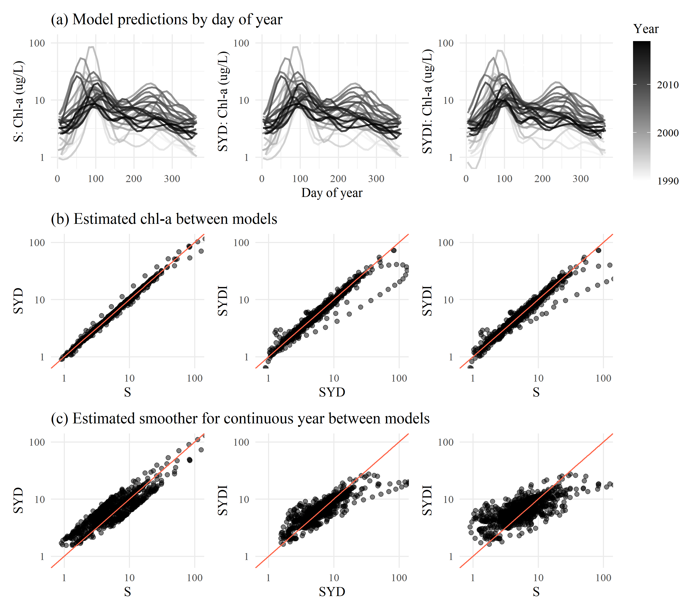

```{r setup, echo = F, warning = F, message = F, results = 'hide'}
# figure path, chunk options
knitr::opts_chunk$set(fig.path = 'figs/', warning = F, message = F, echo = F, cache = T, dev.args = list(family = 'serif'), dpi = 300, warning = F, cache.path = 'manu_draft_cache/',
  fig.process = function(x) {
  x2 = sub('-\\d+([.][a-z]+)$', '\\1', x)
  if (file.rename(x, x2)) x2 else x
  })

# libraries
library(Jabbrev)
library(tidyverse)
library(wqtrends)
library(flextable)
library(officer)
library(ggmap)
library(sf)
library(ggsn)
library(USAboundaries)
library(hrbrthemes)
library(patchwork)
library(lubridate)
library(colorspace)

data(locs)
data(modprf)
data(seastrnd)
data(seastrnd2)
data(chgtrnd)
data(cmptrnd)
data(mods_chl18)
data(mods_chl24)
data(mods_chl27)
data(mods_chl32)
data(mods_chl34)

source('R/funcs.R')

# model levels and labels
modlbs <- c('Const seas', 'Int seas', 'Const seas*')
modbst <- modlbs[3]

locs <- locs %>% 
  rename(station = Station)

# # extract bib entries from online
# bib_scrp('manu_draft.Rmd', 'refs.bib')
```

`r paste('Compiled', Sys.time())`

```{r echo = F, cache = F, eval = F}
spelling::spell_check_files('manu_draft.Rmd')
```

# Abstract

# Introduction

Many environmental monitoring programs generate fine-scale but potentially irregular time-series data to assess long-term trends for regulatory, management, or research purposes. The mismatch between the scales of monitoring versus analysis questions or management goals can lead to statistical challenges [@Urquhart98;@Cumming06;@Forbes18] [Marcus will go over refs]. At finer temporal scales, environmental systems may show short-term fluctuations from multiple factors (e.g., weather events, management, or seasonal changes).  Such fluctuations may not be of direct interest for longer-term trends or may not be well-suited to multi-scale smoothing methods.  However, aggregate features of seasonal patterns that integrate or summarize short-term fluctuations may be of interest.  In this paper, we describe methods to estimate across-year trends of within-year features of interest such as a seasonal average, seasonal peak, or seasonal timing of events, while accounting for uncertainties across analysis steps.  

Previous methods for water quality trend analysis can be generalized into four basic approaches.  Seasonal Kendall tests or related non-parametric approaches have been used for decades in water quality trend assessments to identify monotonic changes that account for seasonal variation between years [@Hirsch82;@Helsel20].  A literature survey of @Wan17 revealed non-parametric approaches to be the most commonly used methods in long-term water quality trend analysis, yet they have limited scope.  They do not account for changes occurring at different temporal scales, do not adequately evaluate irregularly spaced data [is this true? I would think so.], do not incorporate other explanatory variables, and do not estimate a model that could be useful for other purposes.  Thus, while these non-parametric approaches have some degree of robustness, they apply only to narrow goals.

The seasonal trend decomposition using loess (STL) decomposes a time series into additive components of a long-term trend, a seasonal pattern, and residuals [@Cleveland90;@Cloern10;@Stow15].  While useful and widely applied, this method also has important limitations.  STL decomposition does not incorporate explanatory variables, it is defined more as an algorithm of statistical steps than as a coherent statistical model [e.g., @Wan17], and it does not usually include standard errors to allow hypothesis testing [but see @Hafen10].  Conventional STL approaches may also over-simplify trends into absolute components that do not change over time, e.g., a seasonal estimate that is constant across years.  This limitation presents challenges when addressing questions relevant to long-term water quality data, such as timing of seasonal peaks that can suggest system response to changing  environmental conditions [@Cloern10;@Navarro12].

The more recently developed method of weighted regression on time, discharge, and season (WRTDS) uses a more general local regression scheme than STL [@Hirsch10;@Beck15].  Designed for river data where separating the effect of discharge on constituent concentration is important, WRTDS estimates a moving window regression model with components that allows parameters to vary smoothly in relation to both time and discharge.  This yields parameters that are specific to season, year, and flow regime.  Conceptually, the approach is similar to localized multi-polynomial smoothing methods, although the application was developed specifically for describing long-term water quality trends.  Standard error estimates of predictions are available through a "block bootstrap" approach that uses Monte Carlo estimates of false positive rates from the model results [@Hirsch15]. Although a useful addition to the original method in @Hirsch10, the approach requires extensive resampling as a post-hoc application to a previously fitted model.  

The final and most recent approach is to use smoothing splines to separate fluctuations on different time scales and do so within the larger framework of generalized additive models (GAMs) [@He06;@Morton08;@Pearce11;@Haraguchi15;@Murphy19].  These may be seen as generalizing the concepts behind STL and WRTDS. In statistics, the evolution of non-parametric regression methods has largely converged on GAMs rather than more generalized kernel smoothing methods used by both STL and WRTDS.  Kernel smoothing and spline smoothing are closely related, and a key challenge for each is to determine the appropriate degree of smoothing.  For example, WRTDS can potentially give results similar to the spline-based smoothing methods described next, although at higher computational expense and with the limitation that uncertainty estimates are not readily obtainable from the original method [@Beck17]. User input is also required to specify an acceptable degree of smoothing used by the "windows" that define the localized fit of WRTDS at each point in the time series.  These windows are conceptually similar to the kernel (or bandwidth) that used in more conventional smoothing methods. There is no simple rule to guide the choice of defining an appropriate size and a tradeoff between over- and under-smoothing is a hallmark of these approaches. 

Compared to kernel smoothing methods, GAMs have various advantages.  They are formulated using "basis functions", and these can be customized for needs such as cyclic splines (e.g., for an annual pattern) and low-dimensional interactions.  They can naturally include both parametric (e.g. linear or quadratic) components and non-parametric (spline) components.  Importantly, multiple approaches to automatically determine the optimal degree of smoothness have been developed, based on likelihood and/or optimizing out-of-sample prediction error.  They have natural frequentist and Bayesian interpretations, are naturally extensible to include random effects (GAMMs), and have computationally efficient implementations that can be optimized more quickly than other approaches [@Wood17].  For these reasons, GAMs are widely used for non-parametric regression smoothing in many fields.

GAMs have recently been applied to trend analysis of water quality time-series, particularly from long-term monitoring programs [@Haraguchi15;@Murphy19], but with different formulations and goals than given here. For example, in the US, the Chesapeake Bay Program uses GAMs to decompose time-series into long-term and seasonal trends [@Murphy19] and test trend hypotheses between two points in time.  That is related to the methods here, but this paper gives more general methods for analyzing trends of seasonal spline features, describes the relationships among alternative spline formulations when they are used as designed [@Wood03;@Wood17] rather than for ad hoc separation of time scales, and prioritizes full incorporation of uncertainty.  Other studies of environmental time-series with GAMs have addressed the use of transformed response data [@Yang20], serial correlation in high resolution data [@Morton08;@Yang20], and different time lags in describing relationships between response and predictor variables [@Lefcheck17;@Testa18].

Our motivating problem has several needs that are not satisfied by previous methods, but can use GAMs as a starting point. Our general goal is to understand interannual changes in seasonally averaged water quality metrics, such as Chl-a.  However, the seasonal average within each year must account for different sampling times and intervals, and any trend analysis must incorporate the uncertainties in seasonal averages. STL and/or WRTDS could potentially separate seasonal from long-term trends, but doing so is not necessary to determine seasonal averages.  What is needed is an accurate estimate of uncertainty (e.g., a standard error) of seasonal averages, allowing for irregular sampling and the non-independence inherent in time-series.  This can be done with GAMs, but we develop an application that is distinct from previous studies. Even if estimates of seasonal averages and their standard errors are available, none of these methods are designed to understand interannual trends in those averages.  A Kendall test would not incorporate the standard errors or reveal useful long-term patterns beyond a significance test. Similarly, STL and WRTDS are not designed for this goal.

We illustrate the proposed methods with the motivating example of water quality monitoring in the southern portion of San Francisco Bay, California, USA.  For several decades, approximately twice-monthly monitoring has been conducted at fixed locations (stations) of the longitudinal axis of the Bay.  Analysis of these data is complicated by irregularities in timing and consistency of data collection, such that simple seasonal averages of raw data may not adequately describe trends.  Examples of long-term trend questions include: Are there significant trends in spring mean chlorophyll at four-year (or other) time-scales?  At what across-year scale do within-year summer-fall mean chlorophyll levels change?  Are there significant across-year trends in within-year timing of the spring bloom in chlorophyll or in baseline levels during periods of low productivity?  We also provide an approach for using meta-analysis methods [@Gasparrini12;@Sera19] following signal extraction with GAMs that is new to environmental trend-detection problems.  For this step, we give methods for isolating seasonal trends secondarily from GAM results with reasonable certainty and evaluating these trends between years.

# Methods

## Study area and data sources

The San Francisco Estuary (SFE) is the largest estuary on the Pacific Coast of North America and drains an area of approximately 200 thousand km$^2$ in the US state of California. Major freshwater inputs enter the system through the Sacramento-San Joaquin Delta complex upstream of Suisun Bay, where the combined inflow from both rivers is approximately 28 km$^3$ per year.  The northern subembayments are river-dominated (salinity ranging from 0 to 15 ppt), whereas the southern subembayments are marine-dominated with salinity ranging from 5 to 35 ppt depending on the tidal cycle, effluent discharge from wastewater treatment plants, and stormwater runoff.  The South Bay embayment is heavily urbanized and includes thirty-seven wastewater treatments plants that serve 7.2 million people.  Secondary treatment occurs at a majority of the treatment plants and the remaining effluent is discharged into the SFE.  Agricultural runoff from the upper watershed also contributes to nutrient loading in the SFE with the annual nutrient export estimated as approximately 30 thousand kg dy$^{-1}$ of nitrogen from the Delta. 

Nitrogen and phosphorus levels in SFE generally exceed concentrations that have been observed to promote excess primary production in other large estuarine systems.  However, eutrophic conditions have not been regularly observed since routine monitoring began in the 1970s.  Historical resistance of SFE to eutrophication has been attributed to several factors, including elevated suspended sediments that reduce light penetration in the water column, regular exchange and mixing with low-nutrient marine waters and export of estuarine nutrients to the Pacific Ocean, and benthic grazing by filter-feeding bivalves that reduce algal concentrations.  Renewed interest in the potential for nutrient loading to negatively affect water quality has occurred recently, particularly in South Bay, where harmful algal blooms (HABs), increases in summer-fall chlorophyll concentrations, and low dissolved oxygen concentrations beginning in 1999 (Figure \@ref(fig:obsdat)) [@Cloern20]. Although visual changes in observed data are apparent, statistical analyses to quantify current status and to provide estimates of annual and seasonal trends with appropriate bounds on uncertainty have not been sufficiently developed, particularly on a seasonal basis.

The analysis evaluated near-surface chlorophyll-a data collected biweekly to monthly along the South Bay axis extending from Central Bay (stations 18-23), South Bay (stations 24-32), and Lower South Bay (stations 34-36) (Table \@ref(tab:sumtab), Figure \@ref(fig:sitemap)). Monitoring data were obtained from the SFE Research Program of the US Geological Survey [@Cloern16;@Schraga20].  Discrete chlorophyll concentrations at each station were determined by fluorimetric analysis with 90% acetone pigment extraction on GFF filters. Data collected between 1990-2017 were selected for analysis because it represented a suitable balance among three factors relevant to testing the statistical approaches, including sufficient length of record, consistent biweekly-monthly sampling, and a diverse set of stations covering the salinity gradient across multiple subembayments.  While sampling frequency varied somewhat over time or by station, all data were treated as unique time series within the statistical models (i.e., no spatial or temporal binning or averaging was done).

## GAM application

The methods proposed here involve three stages.  First, a GAM is used to estimate a smooth pattern of variation in the raw data along with its uncertainty.  Second, a feature of interest is calculated from the estimated GAM, along with its propagated uncertainty. For this example, the seasonal averages are extracted, whereas other features could be the timing or magnitude of a seasonal peak, but those are not developed here.  Third, a mixed effects meta-analysis is used to estimate trends and test hypotheses about the change in seasonal averages across years.  While meta-analysis methods arose from analyses of results from multiple studies, their distinguishing characteristic is propagation of uncertainty [@Gasparrini12;@Sera19].  Meta-analysis uses response data that includes standard errors (uncertainties) as needed to address our questions.  Two mixed effects meta-analysis approaches are developed, 1) simple comparison of whether seasonal features differ across years, and 2) estimation of short-term linear trends on time-scales chosen by the analyst.

The three-stage approach is motivated in several ways.  In the first stage, the GAM is used for signal-extraction at the scale of the raw data and we explain the relationships among various GAM specifications to emphasis concordance between the trend-analysis goal and signal-extraction goal in the formulation of splines.  The second stage uses mixed-meta analysis to propagate uncertainty from estimated GAM parameters to features of interest, i.e., seasonal averages.  Such features can be practically evaluated as functions of the fitted GAM, rather than as parameters to be estimated within the GAM. On a practical level, the first two stages can be viewed as creating a "data product" that can be used in any subsequent analyses as long as they include the uncertainty associated with each point estimate. This offers an important practical benefit for visualization and management purposes. For the third stage (long-term trend-analysis), we harness existing meta-analysis methods that are well-suited to the task at hand. 

### First-stage analysis: GAM estimation

Generalized additive models use sums of parametric terms (e.g., linear) and non-parametric terms (e.g., smoothing splines) to predict response data. In our approach, GAMs are used to estimate signal and uncertainty from the time-series data.  Results are subsequently used in the second-stage analysis, described below.  

In this section we describe four GAM formulations that can achieve the same or similar fits to data in slightly different ways.  We present these to clarify relationships that may otherwise be confusing and to emphasize that results can be similarly achieved if a model unconstrained to have sufficient capability to extract a signal from raw data. Models will be written in the notation of the `mgcv` R package as formulas for the `gam` function [@Wood17]. 

The fundamental goal is to smooth the raw data across time in order to separate the signal from the noise. The simplest GAM for this purpose can be expressed as:

Model S: `y ~ s(cont_year, k = num_knots_Y)`

Here `y` is the time-series of interest, such as Chl-a, `cont_year` is "continuous year", a continuous numerical date (e.g., July 1st 2019 would be 2019.5), `y ~ s(...)` indicates that `y` will be explained by a smoothing spline (in this case of `cont_year`), and `num_knots_Y` is the number of knots used to create the spline.

For smoothing in `mgcv`, appropriate smoothness is achieved not by choice of knots but by a penalty on the net curvature of the spline [@Wood04].  Smoothing was determined using generalized cross-validation (GCV, as implemented in `mgcv`), which approximately minimizes out-of-sample prediction error.  To allow GCV (or other alternatives) to work as intended, the number of knots must be sufficiently large.  Results should not be sensitive to the number of knots; if they are, the number of knots should be increased.  Therefore, we choose a sufficiently large number of knots for `num_knots_Y` as 12 times the number of years in the time series that was modeled.  This created the potential to have one knot per month as an approach to both prevent under-fitting the observed data and to accurately estimate the seasonal signal within a year.  In some cases, this upper limit was too large given the observed data and the multiplier was reduced by one until sufficient degrees of freedom were available (i.e., 12 * years, 11 * years, etc.).   

The next three spline formulations differ in how spline terms compose a model to smooth the raw data.  For convenience, a linear trend in `cont_year` can specified explicitly as a separate component.  This would be expressed as:

Model SY: `y ~ cont_year + s(cont_year, k = num_knots_Y)`

This model is effectively mathematically equivalent to model S.  The spline for `cont_year` includes an unpenalized linear trend, so a trend will be estimated in model S.  When `cont_year` is included explicitly as a linear term in model SY, the `mgcv` implementation automatically adjusts the basis functions for the spline to exclude the linear term, to avoid over-parameterizing the model.  With model S, the estimated trend in `cont_year` and its uncertainty can be extracted from the fitted spline.  With model SY, it is available more conveniently.  Further, package `mgcv` includes an option `select = TRUE` to penalize linear trends in splines to provide a method for variable selection, such as when numerous splines are included in the model formulation for variables that may or may not be important.  For our approach, this option is not used and all models specify `select = FALSE`.  Details in the supplement explain this justification. 

Next, an average within-year cyclic pattern as a separate spline can be separted in the model formulation.  This can be expressed as:

Model SYD: `y ~ cont_year + s(cont_year, k = num_knots_Y) + s(doy, bs = 'cc', k = num_knots_D)`

Here `doy` is "day-of-year" (i.e., Julian date, a count starting January 1 for each year), `bs = 'cc'` indicates the spline will be cyclic (constrained to start and end at the same value), and `num_knots_D` is the upper limit for the number of knots for the `doy` spline.  While model SYD is not mathematically equivalent to models S and SY, it should be functionally similar.  In this model, the `doy` spline gives the average pattern of fluctuations within each year.  This changes the interpretation of the `cont_year` spline to represent smoothed deviations from the average within-year pattern.

Models S, SY, and SYD can all potentially extract a similar signal from the raw data.  What differs is the allocation of penalties for curvature used to determine smoothness for each spline.  In model SYD, there are separate penalties for the two splines.  Caution is needed in interpreting differences in fit between model SYD and models S or SY because the penalties for smoothing splines based on curvature are heuristic [@Wood17]. For example, if a lower AIC is achieved in one model compared to another, assuming both use sufficient knots, this may just reflect the outcome of alternative penalization heuristics implied by the different formulations. In the examples here, model SYD achieves nearly identical fits to model S or SY, where the latter by definition also achieve identical fits.

Model SYD has the appealing feature that, if some parts of some years have limited data, model SYD will "borrow information" across years.  The model will impute an average seasonal pattern where data are limited. However, a conceptual representation of what an average within-year pattern represents is challenging.  For example, suppose in every year includes a spring chl-a peak.  If the timing is the same in every year whereas the magnitudes vary, then the average within-year pattern will have an average magnitude and appeas as a "typical" year.  However, if the magnitude is the same and the timing varies across years, then the average within-year pattern will not appear typical.  The imputed values will represent a day-by-day average, appearing more spread out in time than the pattern in any single year.

More importantly, the average within-year pattern (and its uncertainty) can be obtained from estimated models S and SY, as well as from model SYD, but using a different approach.  In models S and SY, the average within-year pattern is simply the average across years of the smoothed within-year patterns.  From this perspective, model SYD, like model SY, is a convenience, estimating the average within-year pattern directly as a separate estimated spline.  The average pattern extracted from model S or SY may not be identical to the `doy` spline estimated in model SYD, again due to different smoothing formulations, but in practice they should be similar.

Finally, the raw data can be smoothed using a bivariate spline representing an interaction between `cont_year` and `doy`. This can be expressed as:

Model SYDI: `y ~ cont_year + s(cont_year) + s(doy, bs = "cc") + ti(cont_year, doy, bs = c("tp", "cc"), k = c(num_knots_Y_ti, num_knits_D_ti))`

Here, `ti()` specifies a tensor-product spline for a surface that varies smoothly as a function of both `cont_year` and `doy`.  The number of knots is the product of `num_knots_Y_ti` in the `cont_year` axis and `num_knots_D_ti` in the `doy` axis.  In SYDI, the need for sufficient knots can be satisfied either by sufficiently large values for `num_knots_Y_ti` and `num_knits_D_ti` or a sufficiently large value for knots in `s(cont_year)`, but not both to avoid over-parameterization.

Following similar rationale above, the relationship of model SYDI to model S is similar to that of model SYD to model S.  Model SYDI is more mathematically different, but all of the splines use the same inputs to smooth the same data.  The splines in `dec_time` and `doy` will likely not capture as much variation as above because of fewer knots.  The `ti` term represents an interaction by allowing the pattern in `dec_time` to vary by `doy` and vice-versa.  The interaction term in model SYDI provides an appearance that this model is fundamentally different form those provided by the other models.  However, models S, SY, and SYD all allow within-year fluctuations to vary across years by allowing a spline to be fit through the entire time-series.  Although model SYDI is the only model that includes an explicit interaction term, all of the models support the interaction conceptually. By providing this term with sufficient knots, the raw data can be fully smoothed with model SYDI to a similar degree as for the other models.  However, this outcome is difficult to achieve for reasons explained below.

The distinct aspect of model SYDI is the anticipation that within-year fluctuations will vary smoothly across years.  For example, if one year has an early and large magnitude spring bloom, the years before and after would have similar patterns described by the model, perhaps different but not substantially. For the raw San Francisco Bay data, this may not be the case, as one year might have an early, high spring bloom and the next year a late, low spring bloom, or other such large variation across years.  If the interaction spline has sufficient knots, then the degree of smoothness across years can be estimated to be very low, allowing fluctuations within years to vary strongly across years.  However, if that is the case, the conceptual motivation for model SYDI may not be justified.  In summary, model SDYI may best be suited for systems where within-year fluctuations actually vary smoothly across years, in which case it may out-perform the other models.  If that is not the case, it may perform similarly to the others, but the spline structure and penalty structure are more different, making performance harder to compare.

All of the models require a sufficiently large number of knots in one or more of the spline terms to accommodate the fluctuations in the data and use the GAM estimation methods in the manner for which they were designed.  In models S, SY, and SYD, the number of knots in the `cont_year` term need to be sufficiently large.  In model SYDI, a very large number of knots in both the `cont_year` spline *and* in both dimensions of the interaction spline is impossible to achieve.  Allowing the `cont_year` spline to include many knots would somewhat defeat the purpose of the interaction spline.  In practice, allocation of knots between the different splines can be chosen by the analyst so long it is recognized that different choices will arbitrarily lead to more variation being explained between the splines.

@Murphy19 used a related set of spline formulations but used them differently than we do here. @Murphy19 have a "`gam0`" with only a `s(doy)` term, a "`gam1`" like our SYD, and a "`gam2`" like our SYDI.  Their `gam0` is *a priori* not of interest for our data and was not explored further.  Compared to our uses of SYD and SYDI, their uses differ in choice of knots and interpretation of results.  For SYD, they set a maximum number of knots in the `s(cont_year)` term of 2/3 times the number of years, whereas we use 12 times the number of years, roughly one per month.  Thus, they interpret this spline as separating a long-term (or low-frequency) trend from other patterns, whereas we use it to separate signal from noise at a scale informed by the data.  In the SYDI model, @Murphy19 do not explicitly consider number of knots in the interaction spline.  In both cases, @Murphy19 in effect use choice of number of knots in different spline components to serve as ad hoc allocation of variation in the data to different components while not necessarily allowing any component to fully estimate the signal in the data. @Murphy19 acknowledge that incomplete modeling of fluctuations in the data may lead to inflated Type I error rates, which would apply to their later comparisons of changes across time, but they leave that problem for future work.  For the methods presented here, we seek to avoid inflated Type I error rates arising in this way.  Finally, @Murphy19 present large AIC differences between their spline formulations.  We instead emphasize that, given sufficient knots, the models represent alternative formulations of conceptually similar explanations for the data and yield similar fits.  In our example, such large differences in AIC would only reflect inadequate choice of knots in one or more splines. 

### Log and Box-Cox transformations

Following previous authors, we consider base 10 log-transformed chl-a levels for analysis.  To generalize this choice, we also consider Box-Cox transformations, which scale from log-transformation to no (i.e., identity) transformation as a parameter $\lambda$ scales from 0 to 1. 

### Second-stage analysis: Uncertainty propagation from estimated GAMs to seasonal features

\newcommand{\hm}{\hat{\mu}}
\newcommand{\hmt}{\hat{\mu}_t}
\newcommand{\mt}{\mu_t}
\newcommand{\hmr}{\hat{\mu}_r}
\newcommand{\hshmt}{\hat{\sigma}_{\hat{\mu}, t}}
\newcommand{\hshmr}{\hat{\sigma}_{\hat{\mu}, r}}
\newcommand{\hshm}{\hat{\sigma}_{\hat{\mu}}}
\newcommand{\hsshm}{\hat{\sigma}^2_{\hat{\mu}}}
\newcommand{\hsshmt}{\hat{\sigma}^2_{\hat{\mu}, t}}
\newcommand{\bX}{\mathbf{X}}
\newcommand{\hby}{\hat{\mathbf{y}}}
\newcommand{\hbb}{\hat{\boldsymbol{\beta}}}
\newcommand{\hShb}{\hat{\Sigma}_{\hat{\beta}}}
\newcommand{\hShy}{\hat{\Sigma}_{\hat{\mathbf{y}}}}
\newcommand{\sbs}{\sigma_b^2}

Next we consider the goal of estimating a seasonal average, such as the mean spring Chl-A level, and its uncertainty in each year.  Define $\mu_t$ as the seasonal average in year $t$, $\hmt$ as an estimate of $\mu_t$, and $\hshmt$ as the estimated standard error of $\hmt$. The season includes $n$ days.  In what follows, subscript $t$ will be omitted.

Point estimates of response values for the fitted GAM take the form $\hby = \bX \hbb$, where $\hbb$ is the vector of estimate parameters and $\mathbf{X}$ is a model matrix of explanatory variables, including spline basis function values.  Here $\hbb$ includes both fixed effect parameters and spline parameters, and $\bX$ contains columns corresponding to each.  For example, using model SY, if a point estimate for Chl-A is needed for a single day, given as `dec_year` = $r$, $\bX$ would have a row with with $1$ in the first column (for the intercept parameter), $r$ (for the linear time trend) in the second column, and evaluation of each spline basis function at $r$ (and possibly its corresponding `doy` value) in the remaining columns. The number of spline basis functions is related to the number of knots. Note that $r$ can be any time; it need not be the time of an observation.

To obtain a vector, $\hby$, of fitted point estimates for every day in a season, $\bX$ would have one row for each day.  The seasonal averages used in our examples are calculated at the resolution of days.  The estimated spline yields both $\hbb$ and $\hShb$, an estimate of the covariance matrix of the sampling distribution of $\hbb$.  The scalar standard errors of $\hbb$ are the square roots of the diagonal elements of $\hShb$.  Since parameter estimates are correlated, it is important to use the full $\hShb$ to determine the covariance of $\hby$.  This is given by $\hShy = \bX \hShb \bX^T$.

Finally, the estimated seasonal average is $\hm = A^T \hby$, where $A^T$ is a row vector with all values equal to $1/n$.  The variance of this is $\hsshm = A^T \hShy A$.  The standard error of the seasonal average is $\hshm$.  These are all standard results based on approximate multivariate normality of the sampling distribution of $\hbb$.  @Murphy19 gave a similar summary for the purpose of comparing multi-year averages of month-scale spline values for sets of years at the beginning vs. end of a time-series. [I note that equations 2-4 of Murphy et al. appear to be wrong, giving standard least-squares rather than penalized least-squares. I do not necessarily feel we should distract readers with this correction, but we could do so if desired.]

[Here are more detailed notes on @Murphy19.  I think this is more detail than necessary to include in a paper, but I note it here in case it is helpful for clarity among our group.  I'm fairly sure we are both doing the same thing, just with slightly different notation. @Murphy19 used the above relationships to set up a test of the null hypothesis that `y` is the same at two times (each potentialy an average, but not shown here).  To do so, $\bX$ would have two rows, one for each time.  The vector $A^T$ would [-1, 1], so that $A^T \bX$ gives the point estimate of the difference in Chl-A between those times, and $A^T \bX \hShb \bX^T A$ gives the squared standard error of that difference.  One can then determine if the difference is significantly different from 0. For me, the most confusing statement of the explanation in @Murphy19 was to call $Z_p$ the "prediction vector".  If I follow their notation, it is the vector of spline basis function evaluations, so it is used to predict `y` but is not itself a set of predictions.]

### Third-stage analysis: Trend analysis of seasonal features with uncertainties

In this section we explain how to use the within-year features ($\hmt$) from the estimated GAMs, and their standard errors $\hshmt$, to investigate across-year trends of within-year features.  In worked examples, we use as features two seasonal averages of Chl-A, one for January-July and the other for August-December.  These periods are chosen for their relevance to California's climate. (In the *Discussion* we consider other features of interest that may be obtained from estimated GAMs.)  For any feature of interest, as long as its estimates come with associated standard errors, we give meta-analysis methods to address two kinds of questions:

1. Do two years, or a group of years, differ significantly in a seasonal average?
2. Is there a significant linear trend across a group of years in a seasonal average, where the time-scale of the trend is chosen by the investigator?  This question can be posed in a moving-window manner across a time-series.

[A third question would be "3. Are there significant trends or non-linear fluctuations across years in a seasonal average, where the time-scale of trends is chosen by statistical criteria?"  This needs further work.  My current instinct is that this is too much for this paper, but it should be discussed.]

For all analyses, the response data of interest are $\hmt$, $t = 1, \ldots, N$, with their associated standard errors, $\hshmt$.  $N$ is the number of years of the study. 

### Differences among years in seasonal averages

To test the null hypothesis that  $\mu_t = \mu_r$ for years $r$ and $t$, one can use simple normal distribution theory that $\hmt - \hat{\mu}_r$ has standard error $(\hshmt^2 + \hshmr^2)^{1/2}$.  To test the null hypothesis that all means in a group of (>2) years are equal, one can use a simple case of the meta-analysis given in the next section or a general linear hypothesis test. The latter readily includes consideration of multiple testing.  For example, this is provided in R package `multcomp`.  While this package typically uses the results of a linear or generalized linear model fit as input, it is easy to set up the values of $\hmt$ and $\hshmt$ as inputs.  Details are given in the Appendix.

### Linear trends across years at a chosen time-scale of interest

The standard meta-analysis mixed effects model to estimate linear trends is given as follows, using notation similar to [@Sera19].

\begin{equation}
\hmt = \beta_0 + \beta_t t + b_t + \epsilon_t
(\#eq:mixmet)
\end{equation}

where $\beta_0$ is the intercept, $t$ is the year, $\beta_t$ is the slope, $b_t$ is the random effect for year $t$, and $\epsilon_t$ is the residual for year $t$. Here the seasonal average for year $t$ is $\mu_t = \beta_0 + \beta_t t + b_t$.  The "residual", $\epsilon_t$, represents estimation error in $\hmt$, namely $\hmt - \mt$.  This is assumed to be normally disributed with mean 0 and variance $\hsshmt$, which is assumed known from the calculations above.  The random effect, $b_t$, is the difference between $\mt$ and $\beta_0 + \beta_t t$, what would be considered the "residual" in the sense of unexplained variation not due to the estimation error.  This is assumed normal with mean 0 and unknown variance, $\sbs$, to be estimated.

The R package *mixmeta* was used to estimate this model [@Sera19].  Results have a similar interpretation as those from regression analysis, but parameter estimates and their standard errors incorporate the known standard errors of the response values.  Following meta-analysis theory, $mixmeta$ handles this model as a linear mixed effects model with some variance components fixed.  The default estimation method is restricted maximum likelihood (REML).

We apply this method for windows of a chosen width of years.  In this way, one can ask whether there is a significant linear trend in Chl-A over a chosen series of years, taking into account all the data in those years.  Some years may have had more sampling, resulting in smaller standard error for $\hmt$, while others may have had less sampling, result in higher standard error. The meta-analysis incorporates such differences in uncertainty magnitudes.

# Results

## Model performance and observed results

```{r}
aver2 <- round(100 * mean(modprf$R2), 0)
minr2 <- round(100 * min(modprf$R2), 0)
maxr2 <- round(100 * max(modprf$R2), 0)
minst <- modprf$station[which.min(modprf$R2)]
minstmod <- modprf$model[which.min(modprf$R2)]
minsttrn <- modprf$trans[which.min(modprf$R2)]
minsttrn <- ifelse(is.numeric(minsttrn), 'Box-Cox model', 'log-model')
maxst <- modprf$station[which.max(modprf$R2)]
maxstmod <- modprf$model[which.max(modprf$R2)]
maxsttrn <- modprf$trans[which.max(modprf$R2)]
maxsttrn <- ifelse(is.numeric(maxsttrn), 'Box-Cox model', 'log-model')
avecsr2 <- modprf %>% filter(model %in% 'Const seas') %>% pull(R2) %>% mean %>% '*'(100) %>% round(0)
logr2 <- modprf %>% filter(grepl('^log10$', trans)) %>% pull(R2) %>% mean %>% '*'(100) %>% round(0)
bxcxr2 <- modprf %>% filter(!grepl('^log10$', trans)) %>% pull(R2) %>% mean %>% '*'(100) %>% round(0)
```

A total of six models (three GAM structures, two link functions) were fit to each of nine stations, producing summary statistics for 18 different models (Table \@ref(tab:modprftab)).  Chlorophyll trends were generally well-explained across all models and stations, with an average R-squared value equal to `r aver2`% and ranging from `r minr2`% (`r minstmod` `r minsttrn` at station `r minst`) to `r maxr2`% (`r maxstmod` `r maxsttrn` at station `r maxst`). The constant season model had the worst performance for all stations (average R$^2$ `r avecsr2`%), with either the interactive season or constant season* model having improved measures of model fit.  For all but stations 18 and 22, the constant season* model provided significantly lower AIC and GCV scores and higher R-squared values compared to the interactive season models.  For station 18, the interactive season and constant season* models provided only a marginal improvement over the constant season model.  For station 22, the interactive season and constant season* models provided similar but much improved fit to the data as compared to the constant season model.  Moeel performance comparing either Box-Cox or logarithmic link functions were similar (average R$^2$ values of `r bxcxr2`% and `r logr2`% respectively), although the logarithmic models had slightly improved model performance. Station 18 was the only location where the three GAM models were not significantly different from each other for the Box-Cox transformation.

GAM predictions from north to south on the longitudinal axis provided different descriptions of annual and seasonal changes in chlorophyll.  Four representative stations are shown in Figure \@ref(fig:trnddat) that capture spatial variation in chlorophyll and different temporal trends described by the models.  All models suggested an increase in chlorophyll in the period of record from 1990 to approximately 2005 to 2010, when predictions suggested a decreasing trend until the end of the record. Seasonally, all models indicated a larger spring peak in chlorophyll with more southern stations, whereas a subsequent peak in fall concentrations did not have any noticeable difference in magnitude by location.  However, the magnitude of the fall peak at more southern stations shifted over time depending on the model.  In particular, the interactive season model indicates a shift in the magnitude of the fall peak at stations 24, 27, and 32 with maximum concentrations observed around the mid-early 2000s. The annual trends for all models suggested similar trends over time, i.e., an increase followed by a recent decrease, whereas the constant season* models with an unconstrained smoother on the `decYear` predictor varied considerably at station 24, 27, and 32. Annual trends at these stations were difficult to generalize and had substantial overlap with the seasonal trends.  Conversely, station 18 had minimal visual differences in annual and seasonal trends across all models, which is reflected by similarities in the model performance statistics in Table \@ref(tab:modprftab).

## Trend estimates

Examples of results provided by the trend tests are shown for station 34, with estimates of percent change between year pairs and seasonal trend results for January to July and August to December (Figure \@ref(fig:trnddat)).  This figure illustrates the narrative descriptions that can be obtained for each test and the differences that can be observed depending on season.  Figures \@ref(fig:trnddat)a-c demonstrate that average chlorophyll at station 34 from 1990 to 2000 had a 57.7% increase, although the change is insignificant.  However, the change from 2000 to 2010 was statistically significant with an increase of 78%.  The period from 2010 to 2017 showed a significant decrease of 39.8%.  An assessment of the annual differences indicated if changes overall were observed, but provides no information on seasonal shifts that may have contributed to these differences. The results in figure \@ref(fig:trnddat)d-i show results from mixed-meta regression analysis to indicate which seasonal changes were contributing to the annual differences. Rows d-f show the seasonal averages and trend estimates for the same year periods in rows a-c, but only for months from January to July.  Similarly, rows g-i show the seasonal averages and trend estimates from August to December.  The seasonal trend results suggested that the increase in annual averages from 2000 to 2010 was likely caused by an increase in chlorophyll values in the fall (Figure \@ref(fig:trnddat)h).  Seasonal changes from 2010 to 2017 showed that neither the January to July nor August to December changes were significant, suggesting an overall decrease in chlorophyll across all seasons may have recently occurred. 

Spatial variation in trends suggested that most stations in South Bay had increasing chlorophyll from 1990 to 2010 following a decrease in recent years, although many trends were not significant and varied by location (Figure \@ref(fig:trndmap)a).  From 1990 to 2000, only station 18 and 22 in the northern part of South Bay had significant increasing trends.  The magnitude of the chlorophyll increase in the southernmost stations (34, 36) was higher during this same period, although the trends were not significant.  From 2000 to 2010, significant increases were observed at the three northern-most stations (18, 21, and 22) and two southern stations (32, 34).  From 2010 to 2016, all four southern stations had significant decreases in annual chlorophyll.  The spatial trends were further evaluated with mixed-meta regression analysis to provide additional context to the annual changes by evaluating trends from January to July and August to December (Figure \@ref(fig:trndmap)b).  For the January to July period, significant changes were only observed at the southern stations, with increases at station 34 and 36 from 1990-2000, an increase at station 34 from 2000-2010, and a decrease at station 32 form 2010 to 2016.  No significant changes were observed for the August to December period.  

A final analysis of the seasonal trends evaluated more discrete monthly periods in three month blocks to provide finer resolution to explain trends from the GAM results (Table \@ref(tab:seastrndtab)).  Many stations and time periods did not show any seasonal chlorophyll trends or only had one significant trend (e.g., stations 21 and 24, JFM period from 2000-2010).  However, several trends were observed in the southern stations, with two significant trends at station 32, six at station 34, and three at station 36.  Trends at station 32 indicated a positive increase in the JFM (January, February, March) period from 2000-2010, followed by a significant decrease for the same seasonal period from 2010-2016.  Station 34 had significant increases in the JFM period from 1990-2010 and all other periods the OND (October, November, December) period for 2000 to 2010.  Significant decreases were observed at station 34 in the JFM and AMJ (April, March, July) period from 2010 to 2016.  Station 36 had significant chlorophyll increases in all seasons, except OND for the 1990 to 2000 period.  Accordingly, table \@ref(tab:seastrndtab) demonstrates the value of obtaining greater insight into seasonal changes by evaluating different blocks as compared to the larger seasonal blocks shown in Figure \@ref(fig:trndmap)b. 

## Trend comparisons 

Trends results from the mixed-meta regression method for each season and different time periods were compared to alternative trend analyses to demonstrate different conclusions that can be derived depending on method.  Figure \@ref(fig:trndcmp) shows estimates of chlorophyll change per year for the same seasonal periods and annual groupings as in figure \@ref(fig:trndmap)b.  In addition to mixed-meta analysis, two alternative trend methods were used where the first shows slope estimates from a linear regression on annual averages of observed chlorophyll for the specified seasonal period and the second shows slope estimates from a linear regression model on annual averages derived from the GAM seasonal estimates.  The latter uses the same averages from the mixed-meta analysis, but is a simpler approach that does not account for the uncertainty in the average estimates.  

The different trend analysis methods provided conflicting information on the magnitude and direction of the seasonal chlorophyll changes in each decade (Figure \@ref(fig:trndcmp)).  The slope estimates from the linear model applied to the observed data were understandably more variable than the slope estimate from the average and mixed-meta methods, with much larger slopes observed especially at the more southern stations.  Slope estimates from the linear model applied to the averages from the GAMs as compared ot the mixed-meta results were identical at almost all stations, excluding station 32 in the January-July period from 1990-2000 when the former showed a negative slope and the latter showed a positive slope.  The mixed-meta analyses had less significant trends compared to the average results for the same GAM estimates, which reflects the ability of the former to account for uncertainty in the average estimates when considering trends.  Importantly, completely opposite and/or varying significance of trends were observed between the methods, suggesting choice of analysis method can influence the certainty of conclusions. 

# Discussion

# Conclusions

# Acknowledgments

# Figures

```{r, results = 'hide', message = F}
# treatment colors
cls1 <- RColorBrewer::brewer.pal(9, 'Greys')
cls2 <- RColorBrewer::brewer.pal(3, 'BrBG')

toplo1 <- rawdat %>%
  filter(param %in% 'chl') %>% 
  filter(mo %in% c('Aug', 'Sep', 'Oct', 'Nov', 'Dec')) %>% 
  # filter(station %in% c(24, 27, 30, 32)) %>% 
  group_by(yr) %>% 
  mutate(Median = median(value, na.rm = TRUE)) %>% 
  ungroup() 

toplo2 <- rawdat %>%
  filter(param %in% 'chl') %>% 
  mutate(
    yrcat = case_when(
      yr < 2000  ~ '1990-2000', 
      yr >= 2000 & yr < 2010 ~ '2000-2010', 
      yr >= 2010 ~ '2010-2017'
    ), 
    yrcat = factor(yrcat, levels = c('1990-2000', '2000-2010', '2010-2017'))
  )

ylab <- expression(paste("Chlorophyll-a (", italic(mu), "g ", L^-1, ")"))

p1 <- ggplot(toplo1, aes(x = yr, y = value, fill = Median, group = yr)) + 
  geom_violin(draw_quantiles = 0.5)  + 
  scale_fill_gradientn(colours = cls1) + 
  scale_y_log10() +
  theme_minimal(base_family = 'serif') +
  theme(
    axis.title.x = element_blank()
  ) +
  labs(
    y = ylab, 
    subtitle = '(a) Annual summer/fall concentrations'
  )

p2 <- ggplot(toplo2, aes(x = mo, y = value, fill = yrcat)) + 
  geom_violin(draw_quantiles = 0.5)  + 
  scale_y_log10(ylab) +
  theme_minimal(base_family = 'serif') +
  scale_fill_manual(values = cls2) +
  theme(
    legend.title = element_blank(), 
    axis.title.x = element_blank()
  ) +
  labs(
    y = ylab, 
    subtitle = '(b) Monthly concentrations by decade'
  )

p <- p1 + p2 + plot_layout(ncol = 1)
png('figs/obsdat.png', height = 8, width = 8, family = 'serif', units = 'in', res = 400)
print(p)
dev.off()
```
```{r obsdat, fig.cap = "Observed chlorophyll concentrations for all stations in central and south San Francisco Estuary (18-36, Figure \\@ref(fig:sitemap)), with (a) annual summer/fall concentrations (Aug - Dec) and (b) monthly concentrations by decade."}
knitr::include_graphics('figs/obsdat.png')
```

```{r, results = 'hide', message = F}
# station locations
sflocs <- locs %>% 
  st_as_sf(coords = c('lon', 'lat'), crs = 4326)

# for inset
states <- us_states() %>% 
  filter(!name %in% c('Alaska', 'Hawaii', 'Puerto Rico'))
castate <- states %>% 
  filter(name %in% 'California')
locbuff <- st_buffer(sflocs, dist = 0.1)
locbuff2 <- st_buffer(sflocs, dist = 0.07)
insetbb <- st_buffer(sflocs, dist = 1.5) %>% 
  st_bbox() %>% 
  st_as_sfc(crs = 4326)

# basemap
dat_ext <- unname(st_bbox(locbuff))
bsmap1 <- get_stamenmap(bbox = dat_ext, maptype = 'terrain-background', zoom = 11)

# change opacity of basemap
mapatt <- attributes(bsmap1)
bsmap1_transparent <- matrix(adjustcolor(bsmap1, 
                                                alpha.f = 0.75), 
                                    nrow = nrow(bsmap1))
attributes(bsmap1_transparent) <- mapatt

# basemape plus stations
p1 <- ggmap(bsmap1_transparent) +
  geom_sf(data = sflocs, inherit.aes = F, col = 'black', pch = 21, fill = 'grey', size = 4) + 
  geom_text(data = locs, aes(x = lon + 0.02, y = lat + 0.02, label = station), fontface = 'bold.italic') + 
  theme(
    axis.title = element_blank()
  ) + 
  north(locbuff, scale = 0.15, symbol = 10, location = 'bottomright') +
  scalebar(locbuff2, dist = 10, dist_unit = 'km', location = 'bottomleft', transform = T, 
           st.color = 'black', border.size = 0.5, st.dist = 0.02, st.size = 4) 

# inset
p2 <- ggplot() + 
  geom_sf(data = states, fill = 'white', colour = 'black') + 
  geom_sf(data = castate, fill = 'grey', colour = 'black') + 
  geom_sf(data = insetbb, fill = NA, color = 'blue', size = 2) +
  theme_void()

# final map
p <- p1 + 
  inset(ggplotGrob(p2), xmin = -122.3, xmax = -121.97, ymin = 37.75, ymax = 37.95)

# save as png
png('figs/sitemap.png', height = 6.5, width = 5, units = 'in', family = 'serif', res = 300)
print(p)
dev.off()
```
```{r sitemap, fig.cap = 'Station locations in the central and south San Francisco Estuary used for analysis.  See Table \\@ref(tab:sumtab) for station descriptions.  Full dataset described in @Schraga20.'}
knitr::include_graphics('figs/sitemap.png')
```

```{r, results = 'hide'}
# get predictions for all three gams
tomod <- rawdat %>%
  filter(station %in% 22) %>%
  filter(param %in% 'chl')

# use previously fitted list of models
trans <- 'boxcox'
mods <- list(
  `Const seas` = anlz_gam(tomod, mod = 'gam1', trans = trans),
  `Int seas` = anlz_gam(tomod, mod = 'gam2', trans = trans),
  `Const seas*` = anlz_gam(tomod, mod = 'gam6', trans = trans)
)

p1 <- show_prddoy(mods = mods, ylab = 'Chlorophyll-a (ug/L)', nfac = 3, size = 0.8, alpha = 0.8, faclev = modlbs) + 
  theme(legend.position = 'right') + 
  guides(colour = ggplot2::guide_colourbar(barheight = 15, barwidth = 1)) +
  scale_colour_gradient(low = "white", high = "black") + 
  theme_minimal() + 
  theme(
    legend.title = element_blank()
  )

png('figs/modsumfig.png', height = 2.5, width = 6, units = 'in', family = 'serif', res = 400)
print(p1)
dev.off()
```
```{r modsumfig, fig.cap = "General output for each of the GAM structures for constant season, interactive season, and constant season*.  Day of year (Julian) is on the x-axis and each curve represents a different fitted year for chlorophyll concentration."}

```

```{r, results = 'hide', message = F}
# get predictions to plot
prdplo <- bind_rows(mods_chl18, mods_chl24, mods_chl27, mods_chl32) %>% 
  mutate(prddat = pmap(list(data, modi), function(data, modi){

    prddat <- data.frame(
        dec_time = seq(min(data$dec_time), max(data$dec_time), length = 1000)
      ) %>%
      mutate(
        date = date_decimal(dec_time),
        date = as.Date(date),
        mo = month(date, label = TRUE),
        doy = yday(date),
        yr = year(date)
      )
    
    prd <- predict(modi, newdata = prddat) %>% 
      as.numeric
    
    annprd <- predict(modi, newdata = prddat, type = 'terms')
    int <- attr(annprd, 'constant')
    value <- rowSums(annprd) + int
    annvalue <- rowSums(annprd[, !grepl('doy', colnames(annprd)), drop = FALSE]) + int
    annvalue <- as.numeric(annvalue)
    
    trans <- unique(modi$trans)
    
    if(!inherits(trans, 'numeric'))
      stop('log used')
    
    prddat <- prddat %>% 
      mutate(
        chl = prd,
        chl = forecast::InvBoxCox(chl, trans), 
        annchl = forecast::InvBoxCox(annvalue, trans)
        )
    
    return(prddat)
    
  })) %>% 
  select(station, modi = model, prddat) %>% 
  unnest(prddat) 

ylab <- expression(paste("Chlorophyll-a (", mu, "g ", L^-1, ")"))

toplo <- prdplo %>% 
  filter(yr >= 1991)

obsdat <- rawdat %>% 
  filter(station %in% c(18, 24, 27, 32)) %>% 
  filter(param == 'chl') %>% 
  filter(yr >= 1991) %>% 
  rename(chl = value)

colpal <- "PuBuGn"

p1 <- ggplot(toplo, aes(x = date, y = chl)) + 
  geom_point(data = obsdat, color = 'grey', size = 0.15) + 
  geom_line(size = 0.5) +
  geom_line(aes(y = annchl), color = 'tomato1', size = 0.5, alpha = 0.9) +
  theme_minimal(base_family = 'serif') + 
  theme(
    legend.position = 'right', 
    legend.title = element_blank(), 
    # axis.text.x= element_text(size = 8)
    strip.background = element_blank()
  ) + 
  facet_grid(modi ~ station) +
  scale_y_log10(limits = c(0.74, 83)) + 
  labs(x = 'Date', subtitle = '(a) Model predictions with annual estimates', y = ylab)

p2 <- ggplot(toplo, aes(x = doy, colour = yr, group = factor(yr))) + 
  geom_line(aes(y = chl)) + 
  theme_minimal(base_family = 'serif') + 
  theme(
    legend.position = 'right', 
    legend.title = element_blank(), 
    # axis.text.x= element_text(size = 8)
    strip.background = element_blank()
  ) + 
  scale_colour_continuous_sequential(palette = colpal, rev = T, begin = 0.2) +
  guides(colour = guide_colourbar(barheight = 10, barwidth = 1)) +
  facet_grid(modi ~ station) +
  scale_y_log10() + 
  labs(x = 'Day of year', subtitle = '(b) Model predictions by day of year', y = ylab)

p <- p1 + p2 + plot_layout(ncol = 1)

png('figs/prddat.png', height = 10, width = 9, family = 'serif', units = 'in', res = 400)
print(p)
dev.off()
```
```{r prddat, fig.cap = "GAM predictions for select stations from north to south (18, 24, 27, 32) for each of the GAM structures for constant season, interactive season, and constant season*. The results show (a) predictions across the time series with annual estimates (red line) and (b) predictions by day of year with one smooth per year.  Observed data in (a) are shown with the gray points. Station locations are in Figure \\@ref(fig:sitemap)."}
knitr::include_graphics('figs/prddat.png')
```

```{r, results = 'hide', message = F}
toplo <- mods_chl34 %>% 
  filter(model %in% !!modbst) %>% 
  pull(modi)

ylim <- c(-1, 19)
ylab <- expression(paste("Chlorophyll-a (", mu, "g ", L^-1, ")"))

p1 <- show_perchg(mods = toplo, baseyr = 1991, testyr = 2000, ylab = ylab) +
  labs(
    subtitle = '(a) 1990, 2000, Base: 3.6, Test: 5.7,\nChange: 57.7%, ns', 
    title = NULL
  )
p2 <- show_perchg(mods = toplo, baseyr = 2000, testyr = 2010, ylab = NULL) +
  labs(
    subtitle = '(b) 2000, 2010, Base: 5.7, Test: 10.1,\nChange: 77.5%, p < 0.001', 
    title = NULL
  )
p3 <- show_perchg(mods = toplo, baseyr = 2010, testyr = 2017, ylab = NULL) +
  labs(
    subtitle = '(c) 2010, 2017, Base: 10.1, Test: 6.1,\nChange: -39.8%, p < 0.01', 
    title = NULL
  )
p4 <- show_avgseason(mods = toplo, doystr = 41, doyend = 213, yrstr = 1991, yrend = 2000, ylab = ylab) +
  scale_y_continuous(limits = ylim) + 
  labs(
    subtitle = '(d) 1990-2000, Jan-Jul, slope 0.6, p < 0.01', 
    title = NULL
  )
p5 <- show_avgseason(mods = toplo, doystr = 41, doyend = 213, yrstr = 2000, yrend = 2010, ylab = NULL) +
  scale_y_continuous(limits = ylim) + 
  labs(
    subtitle = '(e) 2000-2010, Jan-Jul, slope 0.5, ns', 
    title = NULL
  )
p6 <- show_avgseason(mods = toplo, doystr = 41, doyend = 213, yrstr = 2010, yrend = 2016, ylab = NULL) +
  scale_y_continuous(limits = ylim) + 
  labs(
    subtitle = '(f) 2010-2017, Jan-Jul, slope -0.4, ns', 
    title = NULL
  )
p7 <- show_avgseason(mods = toplo, doystr = 213, doyend = 338, yrstr = 1991, yrend = 2000, ylab = ylab) +
  scale_y_continuous(limits = ylim) + 
  labs(
    subtitle = '(g) 1990-2000, Aug-Dec, slope 0.26, ns', 
    title = NULL
  )
p8 <- show_avgseason(mods = toplo, doystr = 213, doyend = 338, yrstr = 2000, yrend = 2010, ylab = NULL) +
  scale_y_continuous(limits = ylim) + 
  labs(
    subtitle = '(h) 2000-2010, Aug-Dec, slope 0.56, p < 0.05', 
    title = NULL
  )
p9 <- show_avgseason(mods = toplo, doystr = 213, doyend = 338, yrstr = 2010, yrend = 2017, ylab = NULL) +
  scale_y_continuous(limits = ylim) + 
  labs(
    subtitle = '(i) 2010-2017, Aug-Dec, slope -0.52, ns', 
    title = NULL
  )

p <- p1 + p2 + p3 + p4 + p5 + p6 + p7 + p8 + p9 + plot_layout(nrow = 3) & 
  theme_minimal(base_family = 'serif', base_size = 12) &
  theme(
    axis.title.x = element_blank(),
    legend.position = 'none'
    )

png('figs/trnddat.png', height = 9, width = 11, family = 'serif', units = 'in', res = 400)
print(p)
dev.off()
```
```{r trnddat, fig.cap = "Examples of trend tests using results of GAM predictions for station 34 (`Const seas*`).  Plots (a), (b), and (c) show estimates of percent change as the difference of means between base and test years for chlorophyll.  Plots (d) through (i) show seasonal averages and trend estimates over time.  Plot (d), (e), and (f) show trend estimates for January through July and (g), (h), and (i) show trend estimates for August through December.  The trend lines in (d) through (i) estimate the rate of change of chlorophyll per year, reported as the slope in the plot title. ns: not significant"}
knitr::include_graphics('figs/trnddat.png')
```

```{r, results = 'hide', message = F}
# change opacity of basemap
mapatt <- attributes(bsmap1)
bsmap1_transparent <- matrix(adjustcolor(bsmap1, 
                                         alpha.f = 0.4), 
                             nrow = nrow(bsmap1))
attributes(bsmap1_transparent) <- mapatt

leglab2 <- expression(paste("Chl-a change (", italic(mu), "g ", L^-1, yr^-1, ")"))

pthm <- theme_bw(base_family = 'serif', base_size = 14) +
  theme(
    legend.position = 'top',
    strip.background = element_blank(),
    axis.title = element_blank(), 
    axis.text = element_text(size = 7)
  )

toplo1 <- chgtrnd %>% 
  mutate(
    station = as.numeric(station),
    pval = ifelse(pval == 'sig', '*', '')
    ) %>% 
  left_join(locs, by = 'station') %>% 
  filter(model %in% !!modbst)

toplo2 <- seastrnd2 %>%
  mutate(
    station = as.numeric(station),
    pval = ifelse(pval < 0.05, '*', ''), 
    coefsgn = sign(yrcoef), 
    coefsgn = factor(coefsgn, levels = c('1', '-1'), labels = c('inc', 'dec'))
  ) %>% 
  left_join(locs, by = 'station')

p1 <- ggmap(bsmap1_transparent) +
  geom_point(data = toplo1, aes(x = lon, y = lat, size = abs(perchg), shape = persgn, fill = perchg, colour = pval)) + #, color = 'black') +
  geom_text(data = toplo1, aes(x = lon, y = lat, label = pval), nudge_x = 0.04) + 
  facet_grid( ~ yrs) + 
  scale_fill_gradient2('Chl-a % change', low = 'green', mid = 'white',  high = 'tomato1', midpoint = 0) +
  scale_colour_manual(values = c('black', 'black'), guide = F) +
  coord_map() + 
  scale_shape_manual('Trend', values = c(24, 25)) + 
  pthm +
  scale_size(range = c(1, 6), guide = F) +
  guides(fill = guide_colourbar(barheight = 0.5, barwidth = 6)) +
  labs(
    subtitle = '(a) Percent change between year pairs'
  )

p2 <- ggmap(bsmap1_transparent) +
  geom_point(data = toplo2, aes(x = lon, y = lat, size = abs(yrcoef), shape = coefsgn, fill = yrcoef, colour = pval)) + #, color = 'black') +
  geom_text(data = toplo2, aes(x = lon, y = lat, label = pval), nudge_x = 0.04) + 
  facet_grid(seas ~ yrs) + 
  scale_fill_gradient2(leglab2, low = 'green', mid = 'white',  high = 'tomato1', midpoint = 0) +
  scale_colour_manual(values = c('black', 'black'), guide = F) +
  coord_map() + 
  scale_shape_manual('Trend', values = c(24, 25)) + 
  pthm +
  scale_size(range = c(1, 6), guide = F) +
  guides(fill = guide_colourbar(barheight = 0.5, barwidth = 6)) +
  labs(
    subtitle = '(b) Annual rates of change across seasons by decade'
  )

p <- p1 + p2 + plot_layout(ncol = 1, heights = c(0.5, 1)) 

png('figs/trndmap.png', height = 10, width = 6.5, family = 'serif', units = 'in', res = 400)
p
dev.off()
```
```{r trndmap, fig.cap= "Trend estimates (a) between year pairs and (b) across seasons by decade for chlorophyll at each station.  The top plots show percent change comparing the first and last year within a decade and the bottom plots show seasonal estimates of change per year for chlorophyll concentrations for each decade.  Point type, shape, and color represent the direction and magnitude of an estimated trend.  Trends with $p<0.05$ are marked with an asterisk.  All results are from `Const seas*`."}
knitr::include_graphics('figs/trndmap.png')
```

```{r, results = 'hide', message = F}
toplo <- cmptrnd
p <- ggplot(toplo, aes(y = station, x = yrcoef, shape = mod, colour = pval)) + 
  facet_grid(seas ~ yrs, scales = 'free_x') + 
  geom_point(size = 3, position = position_dodge(width = 0.5), alpha = 0.6) + 
  scale_shape('Trend model') + 
  scale_colour_discrete_diverging(name = 'Trend', palette = 'BlueRed2') +
  geom_vline(xintercept = 0, linetype = 'dashed') + 
  theme_minimal() + 
  theme(
    strip.background = element_blank(),
    panel.background = element_rect(fill = 'gray98', colour = NA), 
    panel.border = element_blank(), 
    legend.position = 'top'
    ) +
  labs(
    y = 'Station (north to south)', 
    x = expression(paste("Chl-a change (", italic(mu), "g ", L^-1, yr^-1, ")"))
  )

png('figs/trndcmp.png', height = 5, width = 7.5, family = 'serif', units = 'in', res = 400)
p
dev.off()
```
```{r trndcmp, fig.cap = 'Trend estimate comparisons for three models applied to seasonal averages of chlorophyll in different annual periods at each station. The "observed" trend model is based on a linear fit to the annual averages of chloropyll from the observed data, the "average" trend model is based on a linear fit to the annual averages of chlorophyll from the GAM constant season* model, and the "mixed-meta" trend model is based on a mixed-meta regression model fit to the annual averages of chlorophyll from the GAM constant season* model.  Values for each model are the slope esimates as annual change per year within each season, with color denoting significant trends.'}
knitr::include_graphics('figs/trndcmp.png')
```

# Tables

```{r sumtab, tab.cap = 'Station locations, sample sizes, and summary values (median, minimum, maximum) for chlorophyll.  Rows are arranged from north to south.'}
totab <- rawdat %>% 
  filter(param %in% c('chl')) %>% 
  group_by(station, param) %>% 
  summarise(
    n = n(), 
    medv = median(value, na.rm = T), 
    minv = min(value, na.rm = T), 
    maxv = max(value, na.rm = T)
  ) %>% 
  ungroup() %>% 
  gather('var', 'val', n, medv, minv, maxv) %>% 
  unite('var', param, var) %>% 
  mutate(var = factor(var, levels = c('chl_n', 'chl_medv', 'chl_minv', 'chl_maxv'))) %>% 
  left_join(locs, by = 'station') %>% 
  spread(var, val)

tab <- flextable(totab) %>% 
  set_header_labels(
    station = 'Station', 
    lat = 'Latitude', 
    lon = 'Longitude', 
    chl_n = 'n', 
    chl_medv = 'Med.', 
    chl_minv = 'Min.', 
    chl_maxv = 'Max.'
  ) %>% 
  # add_header_row(values = c('', '', '', 'Chl-a (ug/L)', '', '', '')) %>% 
  # merge_at(i = 1, j = 4:7, part = 'header') %>% 
  colformat_num(j = c(5, 6, 7), digits = 1) %>%
  colformat_num(j = c(2, 3), digits = 3) %>% 
  align(align = 'right', part = 'header') %>% 
  border_remove() %>% 
  hline_top(border = fp_border(color = 'black')) %>% 
  font(fontname = 'Times', part = 'all') %>%
  fontsize(size = 12, part = 'all') %>% 
  width(j = c(2, 3), width = 0.9) 
tab
```

```{r modsumtab}
tab <- tibble(
  GAM = c('`Constant season`', '`Interactive season`', '`Constant season*`'),
  Summary = c(
    'Nonlinear trends seasonality (constrained knots)', 
    'Nonlinear trends wiht seasonality, plus interaction',
    'Nonlinear trends with seasonality (unconstrained knots)'
  ),
  Details = c(
    'Treats year and doy with separate smoothers with a smooth non-linear trend through time, such that the seasonal peaks are similar across years, but interannual change is evident', 
    'Treats cyear and doy same as `Const seas`; and Within-year seasonal fluctuations that vary across years but in a constrained pattern compared to `Const seas*` (`ti(decYear, doy, bs = c("tp", "cc"))`)', 
    'Variant of `Const seas` with much higher values of k, allowing the splines to follow greater fluctuations both within and across years.')
  )

# table stuff
cap.val <- 'Summary and details for each of the GAM structures.'

# table
knitr::kable(tab, booktabs = T, caption = cap.val)
```

```{r modprftab, tab.cap = 'Model performance statistics for each station and GAM structure (Table \\@ref(tab:modsumtab)). Results are for models of chlorophyll-a using BoxCox and logarithmic transformations. Three GAMs were fit to each station and performance is summarized as $\\Delta$ AIC (from `Const seas`),  $\\Delta$ GCV, and R-squared values.  Probability values ("P-val") show the results of Analysis of Variance comparisons between all BoxCox or logarithmic models at a station.  The p-value for a row refers to the comparison of the model in the current row to the one preceeding (`Const seas` is the base model and does not have a p-value).  A significant p-value indicates the model in the current row provides a statistically significant difference in explaining chlorophyll variance from the model in the preceding row.  ns: not significant at $\\alpha = 0.05$, * $p< 0.05$, and ** $p < 0.005$.'}

totab <- modprf %>% 
  gather('stat', 'val', AIC, GCV, R2, `P-value`) %>% 
  mutate(trans = case_when(
    trans != 'log10' ~ 'BoxCox', 
    T ~ trans)
  ) %>% 
  unite('stat', trans, stat) %>% 
  mutate(
    stat = factor(stat, levels = c('BoxCox_AIC', 'log10_AIC', 'BoxCox_GCV', 'log10_GCV', 'BoxCox_R2', 'log10_R2', 'BoxCox_P-value', 'log10_P-value'))
  ) %>% 
  spread(stat, val) %>% 
  mutate_at(c('BoxCox_AIC', 'log10_AIC', 'BoxCox_GCV', 'log10_GCV', 'BoxCox_R2', 'log10_R2'), as.numeric) %>% 
  group_by(station) %>%
  mutate(
    BoxCox_AIC = BoxCox_AIC - max(BoxCox_AIC),
    log10_AIC = log10_AIC - max(log10_AIC),
    BoxCox_GCV = BoxCox_GCV - max(BoxCox_GCV),
    log10_GCV = log10_GCV - max(log10_GCV)#,
    # minaic = AIC == min(AIC), 
    # mingcv = GCV == min(GCV),
    # maxr2 = R2 == max(R2)
  ) %>% 
  ungroup

# boldaic <- as.numeric(rownames(totab)[totab$minaic])
# boldgcv <- as.numeric(rownames(totab)[totab$mingcv])
# boldr2 <- as.numeric(rownames(totab)[totab$maxr2])

totab <- totab %>% 
  # select(-minaic, -mingcv, -maxr2) %>% 
  mutate(
    station = ifelse(duplicated(station), '', station)
  ) 

tab <- flextable(totab) %>% 
  set_header_labels(
    station = '', 
    model = '', 
    BoxCox_AIC = 'Delta AIC',
    log10_AIC = 'Delta AIC',
    BoxCox_GCV = 'Delta GCV',
    log10_GCV = 'Delta GCV',
    BoxCox_R2 = 'R-squared',
    log10_R2 = 'R-squared',
    `BoxCox_P-value` = 'P-val',
    `log10_P-value` = 'P-val'
  ) %>% 
  merge_at(i = 1, j = 3:4, part = "header") %>% 
  merge_at(i = 1, j = 5:6, part = "header") %>% 
  merge_at(i = 1, j = 7:8, part = "header") %>% 
  merge_at(i = 1, j = 9:10, part = "header") %>% 
  add_header_row(values = c('Station', 'GAM', 'BoxCox', 'Log', 'BoxCox', 'Log', 'BoxCox', 'Log', 'BoxCox', 'Log'), top = F) %>% 
  align(j = c(3:10), align = 'center', part = 'all') %>% 
  colformat_num(j = c(3, 4), digits = 1) %>%
  colformat_num(j = c(5, 6), digits = 3) %>% 
  colformat_num(j = c(7, 8), digits = 2) %>% 
  # bold(i = boldaic, j = 'AIC') %>% 
  # bold(i = boldgcv, j = 'GCV') %>% 
  # bold(i = boldr2, j = 'R2') %>% 
  border_remove() %>% 
  hline_top(border = fp_border(color = 'black')) %>% 
  font(fontname = 'Times', part = 'all') %>%
  font(j = 2, fontname = 'Consolas') %>% 
  fontsize(size = 8, part = 'all') %>% 
  autofit()

tab
```

```{r seastrndtab, tab.cap = 'Seasonal trends from `Const seas*` results by station and decade.  Results show the annual slope estimate as chlorophyll change per year for each seasonal period across years (JFM: January, February, March; AMJ: April, May, June; JAS: July, August, September, OND: October, November, December).  Significant trends based on mixed-meta regression analysis are indicated with asterisks at $\\alpha = 0.05$, * $p< 0.05$, and ** $p < 0.005$.'}
totab <- seastrnd %>% 
  mutate(
    pval = p_ast(pval),
    pval = gsub('ns', '', pval), 
    yrcoef = round(yrcoef, 2)
    ) %>% 
  unite('yrcoef', yrcoef, pval, sep = '') %>% 
  spread(seas, yrcoef) %>% 
  mutate(
    station = ifelse(duplicated(station), '', station)
  )

boldjfm <- grep('\\*', totab$JFM)
boldamj <- grep('\\*', totab$AMJ)
boldjas <- grep('\\*', totab$JAS)
boldond <- grep('\\*', totab$OND)

tab <- flextable(totab) %>% 
  set_header_labels(
    station = 'Station', 
    yrs = 'Years'
  ) %>% 
  add_header_row(values = c('', '', 'Chlorophyll change (ug/l) per year', '', '', '')) %>% 
  merge_at(i = 1, j = 3:6, part = 'header') %>% 
  bold(i = boldjfm, j = 'JFM') %>% 
  bold(i = boldamj, j = 'AMJ') %>% 
  bold(i = boldjas, j = 'JAS') %>% 
  bold(i = boldond, j = 'OND') %>% 
  border_remove() %>% 
  hline_top(border = fp_border(color = 'black')) %>% 
  font(fontname = 'Times', part = 'all') %>%
  fontsize(size = 12, part = 'all') %>%   
  width(j = c(2), width = 1) 
tab
```

# Supplement

When `select = TRUE` is included, the comparison between models S and SY changes.  This option tells `mgcv` to penalize the linear term's coefficient in the spline.  This would be appropriate if `cont_year` was an explanatory variable subject to variable selection -- which it is not here -- but it would be a strange choice if one is explicitly including a linear term for `cont_year`.  If `select = TRUE` is used, models S and SY would still be effectively equivalent, but it would appear by AIC selection that one model is superior.  That would be an artifact of the strange choice in model SY to include a linear trend in `cont_year` both as a separate term and as part of the spline, with the latter subject to penalization.  A link to an RMarkdown file demonstrating this issue is provided.

```{r modprfboxtab, tab.cap = 'Model performance statistics for each station and GAM structure (Table \\@ref(tab:modsumtab)). Results are for models of chlorophyll-a using BoxCox transformations. Three GAMs were fit to each station and performance is summarized as $\\Delta$ AIC, GCV, and R-squared values.  Models with the lowest AIC, GCV and highest R-squared values for each station are emphasized. Probability values ("P-value") show the results of Analysis of Variance comparisons between all models at a station.  The p-value for a row refers to the comparison of the model in the current row to the one preceeding (`gam0` is the base model and does not have a p-value).  A significant p-value indicates the model in the current row provides a statistically significant difference in explaining chlorophyll variance from the model in the preceding row.  Values indicate ns for not significantly different at $\\alpha = 0.05$, * $p< 0.05$, and ** $p < 0.005$.', eval = F}
totab <- modprf %>% 
  filter(trans != 'log10') %>% 
  select(-trans) %>% 
  group_by(station) %>% 
  mutate(
    AIC = AIC - max(AIC),
    minaic = AIC == min(AIC), 
    mingcv = GCV == min(GCV),
    maxr2 = R2 == max(R2)
  ) %>% 
  ungroup

boldaic <- as.numeric(rownames(totab)[totab$minaic])
boldgcv <- as.numeric(rownames(totab)[totab$mingcv])
boldr2 <- as.numeric(rownames(totab)[totab$maxr2])

totab <- totab %>% 
  select(-minaic, -mingcv, -maxr2) %>% 
  mutate(
    station = ifelse(duplicated(station), '', station)
  ) 

tab <- flextable(totab) %>% 
  set_header_labels(
    station = 'Station', 
    model = 'GAM', 
    AIC = 'Delta AIC',
    R2 = 'R-squared'
  ) %>% 
  colformat_num(j = 3, digits = 1) %>%
  colformat_num(j = c(4, 5), digits = 2) %>% 
  bold(i = boldaic, j = 'AIC') %>% 
  bold(i = boldgcv, j = 'GCV') %>% 
  bold(i = boldr2, j = 'R2') %>% 
  border_remove() %>% 
  hline_top(border = fp_border(color = 'black')) %>% 
  font(fontname = 'Times', part = 'all') %>%
  font(j = 2, fontname = 'Consolas') %>% 
  fontsize(size = 12, part = 'all') %>% 
  autofit()

tab
```

```{r modprflogtab, tab.cap = 'Model performance statistics for each station and GAM structure (Table \\@ref(tab:modsumtab)). Results are for models of chlorophyll-a using logarithmic (base-10) ransformations. Three GAMs were fit to each station and performance is summarized as $\\Delta$ AIC (from `gam0`), GCV, and R-squared values.  Models with the lowest AIC, GCV and highest R-squared values for each station are emphasized. Probability values ("P-value") show the results of Analysis of Variance comparisons between all models at a station.  The p-value for a row refers to the comparison of the model in the current row to the one preceeding (`gam0` is the base model and does not have a p-value).  A significant p-value indicates the model in the current row provides a statistically significant difference in explaining chlorophyll variance from the model in the preceding row.  Values indicate ns for not significantly different at $\\alpha = 0.05$, * $p< 0.05$, and ** $p < 0.005$.', eval = F}
totab <- modprf %>% 
  filter(trans == 'log10') %>% 
  select(-trans) %>% 
  group_by(station) %>% 
  mutate(
    AIC = AIC - max(AIC),
    minaic = AIC == min(AIC), 
    mingcv = GCV == min(GCV),
    maxr2 = R2 == max(R2)
  ) %>% 
  ungroup

boldaic <- as.numeric(rownames(totab)[totab$minaic])
boldgcv <- as.numeric(rownames(totab)[totab$mingcv])
boldr2 <- as.numeric(rownames(totab)[totab$maxr2])

totab <- totab %>% 
  select(-minaic, -mingcv, -maxr2) %>% 
  mutate(
    station = ifelse(duplicated(station), '', station)
  ) 

tab <- flextable(totab) %>% 
  set_header_labels(
    station = 'Station', 
    model = 'GAM', 
    AIC = 'Delta AIC',
    R2 = 'R-squared'
  ) %>% 
  colformat_num(j = 3, digits = 1) %>%
  colformat_num(j = c(4, 5), digits = 2) %>% 
  bold(i = boldaic, j = 'AIC') %>% 
  bold(i = boldgcv, j = 'GCV') %>% 
  bold(i = boldr2, j = 'R2') %>% 
  border_remove() %>% 
  hline_top(border = fp_border(color = 'black')) %>% 
  font(fontname = 'Times', part = 'all') %>%
  font(j = 2, fontname = 'Consolas') %>% 
  fontsize(size = 12, part = 'all') %>% 
  autofit()

tab
```


# References
